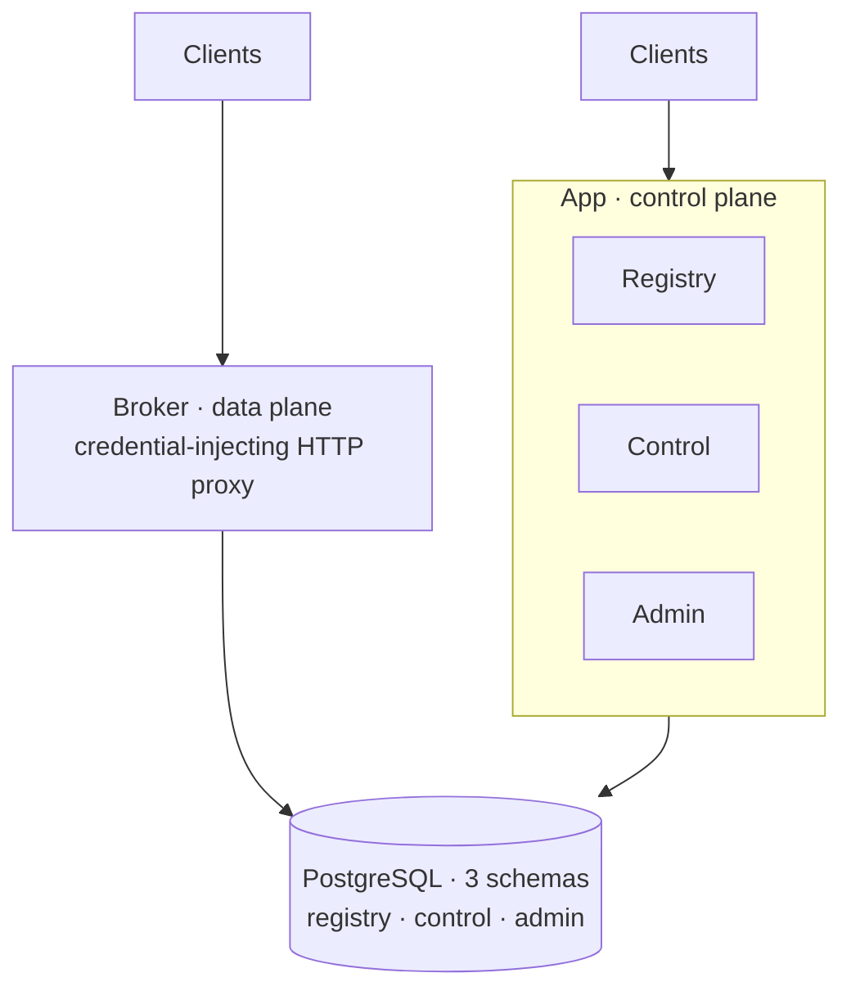

<p align="center">
  
</p>

<p align="center">
  <strong>Secure third-party API execution for AI agents.</strong>
</p>

<p align="center">
  <a href="https://github.com/jentic/jentic-one/actions/workflows/ci.yml"></a>
  <a href="LICENSE"></a>
  
  
  
  
  <br>
  
  
  <a href="https://www.conventionalcommits.org/"></a>
 </p>
 
> [!WARNING]
> **Jentic One is currently in Public Beta.**  
> APIs, database schemas, and CLI commands are subject to breaking changes without a major version bump. We do not recommend running this in production yet.
 
Jentic One is a backend platform for secure third-party API execution. A stateless **Broker** proxy injects stored credentials into outbound requests so secrets never leave the data plane, while a **Control Plane** (Registry, Admin, Control) manages the catalogue of available APIs, access grants, and credential storage.

## Quick Start

Install `jenticctl` to deploy Jentic One locally or manage an existing environment:

```bash
curl -fsSL https://raw.githubusercontent.com/jentic/jentic-one/main/tools/install.sh | sh
```

*For Docker, Helm, or manual deployments, see the full [Installation Guide](docs/installation.md).*

## What is Jentic One?

AI agents increasingly need to call real third-party APIs — but handing an agent your raw API keys is a security problem. Jentic One is a **self-hosted gateway** that keeps that from happening: you register the APIs an agent may use, store the credentials once, and the agent calls out through the Broker. The Broker injects the right credential at execution time and forwards the request, so **secrets never leave your infrastructure** and never reach the agent. Every call is governed by fine-grained permissions and recorded in an append-only audit log.

## Architecture

The system deploys as two peer units — **App** (the control plane, combining Registry + Admin + Control surfaces) and **Broker** (the data plane) — above a shared PostgreSQL database layer.



## Components

| Component | Responsibility |
| --------- | -------------- |
| **Broker** | Stateless execution proxy. Receives an HTTP request with the upstream URL as the path, injects the caller's stored credentials, forwards method/headers/body, and returns the upstream response. Secrets never leave the Broker. |
| **Registry** | API specification catalogue. Stores registered APIs with immutable revisions, operations, security schemes, and server definitions. Owns what APIs are available and at which version. |
| **Control** | Credential storage. Manages polymorphic API credentials (API keys, OAuth2 client credentials, bearer tokens, basic auth) used by the Broker at execution time. |
| **Admin** | Permissions, jobs, audit, and execution telemetry. Owns the operator account, role-based access grants, async job lifecycle, append-only audit log, and execution records. |
| **Shared** | Internal infrastructure layer: configuration loading, async database sessions, structured logging, metrics facade, and the multi-surface application factory. |
| **CLI** | Two Go binaries: `jenticctl` onboards and operates the platform (`jenticctl install`), and `jentic` registers agent identities (`jentic register`) and drives the catalog/broker (`jentic catalog`, `jentic execute`). See [`cli/`](cli/README.md). |

## Quick start

Install the CLI and stand up a local stack with one command:

```bash
curl -fsSL https://raw.githubusercontent.com/jentic/jentic-one/main/tools/install.sh | sh
```

Or work from source:

```bash
make install   # install dependencies and git hooks
make check     # lint + typecheck + tests
make start-app # run the application locally
```

See the [Build & Deploy Guide](deploy/README.md) for full setup instructions.
See the [Security Hardening Guide](docs/security/hardening.md) for information on securing your deployment.

## CLI

The Jentic CLI ships as two Go binaries with a branded, colour-aware terminal
experience — `jenticctl` (install/lifecycle) and `jentic` (API catalog):

```bash
jenticctl install # interactive wizard: generate config + install the app (local venv or Docker)
jentic register   # mint an agent identity (Ed25519 keypair + dynamic client registration)
jentic execute GET:/get --json   # run a real call through the Broker with injected credentials
```

Full reference: [`cli/README.md`](cli/README.md).

## Documentation

| Guide | Description |
| ----- | ----------- |
| [Build & Deploy](deploy/README.md) | Docker, Helm, Terraform, versioning, local kind cluster, and observability |
| [API Specs](openapi/) | OpenAPI specifications (broker, control) |

## Development & testing

Common `make` targets (run `make help` for the full list):

| Target | Description |
| ------ | ----------- |
| `make install` | Full dev setup: sync deps + install git hooks |
| `make check` | Lint, score, secrets audit, unit + arch tests |
| `make fix` | Auto-fix lint issues and reformat code |
| `make test` | Run unit tests |
| `make start-app` | Start the combined app (all surfaces) |

Tests are split into tiers:

- **Unit** — logic with no external services (`make test-unit`).
- **Integration** — database lifecycle against Docker fixtures (`make test-integration`).
- **Architecture** — enforcement of layering and conventions (`make test-arch`).
- **Smoke** — liveness against running services (`make test-smoke`).

Commits follow [Conventional Commits](https://www.conventionalcommits.org/) with a mandatory scope, enforced repo-wide by a `commit-msg` hook.

## Security & telemetry

- **Credentials stay local.** Stored credentials are encrypted at rest and are only ever decrypted inside the Broker at execution time. They are never returned to callers, logged in cleartext, or exposed to the agent.
- **Run Jentic One separately from your agent.** The guarantee above holds on the network path, but a process running as the same OS user as Jentic One can read the key and credential database directly. For real credentials, don't run Jentic One in the same trust boundary as your agent — sandbox the agent or run Jentic One on a separate host/network. See the [security hardening guide](docs/security/hardening.md) for the deployment-tier ladder and a production checklist.
- **Telemetry is opt-in and off by default.** Jentic One sends nothing unless you explicitly enable anonymous product telemetry (`telemetry.enabled: true`); an instance whose config omits the telemetry block stays silent. When enabled, it sends a small, fixed set of anonymous events to Jentic. Each event is a closed schema — `{id, version, event, actor_type?, tags?, ts}` — where `event` and `actor_type` are fixed enums and `tags` are fixed labels (never free text), so there is no room for credentials, request data, or PII.
- **Observability is self-hosted.** Metrics and tracing exporters emit to an OpenTelemetry/Prometheus endpoint *you* configure.
- **Reporting a vulnerability.** Please do not open a public issue for security reports — see [SECURITY.md](SECURITY.md) for responsible-disclosure instructions.

## Contributing

Contributions are welcome. Commit messages follow Conventional Commits, and `make check` must pass before opening a PR. See [CONTRIBUTING.md](CONTRIBUTING.md) for the full workflow, and the Jentic [Code of Conduct](https://github.com/jentic/.github/blob/main/CODE_OF_CONDUCT.md).

## Enterprise & commercial support

Jentic One is fully open source (Apache-2.0) and free to self-host — the open-source build is the real thing, not a trial. If your organization is running it in production and wants help operating a credential broker safely at scale — security hardening reviews, deployment architecture, SLAs, or a managed option — we're happy to help. Reach out at [jentic.com/contact](https://jentic.com/contact). See [SUPPORT.md](SUPPORT.md) for community and commercial support options.

## License

Jentic One is licensed under the [Apache 2.0](LICENSE) license, and ships with an explicit [NOTICE](NOTICE) file containing additional legal notices.
