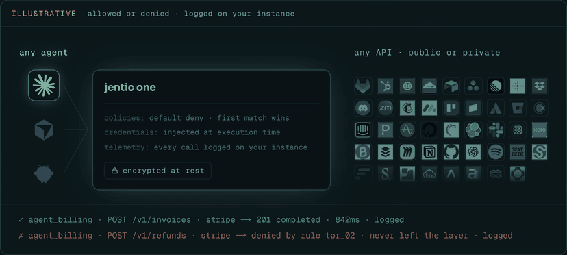
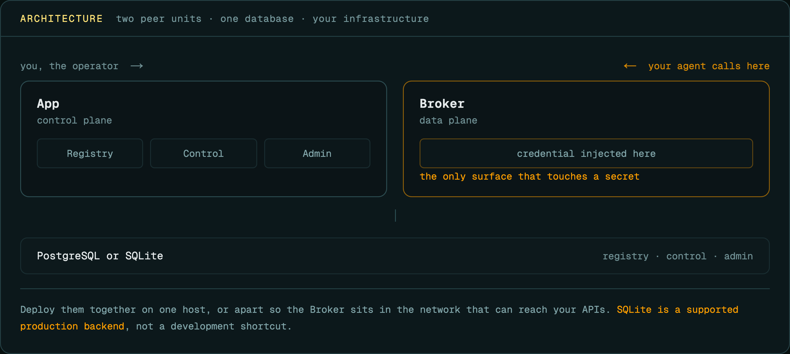

<p align="center">
  
</p>

<p align="center">
  <strong>A self-hosted execution layer for AI agents.</strong><br>
  Connect an agent to any API you need, and enforce exactly what it is allowed to call.
</p>

<p align="center">
  <a href="#quickstart">Quickstart</a> ·
  <a href="docs/guides/first-call.md">First brokered call</a> ·
  <a href="https://github.com/jentic/jentic-public-apis">API Directory</a> ·
  <a href="docs/security/security.md">Security</a> ·
  <a href="https://github.com/jentic/jentic-one/discussions">Discussions</a>
</p>

<p align="center">
  <a href="https://github.com/jentic/jentic-one/actions/workflows/ci.yml"></a>
  <a href="LICENSE"></a>
  
  
  
  
  <br>
  
  
  <a href="https://www.conventionalcommits.org/"></a>
 </p>

> [!NOTE]
> **Public Beta.** Schemas and CLI commands can change between 0.x releases. Pin a version if
> you need stability. Contributions are welcome: see [CONTRIBUTING.md](CONTRIBUTING.md) and the
> [open issues](https://github.com/jentic/jentic-one/issues).

## What Jentic One is

<p align="center">
  
</p>

Giving an agent API access normally means giving it an API key. Jentic One removes that step.
Register the APIs an agent may use, store the credentials once, and the agent makes its calls through the Broker. The Broker checks the agent's permissions, attaches the credential at execution time, and writes an audit record. Your agent never sees your keys.

Agents integrate through the `jentic` CLI, a generated skill, the local `jentic mcp` server,
or plain HTTP. Every path terminates at the credential-injecting Broker: the MCP server runs beside the
agent as a thin client and holds no upstream credentials — those never leave your Broker.

## Quickstart

Every path below runs on Linux and macOS; on Windows, follow the
[Windows guide](docs/installation/windows.md) (WSL2 + native `jentic.exe`).

### Self-hosted (build from source)

```bash
# Build and start the service
git clone https://github.com/jentic/jentic-one.git && cd jentic-one
make install   # install dependencies and git hooks
make dev       # idempotent local bring-up: fixtures + migrations + UI, then run the app
open http://127.0.0.1:8000

# Build the CLIs
cd cli && make build
./jenticctl    # operator CLI — install, manage, admin
./jentic       # agent CLI — search, inspect, execute
```

[More on local development](docs/development/local-setup.md).

### Self-hosted (Docker)

One image (`ghcr.io/jentic/jentic-one-app`) runs both the control plane and the
broker. The trial shape below keeps everything in SQLite files on one volume
and runs with development-mode secrets — don't point it at a real credential:

```bash
docker pull ghcr.io/jentic/jentic-one-app:latest
docker volume create jentic-data

# Grab the trial config (SQLite on the volume) — tweak it, or use as is
curl -fsSLO https://raw.githubusercontent.com/jentic/jentic-one/main/config/quickstart.env

# Migrate, then start the two roles
docker run --rm --env-file quickstart.env -v jentic-data:/data \
  ghcr.io/jentic/jentic-one-app:latest python -m jentic_one.migrations.run
docker run -d --name jentic-app --env-file quickstart.env -v jentic-data:/data \
  -p 127.0.0.1:8000:8000 ghcr.io/jentic/jentic-one-app:latest      # control plane (UI + APIs)
docker run -d --name jentic-broker --env-file quickstart.env -e JENTIC__APPS=broker -v jentic-data:/data \
  -p 127.0.0.1:8100:8000 ghcr.io/jentic/jentic-one-app:latest      # data plane (agents call this)

# First admin (prompts for a password), then sign in at http://127.0.0.1:8000
docker run --rm -it --env-file quickstart.env -v jentic-data:/data \
  ghcr.io/jentic/jentic-one-app:latest python -m jentic_one create-admin --email you@example.com
```

The production shape — external Postgres, image pinned and verified by digest,
real secrets, TLS — is in [docs/installation/docker.md](docs/installation/docker.md).

### Install the CLI

```bash
brew install --cask jentic/tap/jentic    # macOS / Linux
winget install Jentic.Jentic             # Windows

jentic register   # connect this machine to the instance
```

No package manager? Manual download, checksum + signature verification, and
air-gapped transfer are in [docs/installation/cli.md](docs/installation/cli.md)
— along with our Scoop bucket, which carries brand-new releases before winget
review completes.

### Managed install

[AWS Marketplace](docs/installation/aws-marketplace.md) — buy and run the listed product on EKS
(prerequisites, zero-touch install, license-check behaviour).
For commercial use, get in touch: [jentic.com/contact](https://jentic.com/contact).

## How it works

Jentic One handles secure third-party API execution for agents. It deploys as two peer units
above a shared database. **App** is the control plane and contains the Registry, Control and
Admin surfaces. **Broker** is the data plane. Configuration happens through App; the agent
talks only to the Broker.

<p align="center">
  
</p>

On each call the Broker checks the agent's permissions, attaches the stored credential,
forwards the request, and writes an audit record. The credential is added inside the Broker,
after the permission check, and is never returned to the caller.

## Why we built Jentic One

Agents are getting API access the worst way we know how: keys pasted into env vars,
MCP configs, and dotfiles on every machine an agent runs on. Anything in the agent's
context — a prompt injection, a poisoned tool description, a plain bug — can read
those keys and exfiltrate them. And once an agent holds the key itself, there is no
scoping it to *this* endpoint, no record of what it called, and no way to revoke one
agent without rotating the key everywhere.

We think the fix is structural, not better prompting: the agent should never hold the
credential at all. In Jentic One the key is stored once, encrypted, on your
infrastructure; the agent gets an identity instead. Every call goes through the Broker,
which checks that agent's permissions, injects the credential after the check, and
writes an audit record. A compromised agent can only make the calls it was allowed
to make anyway — and you can see every one of them, and cut that one agent off
without touching the key.

## Documentation

The full index is at [docs/README.md](docs/README.md).

- [Installation](docs/installation/quickstart.md) — [Docker](docs/installation/docker.md), [systemd](docs/installation/systemd.md), [Helm](docs/installation/helm.md), [AWS Marketplace](docs/installation/aws-marketplace.md)
- [First brokered call](docs/guides/first-call.md) — from a running instance to a real API response
- [CLI](cli/README.md) — `jentic` (agent) and `jenticctl` (operator)
- [Deploying securely](docs/security/security.md) — read before pointing an instance at a real credential
- [Configuration reference](docs/reference/config.md) — every config key, default, and env var
- [Endpoint & scope reference](docs/reference/endpoints.md) — every HTTP route and who may call it
- [Local development](docs/development/local-setup.md) — running from a source checkout

Agents can read [llms.txt](llms.txt) for a machine-oriented map of the project.

## Contributing

Contributions are welcome — see [CONTRIBUTING.md](CONTRIBUTING.md) and the
[open issues](https://github.com/jentic/jentic-one/issues). Questions and proposals go in
[Discussions](https://github.com/jentic/jentic-one/discussions).

## Links

[Jentic One](https://jentic.com/jentic-one) ·
[API Directory](https://github.com/jentic/jentic-public-apis)

## License

Jentic One is licensed under [Apache 2.0](LICENSE). See [License](./LICENSE)
