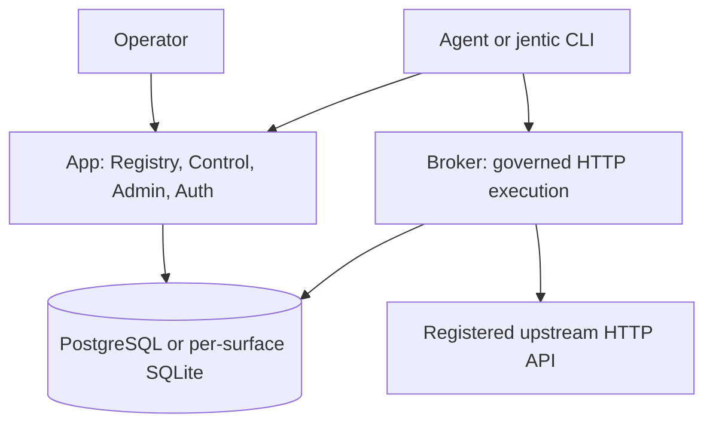

<p align="center">
  
</p>

<p align="center">
  <strong>A self-hosted credential broker for AI agents.</strong><br>
  Register HTTP APIs, approve the operations an agent may call, and inject credentials after access checks.
</p>

<p align="center">
  <a href="#quickstart">Quickstart</a> ·
  <a href="docs/quickstart.md">First brokered call</a> ·
  <a href="https://github.com/jentic/jentic-public-apis">API Directory</a> ·
  <a href="docs/security/hardening.md">Security</a> ·
  <a href="https://github.com/jentic/jentic-one/discussions">Discussions</a>
</p>

<p align="center">
  <a href="https://github.com/jentic/jentic-one/actions/workflows/ci.yml"></a>
  <a href="LICENSE"></a>
  
  
  
  
  <br>
  
  
  <a href="https://www.conventionalcommits.org/"></a>
 </p>

> [!NOTE]
> **Public Beta.** Schemas and CLI commands can change between 0.x releases. Pin a version if
> you need stability. Contributions are welcome: see [CONTRIBUTING.md](CONTRIBUTING.md) and the
> [open issues](https://github.com/jentic/jentic-one/issues).

## What Jentic One is

<p align="center">
  
</p>

Giving an agent API access normally means giving it an API key. Jentic One removes that step.
Register the APIs an agent may use, store the credentials once, and the agent makes its calls
through the Broker. The Broker checks the agent's permissions, attaches the credential at
execution time, and writes an audit record. Credential read APIs return redacted data; cleartext
secret material is shown only in the create response. Rotation accepts a new secret but returns
redacted data.

Jentic One is self-hosted and licensed under Apache-2.0.

**Who it's for**

- Developers running a coding agent locally — Claude Code, Codex, Cursor, OpenClaw, Cline, or
  one you built — that needs access to real APIs.
- Small teams running an agent in a private network or VPC, with the agent calling Jentic One
  over private DNS.
- Teams that need reviewable access controls and audit records before agents call protected APIs.

**What it is not**

| Not | Reason |
| --- | ------ |
| A workflow or orchestration engine | The Broker makes one governed upstream call per execution. An agent that needs multi-step orchestration composes calls itself. |
| A general-purpose secrets manager | It stores credentials used for brokered API calls, not arbitrary application or infrastructure secrets. |
| A hosted service | The open-source product runs in infrastructure you operate. |
| Safe to run as the same OS user as your agent, with real credentials | API controls cannot stop a same-user process from reading the encryption key and database. See [Security](#security--telemetry). |

## Why self-hosted

Most tools in this category are hosted: the credentials live in the vendor's infrastructure.
Jentic One runs on infrastructure you control. Credentials are encrypted at rest in your
database. The Broker decrypts them for execution; Control also handles secret material during
credential creation, rotation, and managed OAuth connect or refresh flows.

Jentic One exposes no MCP endpoint. Agents integrate through the `jentic` CLI, a generated
skill, or the deployment's HTTP APIs.

## Quickstart

The bootstrap script supports macOS and Linux. The `jentic` release binary also supports native
Windows; use WSL for local-stack workflows. A source checkout requires `git` and
[`uv`](https://docs.astral.sh/uv/). Docker is required for the default development database,
and Node is optional when building the UI.

### Option A — signed release binaries

Download `jentic` and, for a local stack, `jenticctl` from the
[latest release](https://github.com/jentic/jentic-one/releases/latest). Verify each archive
against `checksums.txt`, then verify that file with `checksums.txt.sig` and
`checksums.txt.pem`. Run `jenticctl install` to configure and start the local stack. Each
release also ships an SBOM. The [CLI guide](cli/README.md#3-manual-download--verify) has the
complete verification commands.

### Option B — bootstrap script

To install only the agent CLI from a published release for use with an existing remote
deployment:

```bash
curl -fsSL https://raw.githubusercontent.com/jentic/jentic-one/main/tools/install.sh \
  | env JENTIC_INSTALL_METHOD=binary sh
```

To install both binaries and start the local-stack wizard:

```bash
curl -fsSL https://raw.githubusercontent.com/jentic/jentic-one/main/tools/install.sh \
  | env JENTIC_INSTALL_BINARIES=both sh
```

The script prefers checksummed release archives and falls back to a source build when no
matching release asset exists. The default download installs only `jentic`; setting
`JENTIC_INSTALL_BINARIES=both` adds `jenticctl` and, in an interactive terminal, starts
`jenticctl install`. Add `JENTIC_NO_INSTALL=1` to the `env` command to install both binaries
without starting the stack wizard.

### Option C — from source

```bash
make install   # install dependencies and git hooks
make dev       # idempotent local bring-up: fixtures + migrations + UI, then run the app
```

`make dev` is the one-command local flow and is safe to re-run, including after a reboot. It
builds the UI when Node is available and otherwise starts the backend without rebuilding the
UI. See [Local development setup](docs/development/local-setup.md).

## First brokered call

Six steps from a running instance to a response from a real API.

1. **Create your admin account** at `/app/setup` (the wizard opens this automatically, or run
   `jenticctl setup` to do it from the terminal).
2. **Import an API** from the [Jentic API Directory](https://github.com/jentic/jentic-public-apis)
   (e.g. `httpbin.org`, used in step 6), or upload your own specification.
3. **Store a credential** for that API. Cleartext secret material is returned once in the
   create response; subsequent reads and rotation responses are redacted.
4. **Register the agent:** run `jentic setup` for a coding agent, or `jentic register` for
   identity-only onboarding. For a remote deployment, pass both `--url <control-plane URL>`
   and `--broker-url <broker URL>`. Registration waits for an operator to approve the agent.
   On a single-operator install, approve it in the UI and the command completes.
5. **Request access:** `jentic access request --toolkit <vendor/name>`. The operator grants
   the request by binding the agent to the toolkit. A rule-less binding blocks everything;
   the default is deny.
6. **Make the call:** `jentic execute GET:https://httpbin.org/get --json` — the operation's
   full URL, as returned by `jentic search`/`jentic inspect`.

Full walkthrough: [docs/quickstart.md](docs/quickstart.md). To have a coding agent install and
register itself, see [AGENTS.md](AGENTS.md); [llms.txt](llms.txt) is the machine-readable index
of these docs for assistants evaluating the project.

## How it works

Jentic One handles secure third-party API execution for agents. It deploys as two peer units
above shared persistence. **App** is the control plane and contains the Registry, Control,
Admin, and Auth surfaces. **Broker** is the data plane. Agents use App for registration,
discovery, and access requests, and Broker for governed execution.


```mermaid
flowchart TB
    Operator[Operator] --> App[App: Registry, Control, Admin, Auth]
    Agent[Agent or jentic CLI] --> App
    Agent --> Broker[Broker: governed HTTP execution]
    App --> Data[(PostgreSQL or per-surface SQLite)]
    Broker --> Data
    Broker --> Upstream[Registered upstream HTTP API]
```

On each call the Broker checks the agent's permissions, attaches the stored credential,
forwards the request, and writes an audit record. The upstream status, headers, and body are
relayed to the caller. Use trusted upstreams: an upstream can reflect request data, including
an injected credential, in its response.

## Components

| Component | Responsibility |
| --------- | -------------- |
| **Broker** | A stateless credential-injecting HTTP proxy. Receives an HTTP request with the upstream URL as the path, resolves permissions and credentials, forwards method/headers/body, and relays the upstream response. |
| **Registry** | API specification directory. Stores registered APIs with immutable revisions, operations, security schemes, and server definitions. Owns what APIs are available and at which version. |
| **Control** | Credential storage, toolkit bindings, permission rules, and access requests. Supports API keys, basic and bearer authentication, OAuth2 client-credentials and authorization-code flows, no-auth bindings, and AWS SigV4. |
| **Admin** | Operator administration, jobs, audit, and execution telemetry. Owns role grants, async job lifecycle, the append-only audit log, and execution records. |
| **Auth** | Operator and agent authentication. Owns agent registration, token minting, OAuth clients, service accounts, and identity discovery. |
| **Shared** | Internal infrastructure layer: configuration loading, async database sessions, structured logging, metrics facade, and the multi-surface application factory. |
| **CLI** | Two Go binaries: `jenticctl` installs and operates the platform, while `jentic` onboards agents, manages the catalog and access requests, and executes operations. See [`cli/`](cli/README.md). |

Agent identity is per-agent. Each agent registers with its own Ed25519 keypair through dynamic
client registration, and an operator approves it before it can call anything. Revoking one
agent does not affect the others.

Both PostgreSQL and SQLite are supported persistence backends.

## Does Jentic One replace my API gateway?

No. A gateway manages traffic: routing, rate limits, quotas, transformation. Jentic One governs
which agent may make a given call, which stored credential is attached to it, and what is
recorded afterwards. Both sit on the same request path and address different concerns, so
Jentic One runs alongside an existing gateway.

Jentic One works with registered HTTP APIs the deployment can reach, whether public, private,
third-party, or internal. The same credential custody, per-agent permissions, and audit trail
apply whether the upstream is Stripe or an API that exists only inside your network. The public
[Jentic API Directory](https://github.com/jentic/jentic-public-apis) supplies specifications
for APIs that already have one.

## CLI reference

```bash
jenticctl install                                    # interactive wizard: config + install (local venv or Docker)
jentic setup                                         # coding-agent setup: identity, skill, optional isolation
jentic register                                      # identity-only onboarding, then wait for operator approval
jentic catalog search stripe                         # find an API in the directory
jentic execute GET:https://httpbin.org/get --json    # run a call through the Broker with the credential injected
```

Full reference: [`cli/README.md`](cli/README.md).

## Documentation

**Getting to a first call**

| Guide | Covers |
| ----- | ------ |
| [Local development setup](docs/development/local-setup.md) | Running a stack on your machine |
| [Credentials and toolkits](docs/credentials-and-toolkits.md) | Storing a credential and binding an agent to it |
| [Local coding agents](docs/local-agent.md) | Run Claude Code, Codex, Cursor, or Hermes as an isolated Unix user with `jentic run` — flow, examples, grants, and troubleshooting |
| [CLI reference](cli/README.md) | Every `jenticctl` and `jentic` command |

**Deployment and security**

| Guide | Covers |
| ----- | ------ |
| [Security hardening](docs/security/hardening.md) | Deployment-tier ladder and production checklist. Read before using real credentials. |
| [Build & deploy](deploy/README.md) | Docker, Helm, Terraform, versioning, kind, observability |
| [Self-hosted containers + external Postgres](deploy/README.md#self-hosted-containers--external-postgres) | Production-shaped deployment without Kubernetes |
| [Cloud vs self-hosted](docs/cloud-vs-self-hosted.md) | How Jentic One differs from the Jentic cloud platform, why there is no MCP endpoint, and how to run both (or migrate) without silent cross-talk |

**Reference**

| Guide | Covers |
| ----- | ------ |
| [Endpoint & scope reference](docs/reference/endpoints.md) | Every HTTP route, its scope, and who may call it |
| [API specs](openapi/) | OpenAPI specifications (broker, control) |
| In-app reference | On a running deployment: `/docs` for interactive Swagger, `/redoc` for the rendered reference. Both generated from code. |

## Security & telemetry

- **Credential custody is self-hosted.** Stored credentials are encrypted at rest. The create
  response returns cleartext secret material once; later reads and rotation responses are
  redacted. The Broker decrypts credentials for execution, and Control handles managed OAuth
  connect and refresh flows. Secret values are not intentionally written to application logs.
- **Use trusted upstreams.** The Broker injects a credential only after its access check, but
  it relays the upstream response. A reflective or malicious upstream can return request data,
  including the injected credential, to the caller.
- **Run Jentic One separately from your agent.** A process running as the same OS user as
  Jentic One can read the key and credential database directly. For real credentials, do not
  run Jentic One in the same trust boundary as your agent: sandbox the agent, or run Jentic One
  on a separate host or network. The
  [security hardening guide](docs/security/hardening.md) contains the deployment-tier ladder
  and a production checklist.
- **Access is default-deny.** A rule-less binding blocks everything. Permissions are
  first-match.
- **Telemetry is opt-in and off by default.** Jentic One sends nothing unless anonymous product
  telemetry is explicitly enabled (`telemetry.enabled: true`); an instance whose config omits
  the telemetry block stays silent. When enabled, it sends a small, fixed set of anonymous
  events. Each event is a closed schema — `{id, version, event, actor_type?, tags?, ts}` —
  where `event` and `actor_type` are fixed enums and `tags` are fixed labels, never free text,
  so the payload has no room for credentials, request data, or PII. This is enforced in CI by
  [`tests/arch/test_telemetry_no_pii.py`](tests/arch/test_telemetry_no_pii.py).
- **Observability is self-hosted.** Metrics and tracing exporters emit to an
  OpenTelemetry/Prometheus endpoint you configure.
- **Reporting a vulnerability.** Do not open a public issue for security reports. See
  [SECURITY.md](SECURITY.md) for responsible-disclosure instructions.

## Development & testing

Common `make` targets (run `make help` for the full list):

| Target | Description |
| ------ | ----------- |
| `make install` | Full dev setup: sync deps + install git hooks |
| `make dev` | One-command local bring-up (idempotent): fixtures + migrations + UI, then start the app |
| `make check` | Lint, API score, secrets audit, and architecture tests |
| `make fix` | Auto-fix lint issues and reformat code |
| `make test` | Run unit tests |
| `make start-app` | Start the combined app (all surfaces) |

Tests are split into tiers:

- **Unit** — logic with no external services (`make test-unit`).
- **Integration** — database lifecycle against Docker fixtures (`make test-integration`).
- **Architecture** — enforcement of layering and conventions (`make test-arch`).
- **Smoke** — liveness against running services (`make test-smoke`).

## Contributing

Commit messages follow [Conventional Commits](https://www.conventionalcommits.org/) with a
mandatory scope, enforced by the `commit-msg` hook. Run `make check` before opening a pull
request. The architecture tests use a vendored subset of rule facts
([`tests/arch/vendored/`](tests/arch/vendored/)), so a plain clone requires no additional
setup. [CONTRIBUTING.md](CONTRIBUTING.md) has the full workflow and links to issues where help
is wanted. The Jentic [Code of Conduct](https://github.com/jentic/.github/blob/main/CODE_OF_CONDUCT.md)
applies.

Use [Discussions](https://github.com/jentic/jentic-one/discussions) for questions and proposals.

## Migrating from the hosted platform or Jentic Mini

Read [Cloud vs self-hosted](docs/cloud-vs-self-hosted.md) before running Jentic One alongside
the hosted Jentic platform or a self-hosted Jentic Mini instance. The CLI and cloud MCP can
query different backends, making APIs or credentials appear missing. New installations should
start with Jentic One.

## Enterprise & commercial support

Jentic One is licensed under Apache-2.0 and is free to self-host. For security hardening
reviews, deployment architecture, SLAs, or managed operation, contact
[jentic.com/contact](https://jentic.com/contact).
[SUPPORT.md](SUPPORT.md) lists community and commercial support options.

## License

Jentic One is licensed under the [Apache 2.0](LICENSE) license, and ships with an explicit
[NOTICE](NOTICE) file containing additional legal notices.
