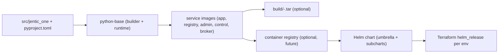

# Build & Deploy

This directory holds everything needed to turn the source tree into runnable
artifacts: Docker images, a Python wheel, Helm charts, and Terraform modules
that install the charts. The whole thing is designed so that:

- One Python package (`src/jentic_one/`) produces many images by changing
  only `JENTIC__APPS` and the entrypoint.
- A single source of version truth (`pyproject.toml`) flows through Make,
  Docker, and Helm.
- Adding a new deployable (or replacing one — e.g. swapping broker from
  Python to Go) is a localized change: a new Dockerfile, a new subchart, one
  line in `Makefile`'s `SERVICES`. Nothing else needs to move.

## Layout

```
deploy/
├── docker/                          # One Dockerfile per deployable
│   ├── python-base.Dockerfile       # Shared multi-stage base (wheel build + runtime)
│   ├── app.Dockerfile               # Combined image (registry+admin+control)
│   ├── registry.Dockerfile          # Registry surface only
│   ├── admin.Dockerfile             # Admin surface only
│   ├── control.Dockerfile           # Control surface only
│   └── broker.Dockerfile            # Broker (Python today; swap when Go)
├── helm/
│   ├── jentic-one/                  # Umbrella Helm chart (apps)
│   │   ├── Chart.yaml               # appVersion = pyproject version
│   │   ├── values.yaml              # Per-service `enabled` toggles + observability
│   │   └── charts/
│   │       ├── common/              # Library chart (template helpers only)
│   │       ├── app/                 # Combined-app subchart
│   │       ├── broker/              # Broker subchart
│   │       ├── registry/            # Registry subchart
│   │       ├── admin/               # Admin subchart
│   │       └── control/             # Control subchart
│   ├── observability/               # Standalone LGTM stack (Grafana/Loki/Tempo/Prom + OTel collector)
│   └── values/                      # Per-mode + per-overlay value files
│       ├── local-combined.yaml      # Mode: combined app + broker + Postgres
│       ├── local-parts.yaml         # Mode: registry + admin + control + broker
│       ├── local-broker.yaml        # Mode: broker only
│       ├── local-otel-app.yaml      # Overlay: wire app sidecars to obs stack
│       └── local-observability.yaml # Overlay: tune obs stack for kind
└── terraform/
    ├── modules/service/             # Generic wrapper around helm_release
    └── envs/
        ├── dev/                     # Composes the modules for dev
        └── prod/                    # Composes the modules for prod
```

The same shape applies to anything new (a future UI, a future Go broker):
one folder under each of `docker/`, `helm/jentic-one/charts/`, and a Terraform
call per env.

## How a build flows



1. **Wheel** — `python-base.Dockerfile`'s `builder` stage runs `uv build --wheel`
   inside the container, producing `jentic_one-<ver>-py3-none-any.whl`. The
   `runtime` stage then `pip install`s that wheel into a minimal Python image.
2. **Service images** — each `<svc>.Dockerfile` is a one-liner that extends
   `python-base` and sets `JENTIC__APPS` (e.g. `app` enables all three
   surfaces, `registry` enables only the registry). Same wheel everywhere;
   only the env differs.
3. **Tarballs** — `make save-<svc>` writes the image out to
   `build/<svc>-<ver>.tar` for offline transfer or air-gapped loading.
4. **Helm chart** — `deploy/helm/jentic-one/` is an umbrella chart with one
   subchart per service. `values.yaml` toggles `<svc>.enabled` per service;
   image tags default to `Chart.appVersion` (which mirrors the pyproject
   version).
5. **Terraform** — `modules/service/` wraps `helm_release` for a single
   subchart. Per-env roots under `envs/<env>/main.tf` decide which services
   are turned on for that environment.

## Version source of truth

```
pyproject.toml [project].version
        │
        ├── scripts/version.sh ──> Makefile (VERSION) ──> docker tag
        │
        └── deploy/helm/jentic-one/Chart.yaml (appVersion) ──> chart image tag default
```

`scripts/version.sh` is a tiny shell that reads `[project].version` from
`pyproject.toml`. Make uses it for the image tag (`$(VERSION)`); the Helm
chart's `appVersion` should be kept in sync (manually for now) and acts as
the default image tag for every subchart so a freshly-installed chart pulls
the matching image automatically.

To bump the release:

1. Edit `[project].version` in `pyproject.toml`.
2. Edit `appVersion` in `deploy/helm/jentic-one/Chart.yaml` to match.
3. `make build-all` (rebuilds images with the new tag).
4. `make save-all` if you need offline tarballs.

## Reproducibility: the digest pin

`deploy/docker/python-base.Dockerfile` pins `python:3.12-slim` to a specific
sha256 digest, not just the floating tag, so a build today and a build in
six months produce the same base layer:

```dockerfile
ARG PYTHON_IMAGE=python:3.12-slim@sha256:090ba77e2958f6af52a5341f788b50b032dd4ca28377d2893dcf1ecbdfdfe203
FROM ${PYTHON_IMAGE} AS builder
...
FROM ${PYTHON_IMAGE} AS runtime
```

To bump the base image (e.g. for a CVE patch):

```bash
docker pull python:3.12-slim
docker inspect --format='{{index .RepoDigests 0}}' python:3.12-slim
# copy the resulting python@sha256:... into python-base.Dockerfile
```

`uv` is also pinned to a major.minor (`ghcr.io/astral-sh/uv:0.7`) rather than
`:latest`. Pin further to a digest if you need to.

## .dockerignore

`.dockerignore` at the repo root is what keeps the build *fast* and *safe*:

- **Fast** — without it, the entire repo (including `.git/`, `tests/`,
  `docker/`, `deploy/`, `.venv/`) gets shipped to the Docker daemon as build
  context. With it, only `pyproject.toml`, `uv.lock`, `README.md`, `src/`,
  and `openapi/` make it across.
- **Safe** — `.env*`, `config/production.yaml`, and any `jentic-one.yaml`
  are excluded so they can never leak into a build cache layer.

If you add a new top-level folder that should *not* be inside images, add it
to `.dockerignore` immediately.

## Make targets at a glance

| Target                  | What it does                                                              |
| ----------------------- | ------------------------------------------------------------------------- |
| `make build-wheel`      | Build a Python wheel into `dist/` using uv (no Docker)                    |
| `make build-base`       | Build the shared `python-base:latest` image                               |
| `make build-<svc>`      | Build `jentic-one/<svc>:<VERSION>` (and `:<GIT_SHA>`); auto-builds base   |
| `make build-all`        | Build base + every service in `SERVICES`                                  |
| `make save-<svc>`       | `docker save` `<svc>` into `build/jentic-<svc>-<VERSION>.tar`             |
| `make save-all`         | Run `save-<svc>` for every service                                        |
| `make push-<svc>`       | Push `<svc>` image with both tags (registry must be configured)           |
| `make images`           | List all locally-built `jentic-one/*` images                              |
| `make clean`            | Remove caches, `dist/`, and `build/`                                      |

`SERVICES` is defined at the top of `Makefile`. Adding a service = append
its name there + drop a Dockerfile in `deploy/docker/`.

## Where do builds *go*?

`docker build` doesn't write a file you can `ls`. It registers the image
with your local Docker daemon's image store. To see what was built:

```bash
make images
# or
docker images jentic-one/*
```

To turn an image into a transferable file, use the save targets:

```bash
make save-app           # writes build/jentic-app-0.1.0.tar
make save-all           # writes one tarball per service
```

To load a tarball back on another machine:

```bash
docker load -i build/jentic-app-0.1.0.tar
```

`build/` is gitignored and dockerignored, so tarballs never end up in git or
in a future image build context.

## Adding a new service

The recipe is the same whether it's a Python service, a Go service, or a
static UI bundle. Only the Dockerfile differs.

1. Create `deploy/docker/<name>.Dockerfile`. For a Python service, copy
   `app.Dockerfile` and change `JENTIC__APPS`. For a Go or Node service,
   write whatever multi-stage build is appropriate; nothing else cares.
2. Append `<name>` to `SERVICES` in `Makefile`.
3. Create `deploy/helm/jentic-one/charts/<name>/` (copy an existing
   subchart). Adjust `values.yaml` and the `Deployment` env vars.
4. Add the subchart to the umbrella `Chart.yaml` `dependencies:` list with a
   `condition: <name>.enabled` toggle.
5. Add a default `<name>: { enabled: false, image: { repository: jentic-one/<name>, tag: "" } }`
   block to the umbrella `values.yaml`.
6. Add `module "<name>" { source = "../../modules/service" ... }` blocks in
   each Terraform env that should run it.

That's everything. No core code or shared template needs to change.

## Swapping broker to Go (worked example)

When the time comes to replace the Python broker with a Go binary:

1. Replace `deploy/docker/broker.Dockerfile` with a Go multi-stage build:

   ```dockerfile
   # syntax=docker/dockerfile:1
   FROM golang:1.23 AS builder
   WORKDIR /src
   COPY go.mod go.sum ./
   RUN go mod download
   COPY . .
   RUN CGO_ENABLED=0 go build -o /broker ./cmd/broker

   FROM gcr.io/distroless/static:nonroot
   COPY --from=builder /broker /broker
   USER nonroot:nonroot
   EXPOSE 8000
   ENTRYPOINT ["/broker"]
   ```

2. Done. `make build-broker` still works. The broker subchart still works
   (it only cares about image repo/tag and ports). Terraform still works.
   Versioning still works (broker would either pull from the same root
   `pyproject.toml` for now, or grow its own `components/broker/VERSION` file
   that `scripts/version.sh` learns to read).

This is the "extensibility" the build system is paying for: each
deployable's runtime is an isolated concern.

## Metrics

The application emits metrics via OpenTelemetry's metrics SDK. The exporter
is configurable at deploy time:

| Exporter     | How it works                                        | When to use                              |
| ------------ | --------------------------------------------------- | ---------------------------------------- |
| `otlp`       | Pushes to OTel Collector on localhost:4317 (sidecar) | Production / OTel-based stacks (default) |
| `prometheus` | Exposes `/metrics` endpoint on the service port      | Environments with Prometheus scraping    |
| `none`       | No-op — SDK inactive                                | Tests, CI, local dev without obs stack   |

### Configuration

Set via Helm values (recommended for k8s) or env var (local dev):

```bash
# Helm values (deploy/helm/jentic-one/values.yaml)
global.observability.metrics.exporter: otlp  # default

# Environment variable
JENTIC__OBSERVABILITY__METRICS__EXPORTER=prometheus
```

### Prometheus scrape path

When `exporter=prometheus`, use the overlay:

```bash
uv run python -m tools.deploy up --mode combined
# Then layer the prometheus overlay:
helm upgrade jentic deploy/helm/jentic-one \
  -f deploy/helm/values/local-combined.yaml \
  -f deploy/helm/values/local-prom-app.yaml
```

This sets pod annotations (`prometheus.io/scrape`, `/port`, `/path`) and
the observability chart's Prometheus instance auto-discovers annotated pods.

### Cardinality discipline

- Never use raw request paths as metric labels — use route templates
  (FastAPI instrumentation does this automatically).
- Keep custom label cardinality bounded (e.g. `operation` enum, not
  user-supplied IDs).
- All custom instruments must go through `shared/metrics.py`'s
  `get_meter()` — the architecture test enforces this.

## Observability hooks

Subcharts include built-in support for structured logging and an
OpenTelemetry sidecar; see `common/templates/_logging.tpl` and
`common/templates/_otel-sidecar.tpl`.

- `LOG_FORMAT` (default `json`), `LOG_LEVEL` (default `info`), and
  `OTEL_SERVICE_NAME` (set to `<release>-<chart>`, e.g. `jentic-broker`) are
  injected into every service pod.
- When `global.observability.otel.enabled=true`, each pod gets an OTel
  Collector sidecar receiving OTLP gRPC on `localhost:4317` and exporting to
  the configured endpoint.

For local dev there's a turnkey backend: see [Cluster UI / observability](#cluster-ui--observability)
below for the full Grafana/Loki/Tempo/Prometheus stack and the `OTEL=1`
shortcut that wires app sidecars to it.

To wire to an external collector manually:

```bash
helm install jentic deploy/helm/jentic-one \
  --set global.observability.otel.enabled=true \
  --set global.observability.otel.endpoint=http://otel-collector:4317
```

## Local cluster workflow

A `kind`-based local cluster lets you validate that chart installs work, pods
become Ready, and health endpoints respond — without pushing to a cloud env.

### Prerequisites

- [kind](https://kind.sigs.k8s.io/) (v0.20+)
- [Helm](https://helm.sh/) (v3.12+)
- [kubectl](https://kubernetes.io/docs/tasks/tools/) configured (kind manages
  kubeconfig automatically)
- Docker images built locally (`make build-all`)

### Mode matrix

| Mode       | Values file                         | What runs                                 |
| ---------- | ----------------------------------- | ----------------------------------------- |
| `combined` | `deploy/helm/values/local-combined.yaml` | app (all surfaces) + broker + PostgreSQL |
| `parts`    | `deploy/helm/values/local-parts.yaml`    | registry + admin + control + broker + PostgreSQL |
| `broker`   | `deploy/helm/values/local-broker.yaml`   | broker + PostgreSQL                      |

### Quick start

```bash
make build-all                                          # Build all Docker images
uv run python -m tools.deploy cluster up                # Create local kind cluster
uv run python -m tools.deploy up --mode combined        # Deploy with combined mode
curl http://localhost:8000/health                        # Verify app health
uv run python -m tools.deploy smoke                     # Run smoke test suite
uv run python -m tools.deploy down                      # Remove the release
uv run python -m tools.deploy cluster down              # Destroy the cluster
```

Add `--otel` to `up` to wire app OTel sidecars to the observability stack
(requires `obs up` first):

```bash
uv run python -m tools.deploy up --mode combined --otel
```

### Switching modes

```bash
uv run python -m tools.deploy down
uv run python -m tools.deploy up --mode parts           # Redeploy with individual surfaces
```

### Image loading

`tools.deploy up` only loads the images that the chosen `--mode` actually needs
into the kind cluster, to keep the deploy fast:

| `--mode`   | Images loaded                          |
| ---------- | -------------------------------------- |
| `combined` | `app`, `broker`                        |
| `parts`    | `registry`, `admin`, `control`, `broker` |
| `broker`   | `broker`                               |

The bundled PostgreSQL uses the stock Bitnami image pulled from Docker Hub, so
no custom database image needs to be built or loaded.

If you plan to switch modes back-and-forth and want to pre-warm everything
once, run `uv run python -m tools.deploy load --all` after `cluster up` —
that loads all five service images. Subsequent `kind load` calls are no-ops
once the image is already on the node.

### Viewing logs

```bash
uv run python -m tools.deploy logs app       # Tail app pod logs
uv run python -m tools.deploy logs broker    # Tail broker pod logs
```

### Port mappings (kind → localhost)

| Host port | Service      | Kind nodePort |
| --------- | ------------ | ------------- |
| 8000      | app/registry | 30080         |
| 8080      | broker       | 30081         |

### CI integration

The `smoke-helm` CI job runs a matrix of all three modes on every PR, using
`helm/kind-action` to spin up an ephemeral cluster. This catches chart
regressions before merge.

## Cluster UI / observability

Two layers, deployed independently:

### Lightweight: k9s

```bash
brew install k9s
uv run python -m tools.deploy ui                # k9s scoped to the jentic namespace
```

That's a terminal UI — pods, services, logs, exec, port-forward, all
keyboard-driven. Fastest way to see what's happening during a `tools.deploy up`.

### Full LGTM stack: Grafana + Loki + Tempo + Prometheus

A separate Helm chart at [`deploy/helm/observability/`](helm/observability/)
deploys the full set into a `monitoring` namespace, with **two independent
pipelines**:

- **Traces + metrics** — apps emit OTLP from a sidecar to the central
  OpenTelemetry Collector, which fans out to Tempo and Prometheus.
- **Logs** — a Grafana Alloy DaemonSet on each node tails
  `/var/log/pods/...` and pushes JSON-parsed log lines (with `level`,
  `trace_id`, `span_id` extracted) directly to Loki. No app-side change
  required; logs continue going to stdout.

```
app pod ─┐
broker  ─┼─ otel sidecar ──► obs-otelcollector ─┬─► Tempo  (traces)
…        ┘                                      └─► Prometheus (metrics)
                                                            ▼
node /var/log/pods ──► Alloy (DaemonSet) ─────► Loki ─► Grafana (UI)
```

The two lanes are intentionally decoupled: trace/metric pipelines stay in
OTel; log shipping stays in the Grafana log agent. They meet only in
Grafana, which correlates them by `trace_id` (via the Loki datasource's
derived fields).

Subchart deps come from upstream community charts:
`grafana/loki`, `grafana/tempo`, `grafana-community/grafana`,
`prometheus-community/prometheus`, `open-telemetry/opentelemetry-collector`,
`grafana/alloy`.

#### Bring it up

```bash
uv run python -m tools.deploy obs up                        # Install observability release into monitoring/
uv run python -m tools.deploy up --mode combined --otel     # Apps' sidecars now point at obs-otelcollector (traces+metrics)
uv run python -m tools.deploy grafana                       # Port-forward Grafana to localhost:3000 + open browser
```

Logs flow into Loki **regardless of `OTEL=1`** because they come from
Alloy, not the app sidecars.

Default Grafana credentials are `admin` / `admin` (overridable in
[`local-observability.yaml`](helm/values/local-observability.yaml)). The
chart pre-wires three datasources so you can immediately query:

| Datasource | What's there                                                     |
| ---------- | ---------------------------------------------------------------- |
| Prometheus | Service-level metrics (request count, latency, RED via spanmetrics) |
| Loki       | All container stdout in the cluster, JSON-parsed where possible   |
| Tempo      | Distributed traces; `Trace → logs` and `Trace → metrics` links wired |

#### Tear it down

```bash
uv run python -m tools.deploy obs down    # uninstall observability release
```

#### Knobs worth knowing

- **Resource sizing** — defaults in
  [`local-observability.yaml`](helm/values/local-observability.yaml) keep
  the whole stack under ~2 GiB on a single kind node. Persistence is off
  (so logs/traces vanish with the pod).
- **OTel-disabled deploys** — leave `OTEL=` unset and the apps run with
  no sidecar, no overhead. Logs still flow into Loki via Alloy.
- **Adding a new component** — drop it into
  `deploy/helm/observability/Chart.yaml` as another subchart; it's a normal
  Helm umbrella, not a custom abstraction.

#### Production note

This stack is for **local dev / smoke**. For production, run the same
charts against persistent storage (e.g. S3 for Tempo/Loki), behind real
auth (OIDC for Grafana), and consider the kube-prometheus-stack chart in
place of plain `prometheus` for alertmanager + node-exporter + service
monitors.

## Production secrets

The local-cluster workflow above injects database credentials as plain
`env` values via the `common.db-env` template helper in
[`deploy/helm/jentic-one/charts/common/templates/_db-env.tpl`](helm/jentic-one/charts/common/templates/_db-env.tpl).
That is **dev-only**. For any environment that handles real data:

1. **Do not** set `global.databases.<surface>.password` in values.yaml.
2. Create a Kubernetes Secret (manually, via SealedSecrets, External
   Secrets Operator, AWS Secrets Manager + IRSA, etc.) holding the
   credentials, e.g.:

   ```yaml
   apiVersion: v1
   kind: Secret
   metadata:
     name: jentic-db-credentials
   type: Opaque
   stringData:
     registry-password: "<rotated>"
     control-password:  "<rotated>"
     admin-password:    "<rotated>"
   ```

3. Replace the password lines in the deployment templates (or add a
   `common.db-env-from-secret` helper alongside the dev one) with:

   ```yaml
   - name: JENTIC__DATABASES__REGISTRY__PASSWORD
     valueFrom:
       secretKeyRef:
         name: jentic-db-credentials
         key: registry-password
   ```

4. Host/port/name/schema are not secrets — keep those as plain values.

5. The same pattern applies to OTel exporter tokens, JWT signing keys, and
   any future credential the chart picks up. New secrets go via
   `secretKeyRef`; never via plain `value:`.

The umbrella [`values.yaml`](helm/jentic-one/values.yaml) and
[`_db-env.tpl`](helm/jentic-one/charts/common/templates/_db-env.tpl) both
carry inline warnings about this so the dev pattern can't silently leak
into a prod values file.

## What's deferred

The build system was scaffolded with explicit gaps; these are intentional
and will be filled when the answers exist:

- **Image registry** — `IMG_PREFIX` defaults to the bare string
  `jentic-one`. Set it to `ghcr.io/jentic` (or wherever) to push real images.
  CI's `build-images` job is stubbed but not yet pushing.
- **Multi-arch builds** — single-arch (host) only today; switch to
  `docker buildx build --platform linux/amd64,linux/arm64` when needed.
- **Helm chart publishing** — chart is built locally; no OCI-registry push
  yet.
- **Real Terraform env values** — cluster/namespace/ingress are TODO
  placeholders.
