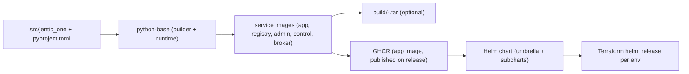

# Build & Deploy

This directory turns the source tree into runnable artifacts: Docker images,
Helm charts, and Terraform modules that install the charts. Three design
rules shape everything here:

- One Python package (`src/jentic_one/`) produces every image; the surface
  set is chosen at **runtime** via `JENTIC__APPS`, not at build time. The
  process shapes this enables (combined / parts / broker-scaled) are mapped
  in [`docs/architecture/composition-and-processes.md`](../docs/architecture/composition-and-processes.md#deployment-topologies).
- A single source of version truth (`pyproject.toml`) flows through Make,
  Docker, and Helm.
- Adding a new deployable is a localized change: a new Dockerfile, a new
  subchart, one line in `Makefile`'s `SERVICES`.

**Looking to install, not build?** The install guides live under
[`docs/installation/`](../docs/installation/README.md) — Docker,
docker-compose, systemd, Helm, AWS Marketplace. This page is the build
architecture; [`helm/README.md`](helm/README.md) is the chart + local-cluster
workflow (including the smoke tests CI runs).

## Layout

```
deploy/
├── docker/                          # One Dockerfile per deployable
│   ├── python-base.Dockerfile       # Shared multi-stage base (wheel build + runtime)
│   ├── app.Dockerfile               # Combined image, single-arch local build
│   ├── app.multiarch.Dockerfile     # Self-contained amd64+arm64 app image — the release/buildx path
│   ├── registry.Dockerfile          # Registry surface only
│   ├── admin.Dockerfile             # Admin surface only
│   ├── control.Dockerfile           # Control surface only
│   ├── broker.Dockerfile            # Broker surface only
│   ├── postgres-mirror.Dockerfile   # AWS Marketplace mirror of the official postgres image
│   └── nginx/parts-gateway.conf     # Gateway config for the parts topology
├── helm/
│   ├── README.md                    # Chart docs + local kind cluster / smoke workflow
│   ├── jentic-one/                  # Umbrella Helm chart
│   │   ├── Chart.yaml               # appVersion = pyproject version
│   │   ├── values.yaml              # Per-service `enabled` toggles + observability
│   │   ├── templates/               # Release-scoped resources (app-secrets, migrate job, …)
│   │   └── charts/
│   │       ├── common/              # Library chart (template helpers only)
│   │       ├── app/                 # Combined-app subchart
│   │       ├── broker/              # Broker subchart
│   │       ├── registry/            # Registry subchart
│   │       ├── admin/               # Admin subchart
│   │       ├── control/             # Control subchart
│   │       ├── gateway/             # Nginx gateway for the parts topology
│   │       └── postgresql/          # Bundled dev/trial database
│   ├── observability/               # Standalone LGTM stack (Grafana/Loki/Tempo/Prom + OTel collector)
│   └── values/                      # Per-mode + per-overlay value files
│       ├── local-combined.yaml      # Mode: combined app + broker + Postgres
│       ├── local-parts.yaml         # Mode: registry + admin + control + broker
│       ├── local-broker.yaml        # Mode: broker only
│       ├── local-otel-app.yaml      # Overlay: wire app sidecars to obs stack
│       ├── local-prom-app.yaml      # Overlay: Prometheus scrape annotations
│       ├── local-observability.yaml # Overlay: tune obs stack for kind
│       └── aws-marketplace.yaml     # Overlay: the Marketplace listing's defaults
├── k8s/kind-config.yaml             # Local kind cluster (host-port mappings)
├── mcp-daemon/                      # Socket-activated `jentic mcp --http` units — see its README
└── terraform/
    ├── modules/service/             # Generic wrapper around helm_release
    └── envs/{dev,prod}/             # Compose the modules per env (values are placeholders)
```

The same shape applies to anything new: one folder under each of `docker/`,
`helm/jentic-one/charts/`, and a Terraform call per env.

## How a build flows


```mermaid
flowchart LR
    src["src/jentic_one + pyproject.toml"] --> base["python-base (builder + runtime)"]
    base --> images["service images (app, registry, admin, control, broker)"]
    images --> tar["build/<svc>-<ver>.tar (optional)"]
    images --> registry["GHCR (app image, published on release)"]
    registry --> chart["Helm chart (umbrella + subcharts)"]
    chart --> tf["Terraform helm_release per env"]
```

1. **Wheel** — `python-base.Dockerfile`'s `builder` stage runs `uv build
   --wheel` inside the container; the `runtime` stage installs that wheel
   into a minimal image. The wheel is never published on its own — the
   container image is the only supported backend distribution.
2. **Service images** — each `<svc>.Dockerfile` extends `python-base` and
   sets `JENTIC__APPS`. Same wheel everywhere; only the env differs.
3. **Tarballs** — `make save-<svc>` writes `build/<svc>-<ver>.tar` for
   offline transfer or air-gapped loading.
4. **Helm chart** — an umbrella chart with one subchart per service;
   `values.yaml` toggles `<svc>.enabled`, image tags default to
   `Chart.appVersion`.
5. **Terraform** — `modules/service/` wraps `helm_release` for a single
   subchart; per-env roots under `envs/<env>/main.tf` pick the services.

## One image, runtime surfaces

There is a single application image. The surface set is chosen at runtime
via `JENTIC__APPS` (comma-separated):

| Role       | `JENTIC__APPS`                | Notes |
| ---------- | ----------------------------- | ----- |
| **app**    | `registry,admin,control,auth` | The UI + control/admin/registry/auth APIs. The image default. |
| **broker** | `broker`                      | The runtime execution edge. **Must run as the sole surface** — the entrypoint refuses to bundle it with others. |

So every deployment is **two containers from the same image**: one `app`
and one `broker` (`JENTIC__APPS=broker`). Each surface opens only the
database connections it needs; the surface/DB dependency map is
`SURFACE_DB_DEPS` in [`src/jentic_one/__main__.py`](../src/jentic_one/__main__.py).

## The published image

Each release publishes the `app` image to GHCR
([`release.yml`](../.github/workflows/release.yml) `publish-image`):

```bash
docker pull ghcr.io/jentic/jentic-one-app:latest   # floating: newest stable release
docker pull ghcr.io/jentic/jentic-one-app:1.2.3    # a specific release
```

Tag semantics:

- **Only a `@sha256:` digest is a true pin** — every tag, including
  `:1.2.3`, could in principle be re-pushed. For production, pin the digest
  the release run printed (the `publish-image` job echoes
  `Image digest: sha256:…`; it's also on the GHCR package page).
- `:latest` moves only on stable `vX.Y.Z` releases; prereleases (e.g.
  `v1.2.3-rc.1`) publish their own version tag and never touch `:latest`.

The surface images (`registry`/`admin`/`control`/`broker`) build locally
only (`make build-<svc>`); the published `app` image covers both roles via
`JENTIC__APPS`.

### Verify the signature

Every published image is cosign-signed (keyless, the release workflow's OIDC
identity) and carries an SPDX SBOM attestation:

```bash
cosign verify \
  --certificate-identity-regexp '^https://github\.com/jentic/jentic-one/\.github/workflows/release\.yml@refs/tags/v.*$' \
  --certificate-oidc-issuer https://token.actions.githubusercontent.com \
  ghcr.io/jentic/jentic-one-app@sha256:<digest>

# and inspect the attached SBOM attestation:
cosign verify-attestation --type spdxjson \
  --certificate-identity-regexp '^https://github\.com/jentic/jentic-one/\.github/workflows/release\.yml@refs/tags/v.*$' \
  --certificate-oidc-issuer https://token.actions.githubusercontent.com \
  ghcr.io/jentic/jentic-one-app@sha256:<digest>
```

### Multi-arch

The published image is a multi-arch OCI index (`linux/amd64` +
`linux/arm64`), built from the self-contained
[`app.multiarch.Dockerfile`](docker/app.multiarch.Dockerfile) with `docker
buildx`. Local `make build-<svc>` images are single-arch (your machine's
platform). To publish a multi-arch image from your own fork/registry:

```bash
docker login ghcr.io                              # or your registry
make release-image REGISTRY=ghcr.io/<your-org>    # buildx: amd64 + arm64 index
```

It pushes to `<REGISTRY>/jentic-one-app` tagged with the pyproject version
and the short git SHA; `latest` moves only when the version is a stable
`X.Y.Z` (same guard as CI). Requires a buildx builder
(`docker buildx create --use`) and QEMU for the non-native arch leg.

## Version source of truth

```
pyproject.toml [project].version
        │
        ├── scripts/version.sh ──> Makefile (VERSION) ──> docker tag
        │
        └── deploy/helm/jentic-one/Chart.yaml (appVersion) ──> chart image tag default
```

`scripts/version.sh` reads `[project].version` from `pyproject.toml`; Make
uses it for the image tag. The Helm chart's `appVersion` is bumped in
lockstep by release-please (its Release PR touches `pyproject.toml`,
`uv.lock`, and every `Chart.yaml` together — see
[`docs/development/releasing.md`](../docs/development/releasing.md)), and
acts as the default image tag for every subchart.

## Reproducibility: base image digest pins

`docker/python-base.Dockerfile` pins `python:3.12-slim`, `node:22-slim`
**and** `ubuntu:24.04` to sha256 digests, so a build today and a build in
six months produce the same base layers. The runtime stage is Ubuntu rather
than Debian-based `python:3.12-slim`: AWS Marketplace's scanner blocks on
NVD-critical CVEs that Debian marks won't-fix, while Ubuntu backports the
fixes (see the Dockerfile header). The builder/UI stages never ship, so
they stay on the official images.

To bump a base image (e.g. for a CVE patch):

```bash
docker pull ubuntu:24.04              # or python:3.12-slim / node:22-slim
docker buildx imagetools inspect ubuntu:24.04
# copy the resulting sha256:... into the matching ARG in python-base.Dockerfile
```

`uv` is pinned to a major.minor (`ghcr.io/astral-sh/uv:0.7`); pin further to
a digest if you need to.

## .dockerignore

`.dockerignore` at the repo root keeps the build fast (only
`pyproject.toml`, `uv.lock`, `README.md`, `src/`, and `openapi/` reach the
Docker daemon as context) and safe (`.env*`, `config/production.yaml`, and
any `jentic-one.yaml` are excluded so they can never leak into a build cache
layer). If you add a new top-level folder that should not be inside images,
add it to `.dockerignore` immediately.

## Make targets

| Target                  | What it does                                                             |
| ----------------------- | ------------------------------------------------------------------------ |
| `make build-base`       | Build the shared `python-base:latest` image                              |
| `make build-<svc>`      | Build `jentic-one/<svc>:<VERSION>` (and `:<GIT_SHA>`); auto-builds base  |
| `make build-all`        | Build base + every service in `SERVICES`                                 |
| `make save-<svc>`       | `docker save` `<svc>` into `build/jentic-<svc>-<VERSION>.tar` (load elsewhere with `docker load -i`) |
| `make save-all`         | Run `save-<svc>` for every service                                       |
| `make push-<svc>`       | Push `<svc>` image with both tags (single-arch; registry must be configured) |
| `make release-image`    | Build + push the multi-arch `app` image to `REGISTRY` (see Multi-arch)   |
| `make images`           | List all locally-built `jentic-one/*` images                             |
| `make clean`            | Remove caches, `dist/`, and `build/`                                     |

`SERVICES` is defined at the top of `Makefile`; `build/` is gitignored and
dockerignored, so tarballs never end up in git or in an image build context.

## Adding a new service

The recipe is the same whether it's a Python service, a Go service, or a
static UI bundle — only the Dockerfile differs:

1. Create `deploy/docker/<name>.Dockerfile`. For a Python service, copy
   `app.Dockerfile` and change `JENTIC__APPS`.
2. Append `<name>` to `SERVICES` in `Makefile`.
3. Create `deploy/helm/jentic-one/charts/<name>/` (copy an existing
   subchart); adjust `values.yaml` and the `Deployment` env vars.
4. Add the subchart to the umbrella `Chart.yaml` `dependencies:` with a
   `condition: <name>.enabled` toggle, and a default
   `<name>: { enabled: false, image: { … } }` block to the umbrella
   `values.yaml`.
5. Add a `module "<name>"` block in each Terraform env that should run it.

No core code or shared template needs to change.

## Where the rest lives

| Topic | Where |
| ----- | ----- |
| Installing (Docker, compose, systemd, Helm, Windows) | [`docs/installation/`](../docs/installation/README.md) |
| Chart docs, local kind cluster, smoke tests, observability stack | [`helm/README.md`](helm/README.md) |
| Kubernetes secrets (generated vs your own) | [`docs/installation/helm.md`](../docs/installation/helm.md#secrets) |
| Day-2 operations (monitoring, backups, upgrades) | [`docs/operations/`](../docs/operations/README.md) |
| AWS Marketplace publishing (seller/maintainer) | [`docs/development/marketplace-publishing.md`](../docs/development/marketplace-publishing.md) |
| The isolated MCP daemon units | [`mcp-daemon/README.md`](mcp-daemon/README.md) |
