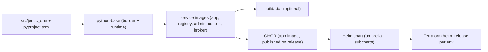

# Build & Deploy

This directory holds everything needed to turn the source tree into runnable
artifacts: Docker images, a Python wheel, Helm charts, and Terraform modules
that install the charts. The whole thing is designed so that:

- One Python package (`src/jentic_one/`) produces many images by changing
  only `JENTIC__APPS` and the entrypoint.
- A single source of version truth (`pyproject.toml`) flows through Make,
  Docker, and Helm.
- Adding a new deployable (or replacing one — e.g. swapping broker from
  Python to Go) is a localized change: a new Dockerfile, a new subchart, one
  line in `Makefile`'s `SERVICES`. Nothing else needs to move.

## Layout

```
deploy/
├── docker/                          # One Dockerfile per deployable
│   ├── python-base.Dockerfile       # Shared multi-stage base (wheel build + runtime)
│   ├── app.Dockerfile               # Combined image (registry+admin+control+auth), single-arch local build
│   ├── app.multiarch.Dockerfile     # Self-contained multi-arch (amd64+arm64) app image — the release/buildx path
│   ├── registry.Dockerfile          # Registry surface only
│   ├── admin.Dockerfile             # Admin surface only
│   ├── control.Dockerfile           # Control surface only
│   └── broker.Dockerfile            # Broker (Python today; swap when Go)
├── helm/
│   ├── jentic-one/                  # Umbrella Helm chart (apps)
│   │   ├── Chart.yaml               # appVersion = pyproject version
│   │   ├── values.yaml              # Per-service `enabled` toggles + observability
│   │   └── charts/
│   │       ├── common/              # Library chart (template helpers only)
│   │       ├── app/                 # Combined-app subchart
│   │       ├── broker/              # Broker subchart
│   │       ├── registry/            # Registry subchart
│   │       ├── admin/               # Admin subchart
│   │       └── control/             # Control subchart
│   ├── observability/               # Standalone LGTM stack (Grafana/Loki/Tempo/Prom + OTel collector)
│   └── values/                      # Per-mode + per-overlay value files
│       ├── local-combined.yaml      # Mode: combined app + broker + Postgres
│       ├── local-parts.yaml         # Mode: registry + admin + control + broker
│       ├── local-broker.yaml        # Mode: broker only
│       ├── local-otel-app.yaml      # Overlay: wire app sidecars to obs stack
│       └── local-observability.yaml # Overlay: tune obs stack for kind
└── terraform/
    ├── modules/service/             # Generic wrapper around helm_release
    └── envs/
        ├── dev/                     # Composes the modules for dev
        └── prod/                    # Composes the modules for prod
```

The same shape applies to anything new (a future UI, a future Go broker):
one folder under each of `docker/`, `helm/jentic-one/charts/`, and a Terraform
call per env.

## How a build flows


```mermaid
flowchart LR
    src["src/jentic_one + pyproject.toml"] --> base["python-base (builder + runtime)"]
    base --> images["service images (app, registry, admin, control, broker)"]
    images --> tar["build/<svc>-<ver>.tar (optional)"]
    images --> registry["GHCR (app image, published on release)"]
    registry --> chart["Helm chart (umbrella + subcharts)"]
    chart --> tf["Terraform helm_release per env"]
```

1. **Wheel** — `python-base.Dockerfile`'s `builder` stage runs `uv build --wheel`
   inside the container, producing `jentic_one-<ver>-py3-none-any.whl`. The
   `runtime` stage then `pip install`s that wheel into a minimal Python image.
2. **Service images** — each `<svc>.Dockerfile` is a one-liner that extends
   `python-base` and sets `JENTIC__APPS` (e.g. `app` enables all four default
   surfaces — registry, admin, control, auth — while `registry` enables only
   the registry). Same wheel everywhere; only the env differs.
3. **Tarballs** — `make save-<svc>` writes the image out to
   `build/<svc>-<ver>.tar` for offline transfer or air-gapped loading.
4. **Helm chart** — `deploy/helm/jentic-one/` is an umbrella chart with one
   subchart per service. `values.yaml` toggles `<svc>.enabled` per service;
   image tags default to `Chart.appVersion` (which mirrors the pyproject
   version).
5. **Terraform** — `modules/service/` wraps `helm_release` for a single
   subchart. Per-env roots under `envs/<env>/main.tf` decide which services
   are turned on for that environment.

## Self-hosted: containers + external Postgres

This is the "no Kubernetes" topology: run the published container image on a
VM (or any container host) against a **managed/external PostgreSQL**, injecting
secrets from your own secrets manager. It's the smallest real deployment that
is still production-shaped.

> **The container image is the only supported backend distribution.** There is
> no `pip install jentic-one`: the Python wheel is built in CI purely as a
> packaging test (that the UI bundle force-includes correctly) and is never
> published. Consume `ghcr.io/jentic/jentic-one-app` (pinned to a digest for
> prod — see below), or build it locally from a checkout.

> **Public Beta.** The same caveat as the repo front page applies: we don't
> recommend production use yet. "Production-shaped" here means the topology
> and secret handling are the real thing — not that the product is done.
> Also note a self-hosted instance serves the HTTP APIs + UI; the hosted MCP
> endpoint is a cloud-tier feature — see
> [`docs/cloud-vs-self-hosted.md`](../docs/cloud-vs-self-hosted.md).

### The one-image, two-surfaces model

There is a single application image — the published `app` image (or a locally
built `jentic-one/app`). **The surface set is chosen at runtime**, not at build
time, via the `JENTIC__APPS` environment variable:

| Role         | `JENTIC__APPS`                     | Notes                                   |
| ------------ | ---------------------------------- | --------------------------------------- |
| **app**      | `registry,admin,control,auth`      | The UI + control/admin/registry/auth APIs. This is the image default. |
| **broker**   | `broker`                           | The runtime execution edge. **Must run as the sole surface.** |

The broker **must be the only surface in its process** — the entry point
(`src/jentic_one/__main__.py`) raises `broker must run as the sole surface; do
not bundle it with others` if `broker` is listed alongside anything else. So a
self-hosted deployment is **two containers from the same image**: one `app`
(default `JENTIC__APPS`) and one `broker` (`JENTIC__APPS=broker`).

`JENTIC__APPS` accepts a comma-separated string; each surface only opens the
database connections it needs (`auth` also reads the `admin` and `control`
DBs; `broker` reads `admin`, `control`, and `registry`; standalone `control`
and `registry` read `admin` to verify callers). The surface/DB dependency map
lives in `SURFACE_DB_DEPS` in `src/jentic_one/__main__.py`.

### Pull the image

Once a release is cut, the `app` image is published to GHCR by the
`publish-image` job in [`release.yml`](../.github/workflows/release.yml):

```bash
docker pull ghcr.io/jentic/jentic-one-app:latest      # floating: tracks the newest stable release
docker pull ghcr.io/jentic/jentic-one-app:1.2.3       # a specific release (tags can still be re-pushed)
```

Note that **only a `@sha256:` digest is a true pin** — every tag, including
the version tag `:1.2.3`, is floating and could in principle be re-pushed. For
production, pin to the digest the release run printed (the `publish-image` job
echoes `Image digest: sha256:…`, and it's shown on the GHCR package page):

```bash
docker pull ghcr.io/jentic/jentic-one-app@sha256:<digest-from-the-release>
```

`:latest` only moves on stable releases (a `vX.Y.Z` git tag exactly, published
as image tag `X.Y.Z`) — prerelease tags (e.g. `v1.2.3-rc.1`) publish their own
version tag but never touch `:latest`.

If `docker pull` returns `denied`, the GHCR package may not have been made
public yet (it starts private on first publish — see the first-release
checklist in [`docs/releasing.md`](../docs/releasing.md)); open an issue if
you hit this.

### Verify the image signature

Every published image is signed with cosign (keyless, via the release
workflow's OIDC identity) and carries an SPDX SBOM attestation — the same
supply-chain treatment as the CLI binaries. To verify you're running the
image CI built:

```bash
cosign verify \
  --certificate-identity-regexp '^https://github\.com/jentic/jentic-one/\.github/workflows/release\.yml@refs/tags/v.*$' \
  --certificate-oidc-issuer https://token.actions.githubusercontent.com \
  ghcr.io/jentic/jentic-one-app@sha256:<digest>

# and inspect the attached SBOM attestation:
cosign verify-attestation --type spdxjson \
  --certificate-identity-regexp '^https://github\.com/jentic/jentic-one/\.github/workflows/release\.yml@refs/tags/v.*$' \
  --certificate-oidc-issuer https://token.actions.githubusercontent.com \
  ghcr.io/jentic/jentic-one-app@sha256:<digest>
```

To publish from your own fork/registry instead:

```bash
docker login ghcr.io                                   # or your registry
make release-image REGISTRY=ghcr.io/<your-org>         # builds + pushes app image
```

`make release-image` builds `deploy/docker/app.multiarch.Dockerfile` for
`linux/amd64` + `linux/arm64` with `docker buildx` and pushes the multi-arch
OCI index to `<REGISTRY>/jentic-one-app` tagged with the pyproject version and
the short git SHA; `latest` only moves when the version is a stable `X.Y.Z`
(same guard as CI). Requires a buildx builder (`docker buildx create --use`)
and QEMU for the non-native arch leg.

### The three databases (one instance, three schemas)

The app uses **three logical databases** — `registry`, `control`, and `admin`.
In every shipped Postgres config they are three **schemas inside a single
PostgreSQL database** (isolated by `schema_name`), each with its own connection
settings (the local-dev SQLite config ships them as three files instead).
You can equally point each at a different host/database if you prefer stronger
isolation; the config shape is identical.

Environment variables follow the `JENTIC__<SECTION>__<KEY>` convention (double
underscore for nesting):

| Setting                     | Env var                                        | Default     |
| --------------------------- | ---------------------------------------------- | ----------- |
| Registry DB host            | `JENTIC__DATABASES__REGISTRY__HOST`            | `localhost` |
| Registry DB name            | `JENTIC__DATABASES__REGISTRY__NAME`            | (required)  |
| Registry DB user            | `JENTIC__DATABASES__REGISTRY__USER`            | `postgres`  |
| Registry DB password        | `JENTIC__DATABASES__REGISTRY__PASSWORD`        | `""`        |
| Registry DB schema          | `JENTIC__DATABASES__REGISTRY__SCHEMA_NAME`     | `public`    |
| …same for `CONTROL` / `ADMIN` | `JENTIC__DATABASES__CONTROL__…` / `…ADMIN__…` |             |

`PORT`, `POOL_MAX`, and `BACKEND` (defaults `5432` / `10` / `postgres`) are
available on each DB the same way.

### Mandatory vs optional secrets

When `JENTIC_ENV=production`, the config loader **refuses to boot** with the
shipped placeholder values for these — they must be set explicitly:

| Secret                          | Env var                                             | Why it's mandatory |
| ------------------------------- | --------------------------------------------------- | ------------------ |
| Admin JWT signing secret        | `JENTIC__ADMIN__AUTH__JWT_SECRET`                   | Signs admin/session JWTs. Boot fails on the placeholder **or an empty value** in prod. |
| Admin invite pepper             | `JENTIC__ADMIN__INVITE__PEPPER`                     | Peppers invite-token hashes. Boot fails on the placeholder **or an empty value** in prod. |
| Connect-flow state secret       | `JENTIC__CREDENTIALS__CONNECT__STATE_SECRET`        | Signs the OAuth connect `state`. Boot fails on the placeholder in prod (an empty value is **not** caught — don't set it blank). |

**Effectively mandatory** (not enforced at boot, but the feature 500s without it):

| Secret                          | Where                                               | Why |
| ------------------------------- | --------------------------------------------------- | --- |
| Credential encryption keyset    | `credentials.encryption` (`active_id` + `entries`)  | AES-256-GCM envelope key for credential-at-rest. Credential **writes** fail without a non-empty keyset. Set via YAML (a list of `{id, material}`), not a single env var. On Kubernetes the chart can manage it — see [Generated application secrets on Kubernetes](#generated-application-secrets-on-kubernetes). |
| Database passwords              | `JENTIC__DATABASES__<DB>__PASSWORD`                 | Needed to connect to a real Postgres. |

Generate a fresh secret / encryption key material with:

```bash
python -c "import os,base64;print(base64.b64encode(os.urandom(32)).decode())"
```

**Optional** (sensible defaults, override only if needed): everything else —
`JENTIC__SERVER__PORT`, observability exporters, rate-limit/circuit-breaker
knobs, `auth.canonical_base_url` (set this to your public URL so issued
OAuth/OIDC token `iss`/`aud` are correct), OTel endpoints, telemetry (off by
default).

### A worked production `config.yaml`

Non-secret shape lives in the file; **secrets come from the environment**
(never commit them). This is the minimal file to boot `app` + `broker` against
an external Postgres. Save it on the host as `/etc/jentic/production.yaml` —
that's the path every command below mounts and points `JENTIC_CONFIG_FILE` at.
(The shipped starting point is
[`config/production.yaml.example`](../config/production.yaml.example).)

```yaml
# /etc/jentic/production.yaml — non-secret shape; secrets via env (JENTIC__…).
# Point all three DBs at your managed Postgres (host/name/user set here or via
# env). Passwords MUST come from the environment, not this file.
databases:
  registry:
    host: db.prod.internal
    port: 5432
    name: jentic
    user: registry_user
    schema_name: registry
    pool_max: 20
  control:
    host: db.prod.internal
    port: 5432
    name: jentic
    user: control_user
    schema_name: control
    pool_max: 15
  admin:
    host: db.prod.internal
    port: 5432
    name: jentic
    user: admin_user
    schema_name: admin
    pool_max: 10

server:
  host: "0.0.0.0"
  port: 8000

# Set this to the app's public base URL so issued OAuth/OIDC token iss/aud and
# connect redirect URIs are correct.
auth:
  canonical_base_url: "https://jentic.example.com"

# Credential-at-rest encryption keyset (AES-256-GCM). Required for credential
# WRITES. Generate material with the python one-liner above. The keyset is a
# LIST, so it can't come from a single JENTIC__… env var — keep it in this file
# and mount the file itself as a secret (this file then holds real key material,
# so treat the whole file as sensitive and never commit it).
credentials:
  encryption:
    active_id: v1
    entries:
      - id: v1
        material: "REPLACE-WITH-BASE64-32-BYTES"   # pragma: allowlist secret

# Keep exporters off until you run a collector. With `otlp` and no
# OTEL_EXPORTER_OTLP_ENDPOINT set, the SDK dials localhost:4317 INSIDE the
# container (nothing listens there) and logs an export failure every interval.
# When you have a collector: set both exporters to `otlp` and pass
# OTEL_EXPORTER_OTLP_ENDPOINT=http://collector:4317 to both containers.
observability:
  metrics:
    exporter: none     # or "otlp" / "prometheus"
  tracing:
    exporter: none     # or "otlp"
```

**Connection-pool sizing:** each process caps at `pool_max` + 10 overflow per
DB, and **both** the app and broker containers open all three pools — so this
example can reach (30+25+20) × 2 ≈ **190 server connections** worst-case.
Size against your instance's `max_connections` (managed-PG entry tiers are
often ~100) or front Postgres with a pooler like pgbouncer.

The mandatory secrets are supplied out-of-band, e.g. from a `.env` / secrets
manager. Save this on the host as `prod.env` (the bootstrap commands below
reference it), and keep it out of git with `chmod 600`:

```bash
JENTIC_ENV=production
JENTIC_CONFIG_FILE=/etc/jentic/production.yaml

JENTIC__DATABASES__REGISTRY__PASSWORD=…
JENTIC__DATABASES__CONTROL__PASSWORD=…
JENTIC__DATABASES__ADMIN__PASSWORD=…

JENTIC__ADMIN__AUTH__JWT_SECRET=…
JENTIC__ADMIN__INVITE__PEPPER=…
JENTIC__CREDENTIALS__CONNECT__STATE_SECRET=…
```

Note `docker --env-file` takes values literally — don't quote them (quotes
become part of the value).

(Kubernetes deployments inject the same secrets differently — see
[Production secrets](#production-secrets) below.)

### Bootstrap sequence (roles + schemas → migrations → admin)

The container runs migrations and creates the first admin via the same packaged
code that serves requests — no extra tooling. All the examples pin the image by
digest (only true pin — "Pull the image" above) via a shell variable:

```bash
IMAGE="ghcr.io/jentic/jentic-one-app@sha256:<digest-from-the-release>"
```

**1. Create the roles and schemas** (once, on your Postgres — the database
itself, `jentic` in the worked config, must already exist). The migration
runner applies tables *into* these schemas but creates neither the schemas nor
the login roles, and a role without `CREATE` on its schema fails the very
first migration with `permission denied`. This mirrors the repo's own
[`docker/local-setup/init-schemas.sql`](../docker/local-setup/init-schemas.sql):

```sql
CREATE SCHEMA IF NOT EXISTS registry;
CREATE SCHEMA IF NOT EXISTS control;
CREATE SCHEMA IF NOT EXISTS admin;

-- Per-surface login roles (use real passwords — these must match the
-- JENTIC__DATABASES__<DB>__PASSWORD values in prod.env).
CREATE ROLE registry_user LOGIN PASSWORD '…';
CREATE ROLE control_user LOGIN PASSWORD '…';
CREATE ROLE admin_user LOGIN PASSWORD '…';

-- Each role needs USAGE + CREATE on its schema (Alembic creates tables there).
GRANT USAGE, CREATE ON SCHEMA registry TO registry_user;
GRANT USAGE, CREATE ON SCHEMA control TO control_user;
GRANT USAGE, CREATE ON SCHEMA admin TO admin_user;
```

(Simpler variant: run everything as one owning login and set the same
`user` for all three DBs in the config — the per-surface roles above are the
least-privilege version.)

**2. Run migrations** — the entrypoint is `python -m jentic_one.migrations.run`
(migrates all three DBs in dependency order; reads the same `JENTIC__…` config):

```bash
docker run --rm --env-file prod.env \
  -v /etc/jentic:/etc/jentic:ro \
  "$IMAGE" \
  python -m jentic_one.migrations.run
```

**3. Create the first admin** (one-time first-run setup). The `create-admin`
subcommand prompts for the password (minimum 12 characters), or reads it from
stdin when non-interactive:

```bash
read -rs ADMIN_PASSWORD   # or fetch from your secrets manager
printf '%s\n' "$ADMIN_PASSWORD" | docker run --rm -i --env-file prod.env \
  -v /etc/jentic:/etc/jentic:ro \
  "$IMAGE" \
  python -m jentic_one create-admin --email admin@example.com
```

It exits non-zero and prints `setup already complete` if an admin already
exists, so re-running is safe.

### Running app + broker

Both are the same image; only `JENTIC__APPS` and the exposed port differ. The
container listens on `8000` (`server.port`).

```bash
# app: default surfaces (registry,admin,control,auth) — serves the UI + APIs.
docker run -d --name jentic-app --env-file prod.env \
  -v /etc/jentic:/etc/jentic:ro -p 127.0.0.1:8000:8000 \
  "$IMAGE"

# broker: sole surface (the runtime execution edge).
docker run -d --name jentic-broker --env-file prod.env \
  -e JENTIC__APPS=broker \
  -v /etc/jentic:/etc/jentic:ro -p 127.0.0.1:8080:8000 \
  "$IMAGE"
```

Each surface exposes `GET /health`. Both surfaces speak plain HTTP — the
loopback binds above keep them off the network until a TLS-terminating
reverse proxy / load balancer fronts them: route the public UI +
control/admin/registry/auth traffic to the `app` container and the execution
traffic to the `broker` container.

### docker-compose example

A single file to bring up migrations, the first-admin bootstrap, and the two
long-running services against an **external** Postgres (no bundled DB — point
`JENTIC__DATABASES__*__HOST` at your managed instance). Save the worked config
as `./production.yaml` and the env block as `.env`, both next to the compose
file:

```yaml
# docker-compose.yaml — app + broker against an EXTERNAL Postgres.
# `migrate` is a one-shot init service; `app` and `broker` wait for it to
# complete before starting. The first admin is created afterwards with a
# one-off `docker compose run` (see below).
#
# The digest pin is the reproducibility contract: replace it with the digest
# echoed by the release you are deploying ("Pull the image" above). A floating
# tag here would let a re-pushed tag change your deployment underneath you.
#
# Ports bind to 127.0.0.1: both surfaces speak plain HTTP, so expose them via
# a TLS-terminating reverse proxy (or your ingress) — never directly.
#
# The healthcheck uses python (the image has no curl); it makes
# `docker compose ps` a real health signal, e.g. a crash-looping broker.
x-image: &image ghcr.io/jentic/jentic-one-app@sha256:<digest-from-the-release>
x-healthcheck: &healthcheck
  test: ["CMD", "python", "-c", "import urllib.request; urllib.request.urlopen('http://127.0.0.1:8000/health', timeout=3)"]
  interval: 30s
  timeout: 5s
  retries: 3
  start_period: 15s
x-common: &common
  image: *image
  env_file: [.env]                 # JENTIC_ENV, DB passwords, the three secrets
  volumes:
    - ./production.yaml:/etc/jentic/production.yaml:ro
  environment:
    JENTIC_CONFIG_FILE: /etc/jentic/production.yaml

services:
  migrate:
    <<: *common
    command: ["python", "-m", "jentic_one.migrations.run"]
    restart: "no"

  app:
    <<: *common
    depends_on:
      migrate: { condition: service_completed_successfully }
    ports: ["127.0.0.1:8000:8000"]
    restart: unless-stopped
    healthcheck: *healthcheck

  broker:
    <<: *common
    depends_on:
      migrate: { condition: service_completed_successfully }
    # YAML merge replaces the whole `environment` map, so JENTIC_CONFIG_FILE
    # must be re-declared alongside the broker-specific JENTIC__APPS.
    environment:
      JENTIC_CONFIG_FILE: /etc/jentic/production.yaml
      JENTIC__APPS: broker
    ports: ["127.0.0.1:8080:8000"]
    restart: unless-stopped
    healthcheck: *healthcheck
```

Create the roles and schemas on your Postgres first (see above), then:

```bash
docker compose up -d migrate                 # runs migrations, then exits 0
docker compose logs migrate                  # `up -d` detaches — check it succeeded
read -rs ADMIN_PASSWORD
printf '%s\n' "$ADMIN_PASSWORD" | docker compose run --rm -T app \
  python -m jentic_one create-admin --email admin@example.com
docker compose up -d app broker              # start the long-running services
curl -fsS http://localhost:8000/health       # app
curl -fsS http://localhost:8080/health       # broker
```

### Upgrading (and rolling back)

When the next release is cut:

1. Take the new digest from that release's `publish-image` job output (or the
   GHCR package page) and re-run the `cosign verify` command above against it.
2. Edit the `x-image` digest in the compose file.
3. `docker compose up -d` — compose recreates `migrate` first (its config
   changed), re-runs the pending migrations, and only recreates `app`/`broker`
   once it exits 0. **If migrate fails, `up` aborts and the old containers
   keep running the old release** — fix, then re-run.

Rollback contract: migrations are applied forward. Rolling the image back
without downgrading the schema means old code on a newer schema — prefer
rolling forward to a fixed release. (A schema downgrade path exists —
`python -m jentic_one.migrations.run --direction down` — but treat it as a
break-glass tool, not the routine rollback.)

## Version source of truth

```
pyproject.toml [project].version
        │
        ├── scripts/version.sh ──> Makefile (VERSION) ──> docker tag
        │
        └── deploy/helm/jentic-one/Chart.yaml (appVersion) ──> chart image tag default
```

`scripts/version.sh` is a tiny shell that reads `[project].version` from
`pyproject.toml`. Make uses it for the image tag (`$(VERSION)`); the Helm
chart's `appVersion` should be kept in sync (manually for now) and acts as
the default image tag for every subchart so a freshly-installed chart pulls
the matching image automatically.

To bump the release:

1. Edit `[project].version` in `pyproject.toml`.
2. Edit `appVersion` in `deploy/helm/jentic-one/Chart.yaml` to match.
3. `make build-all` (rebuilds images with the new tag).
4. `make save-all` if you need offline tarballs.

## Reproducibility: the digest pin

`deploy/docker/python-base.Dockerfile` pins `python:3.12-slim`,
`node:22-slim` **and** `ubuntu:24.04` to specific sha256 digests, not just the
floating tags, so a build today and a build in six months produce the same
base layers. The runtime stage is Ubuntu rather than Debian-based
`python:3.12-slim`: AWS Marketplace's scanner blocks on NVD-critical CVEs
that Debian stable marks won't-fix (no-dsa) and therefore never patches,
while Ubuntu backports the fixes — see the Dockerfile header. The
builder/UI stages never ship, so they stay on the official images:

```dockerfile
ARG PYTHON_IMAGE=python:3.12-slim@sha256:...   # builder only
ARG NODE_IMAGE=node:22-slim@sha256:...         # UI build only
ARG UBUNTU_IMAGE=ubuntu:24.04@sha256:...       # the runtime base that ships
FROM ${PYTHON_IMAGE} AS builder
...
FROM ${UBUNTU_IMAGE} AS runtime
```

To bump any base image (e.g. for a CVE patch):

```bash
docker pull ubuntu:24.04              # or python:3.12-slim / node:22-slim
docker buildx imagetools inspect ubuntu:24.04
# copy the resulting sha256:... into the matching ARG in python-base.Dockerfile
```

`uv` is also pinned to a major.minor (`ghcr.io/astral-sh/uv:0.7`) rather than
`:latest`. Pin further to a digest if you need to.

## .dockerignore

`.dockerignore` at the repo root is what keeps the build *fast* and *safe*:

- **Fast** — without it, the entire repo (including `.git/`, `tests/`,
  `docker/`, `deploy/`, `.venv/`) gets shipped to the Docker daemon as build
  context. With it, only `pyproject.toml`, `uv.lock`, `README.md`, `src/`,
  and `openapi/` make it across.
- **Safe** — `.env*`, `config/production.yaml`, and any `jentic-one.yaml`
  are excluded so they can never leak into a build cache layer.

If you add a new top-level folder that should *not* be inside images, add it
to `.dockerignore` immediately.

## Make targets at a glance

| Target                  | What it does                                                              |
| ----------------------- | ------------------------------------------------------------------------- |
| `make build-wheel`      | Build a Python wheel into `dist/` using uv (no Docker)                    |
| `make build-base`       | Build the shared `python-base:latest` image                               |
| `make build-<svc>`      | Build `jentic-one/<svc>:<VERSION>` (and `:<GIT_SHA>`); auto-builds base   |
| `make build-all`        | Build base + every service in `SERVICES`                                  |
| `make save-<svc>`       | `docker save` `<svc>` into `build/jentic-<svc>-<VERSION>.tar`             |
| `make save-all`         | Run `save-<svc>` for every service                                        |
| `make push-<svc>`       | Push `<svc>` image with both tags (registry must be configured)           |
| `make images`           | List all locally-built `jentic-one/*` images                              |
| `make clean`            | Remove caches, `dist/`, and `build/`                                      |

`SERVICES` is defined at the top of `Makefile`. Adding a service = append
its name there + drop a Dockerfile in `deploy/docker/`.

## Where do builds *go*?

`docker build` doesn't write a file you can `ls`. It registers the image
with your local Docker daemon's image store. To see what was built:

```bash
make images
# or
docker images jentic-one/*
```

To turn an image into a transferable file, use the save targets:

```bash
make save-app           # writes build/jentic-app-0.13.2.tar
make save-all           # writes one tarball per service
```

To load a tarball back on another machine:

```bash
docker load -i build/jentic-app-0.13.2.tar
```

`build/` is gitignored and dockerignored, so tarballs never end up in git or
in a future image build context.

## Adding a new service

The recipe is the same whether it's a Python service, a Go service, or a
static UI bundle. Only the Dockerfile differs.

1. Create `deploy/docker/<name>.Dockerfile`. For a Python service, copy
   `app.Dockerfile` and change `JENTIC__APPS`. For a Go or Node service,
   write whatever multi-stage build is appropriate; nothing else cares.
2. Append `<name>` to `SERVICES` in `Makefile`.
3. Create `deploy/helm/jentic-one/charts/<name>/` (copy an existing
   subchart). Adjust `values.yaml` and the `Deployment` env vars.
4. Add the subchart to the umbrella `Chart.yaml` `dependencies:` list with a
   `condition: <name>.enabled` toggle.
5. Add a default `<name>: { enabled: false, image: { repository: jentic-one/<name>, tag: "" } }`
   block to the umbrella `values.yaml`.
6. Add `module "<name>" { source = "../../modules/service" ... }` blocks in
   each Terraform env that should run it.

That's everything. No core code or shared template needs to change.

## Swapping broker to Go (worked example)

When the time comes to replace the Python broker with a Go binary:

1. Replace `deploy/docker/broker.Dockerfile` with a Go multi-stage build:

   ```dockerfile
   # syntax=docker/dockerfile:1
   FROM golang:1.23 AS builder
   WORKDIR /src
   COPY go.mod go.sum ./
   RUN go mod download
   COPY . .
   RUN CGO_ENABLED=0 go build -o /broker ./cmd/broker

   FROM gcr.io/distroless/static:nonroot
   COPY --from=builder /broker /broker
   USER nonroot:nonroot
   EXPOSE 8000
   ENTRYPOINT ["/broker"]
   ```

2. Done. `make build-broker` still works. The broker subchart still works
   (it only cares about image repo/tag and ports). Terraform still works.
   Versioning still works (broker would either pull from the same root
   `pyproject.toml` for now, or grow its own `components/broker/VERSION` file
   that `scripts/version.sh` learns to read).

This is the "extensibility" the build system is paying for: each
deployable's runtime is an isolated concern.

## Metrics

The application emits metrics via OpenTelemetry's metrics SDK. The exporter
is configurable at deploy time:

| Exporter     | How it works                                        | When to use                              |
| ------------ | --------------------------------------------------- | ---------------------------------------- |
| `otlp`       | Pushes to OTel Collector on localhost:4317 (sidecar) | Production / OTel-based stacks (default) |
| `prometheus` | Exposes `/metrics` endpoint on the service port      | Environments with Prometheus scraping    |
| `none`       | No-op — SDK inactive                                | Tests, CI, local dev without obs stack   |

### Configuration

Set via Helm values (recommended for k8s) or env var (local dev):

```bash
# Helm values (deploy/helm/jentic-one/values.yaml)
global.observability.metrics.exporter: otlp  # default

# Environment variable
JENTIC__OBSERVABILITY__METRICS__EXPORTER=prometheus
```

### Prometheus scrape path

When `exporter=prometheus`, use the overlay:

```bash
make deploy-local MODE=combined
# Then layer the prometheus overlay:
helm upgrade jentic deploy/helm/jentic-one \
  -f deploy/helm/values/local-combined.yaml \
  -f deploy/helm/values/local-prom-app.yaml
```

This sets pod annotations (`prometheus.io/scrape`, `/port`, `/path`) and
the observability chart's Prometheus instance auto-discovers annotated pods.

### Cardinality discipline

- Never use raw request paths as metric labels — use route templates
  (FastAPI instrumentation does this automatically).
- Keep custom label cardinality bounded (e.g. `operation` enum, not
  user-supplied IDs).
- All custom instruments must go through `shared/metrics.py`'s
  `get_meter()` — the architecture test enforces this.

## Observability hooks

Subcharts include built-in support for structured logging and an
OpenTelemetry sidecar; see `common/templates/_logging.tpl` and
`common/templates/_otel-sidecar.tpl`.

- `LOG_FORMAT` (default `json`), `LOG_LEVEL` (default `info`), and
  `OTEL_SERVICE_NAME` (set to `<release>-<chart>`, e.g. `jentic-broker`) are
  injected into every service pod.
- When `global.observability.otel.enabled=true`, each pod gets an OTel
  Collector sidecar receiving OTLP gRPC on `localhost:4317` and exporting to
  the configured endpoint.

For local dev there's a turnkey backend: see [Cluster UI / observability](#cluster-ui--observability)
below for the full Grafana/Loki/Tempo/Prometheus stack and the `OTEL=1`
shortcut that wires app sidecars to it.

To wire to an external collector manually:

```bash
helm install jentic deploy/helm/jentic-one \
  --set global.observability.otel.enabled=true \
  --set global.observability.otel.endpoint=http://otel-collector:4317
```

## Local cluster workflow

A `kind`-based local cluster lets you validate that chart installs work, pods
become Ready, and health endpoints respond — without pushing to a cloud env.

### Prerequisites

- [kind](https://kind.sigs.k8s.io/) (v0.20+)
- [Helm](https://helm.sh/) (v3.12+)
- [kubectl](https://kubernetes.io/docs/tasks/tools/) configured (kind manages
  kubeconfig automatically)
- Docker images built locally (`make build-all`)

### Mode matrix

| Mode       | Values file                         | What runs                                 |
| ---------- | ----------------------------------- | ----------------------------------------- |
| `combined` | `deploy/helm/values/local-combined.yaml` | app (all surfaces) + broker + PostgreSQL |
| `parts`    | `deploy/helm/values/local-parts.yaml`    | registry + admin + control + broker + PostgreSQL |
| `broker`   | `deploy/helm/values/local-broker.yaml`   | broker + PostgreSQL                      |

### Quick start

```bash
make build-all                                          # Build all Docker images
uv run python -m tools.deploy cluster up                # Create local kind cluster
uv run python -m tools.deploy up --mode combined        # Deploy with combined mode
curl http://localhost:8000/health                        # Verify app health
uv run python -m tools.deploy smoke                     # Run smoke test suite
uv run python -m tools.deploy down                      # Remove the release
uv run python -m tools.deploy cluster down              # Destroy the cluster
```

> **Local / remote coexistence.** If you self-host alongside a hosted Jentic
> install (e.g. Jentic Cloud), a client (the `jentic` CLI, an agent, or an MCP
> server) is bound to exactly one backend via its own config — the two have
> independent registries and credentials, so a client pointed at the wrong one
> looks like data loss. Confirm which backend a base URL serves with the
> unauthenticated identity probe `curl http://localhost:8000/instance` (returns
> `backend` = `local` / `remote` — the operator-declared `server.backend`, default
> `local` — plus `canonical_base_url`, `host`, and a telemetry-derived opaque
> `instance_id`, `null` when telemetry is off). To migrate a
> client to this install, point *its* backend base URL at your local
> `canonical_base_url` and re-check `/instance`.
> See [`docs/context-and-config.md`](../docs/context-and-config.md#local--remote-coexistence-which-backend-am-i-talking-to).

Add `--otel` to `up` to wire app OTel sidecars to the observability stack
(requires `obs up` first):

```bash
uv run python -m tools.deploy up --mode combined --otel
```

### Switching modes

```bash
uv run python -m tools.deploy down
uv run python -m tools.deploy up --mode parts           # Redeploy with individual surfaces
```

### Image loading

`deploy-local` only loads the images that the chosen `MODE` actually needs
into the kind cluster, to keep the deploy fast:

| `MODE`     | Images loaded                          |
| ---------- | -------------------------------------- |
| `combined` | `app`, `broker`                        |
| `parts`    | `registry`, `admin`, `control`, `broker` |
| `broker`   | `broker`                               |

The bundled PostgreSQL runs the official `postgres` image pulled from Docker
Hub, so no custom database image needs to be built or loaded.

If you plan to switch modes back-and-forth and want to pre-warm everything
once, run `uv run python -m tools.deploy load --all` after `cluster up` —
that loads all five service images. Subsequent `kind load` calls are no-ops
once the image is already on the node.

### Viewing logs

```bash
uv run python -m tools.deploy logs app       # Tail app pod logs
uv run python -m tools.deploy logs broker    # Tail broker pod logs
```

### Port mappings (kind → localhost)

| Host port | Service      | Kind nodePort |
| --------- | ------------ | ------------- |
| 8000      | app/registry | 30080         |
| 8080      | broker       | 30081         |

### CI integration

The `smoke-helm` CI job runs a matrix of all three modes on every PR, using
`helm/kind-action` to spin up an ephemeral cluster. This catches chart
regressions before merge.

## Cluster UI / observability

Two layers, deployed independently:

### Lightweight: k9s

```bash
brew install k9s
uv run python -m tools.deploy ui                # k9s scoped to the jentic namespace
```

That's a terminal UI — pods, services, logs, exec, port-forward, all
keyboard-driven. Fastest way to see what's happening during `deploy-local`.

### Full LGTM stack: Grafana + Loki + Tempo + Prometheus

A separate Helm chart at [`deploy/helm/observability/`](helm/observability/)
deploys the full set into a `monitoring` namespace, with **two independent
pipelines**:

- **Traces + metrics** — apps emit OTLP from a sidecar to the central
  OpenTelemetry Collector, which fans out to Tempo and Prometheus.
- **Logs** — a Grafana Alloy DaemonSet on each node tails
  `/var/log/pods/...` and pushes JSON-parsed log lines (with `level`,
  `trace_id`, `span_id` extracted) directly to Loki. No app-side change
  required; logs continue going to stdout.

```
app pod ─┐
broker  ─┼─ otel sidecar ──► obs-otelcollector ─┬─► Tempo  (traces)
…        ┘                                      └─► Prometheus (metrics)
                                                            ▼
node /var/log/pods ──► Alloy (DaemonSet) ─────► Loki ─► Grafana (UI)
```

The two lanes are intentionally decoupled: trace/metric pipelines stay in
OTel; log shipping stays in the Grafana log agent. They meet only in
Grafana, which correlates them by `trace_id` (via the Loki datasource's
derived fields).

Subchart deps come from upstream community charts:
`grafana/loki`, `grafana/tempo`, `grafana-community/grafana`,
`prometheus-community/prometheus`, `open-telemetry/opentelemetry-collector`,
`grafana/alloy`.

#### Bring it up

```bash
uv run python -m tools.deploy obs up                        # Install observability release into monitoring/
uv run python -m tools.deploy up --mode combined --otel     # Apps' sidecars now point at obs-otelcollector (traces+metrics)
uv run python -m tools.deploy grafana                       # Port-forward Grafana to localhost:3000 + open browser
```

Logs flow into Loki **regardless of `OTEL=1`** because they come from
Alloy, not the app sidecars.

Default Grafana credentials are `admin` / `admin` (overridable in
[`local-observability.yaml`](helm/values/local-observability.yaml)). The
chart pre-wires three datasources so you can immediately query:

| Datasource | What's there                                                     |
| ---------- | ---------------------------------------------------------------- |
| Prometheus | Service-level metrics (request count, latency, RED via spanmetrics) |
| Loki       | All container stdout in the cluster, JSON-parsed where possible   |
| Tempo      | Distributed traces; `Trace → logs` and `Trace → metrics` links wired |

#### Tear it down

```bash
uv run python -m tools.deploy obs down    # uninstall observability release
```

#### Knobs worth knowing

- **Resource sizing** — defaults in
  [`local-observability.yaml`](helm/values/local-observability.yaml) keep
  the whole stack under ~2 GiB on a single kind node. Persistence is off
  (so logs/traces vanish with the pod).
- **OTel-disabled deploys** — leave `OTEL=` unset and the apps run with
  no sidecar, no overhead. Logs still flow into Loki via Alloy.
- **Adding a new component** — drop it into
  `deploy/helm/observability/Chart.yaml` as another subchart; it's a normal
  Helm umbrella, not a custom abstraction.

#### Production note

This stack is for **local dev / smoke**. For production, run the same
charts against persistent storage (e.g. S3 for Tempo/Loki), behind real
auth (OIDC for Grafana), and consider the kube-prometheus-stack chart in
place of plain `prometheus` for alertmanager + node-exporter + service
monitors.

## Production secrets

The self-hosted container path injects these same secrets via the environment
(see [Mandatory vs optional secrets](#mandatory-vs-optional-secrets) above);
this section is the **Kubernetes** version of the story.

The local-cluster workflow above injects database credentials as plain
`env` values via the `common.db-env` template helper in
[`deploy/helm/jentic-one/charts/common/templates/_db-env.tpl`](helm/jentic-one/charts/common/templates/_db-env.tpl).
That is **dev-only**. For any environment that handles real data:

1. **Do not** set `global.databases.<surface>.password` in values.yaml.
2. Create a Kubernetes Secret (manually, via SealedSecrets, External
   Secrets Operator, AWS Secrets Manager + IRSA, etc.) holding the
   credentials, e.g.:

   ```yaml
   apiVersion: v1
   kind: Secret
   metadata:
     name: jentic-db-credentials
   type: Opaque
   stringData:
     registry-password: "<rotated>"
     control-password:  "<rotated>"
     admin-password:    "<rotated>"
   ```

3. Replace the password lines in the deployment templates (or add a
   `common.db-env-from-secret` helper alongside the dev one) with:

   ```yaml
   - name: JENTIC__DATABASES__REGISTRY__PASSWORD
     valueFrom:
       secretKeyRef:
         name: jentic-db-credentials
         key: registry-password
   ```

4. Host/port/name/schema are not secrets — keep those as plain values.

5. The same pattern applies to OTel exporter tokens, JWT signing keys, and
   any future credential the chart picks up. New secrets go via
   `secretKeyRef`; never via plain `value:`.

The umbrella [`values.yaml`](helm/jentic-one/values.yaml) and
[`_db-env.tpl`](helm/jentic-one/charts/common/templates/_db-env.tpl) both
carry inline warnings about this so the dev pattern can't silently leak
into a prod values file.

### Generated application secrets on Kubernetes

Four config values have no safe default and every deployment must supply
them (see [Mandatory vs optional secrets](#mandatory-vs-optional-secrets)):
the credential-encryption keyset (`credentials.encryption` — a *list*, so it
cannot ride the flat `JENTIC__*` env convention; credential writes 500
without it), the admin JWT secret, the invite pepper, and the connect state
secret (all three ship a public placeholder that `JENTIC_ENV=production`
refuses to boot with). The same Secret also carries the **bundled-DB
passwords** (`db-password-{registry,control,admin,postgres}` keys): for the
in-cluster Postgres these are pure pod-to-pod wiring on a ClusterIP service
nothing outside the cluster can reach, so generated random values beat
anything an operator would type in. The chart offers three sources, in
order of preference:

1. **`global.appSecrets.generate: true`** — the chart mints random values
   into a release-scoped Secret (`<release>-app-secrets`) on first install
   and **reuses each key verbatim on every upgrade** (the template `lookup`s
   the live Secret and generates only missing keys — regenerating would
   orphan everything already encrypted, revoke every live session, and break
   DB logins). The config.yaml key mounts into the app, broker, and control
   pods as `JENTIC_CONFIG_FILE`; the DB passwords reach the service pods and
   the Postgres server/init script as `secretKeyRef` env, so no password
   ever lands in a ConfigMap or plain pod env. The Secret carries
   `helm.sh/resource-policy: keep` so `helm uninstall` leaves it (and your
   decryptability) behind; a same-name reinstall re-adopts it. This is the
   AWS Marketplace overlay's default, paired with `JENTIC_ENV=production` —
   a Marketplace launch needs zero buyer-supplied values.
   Caveat: piping `helm template` to `kubectl apply` bypasses the lookup and
   WILL rotate the secrets — use `helm install`/`upgrade`.
2. **`global.appSecrets.existingSecret: <name>`** — mount your own Secret
   (created via SealedSecrets/ESO/etc.). It must hold a `config.yaml` key
   shaped like the keyset block in the worked production config above, plus
   `admin.auth.jwt_secret`, `admin.invite.pepper`, and
   `credentials.connect.state_secret` — and, if the bundled Postgres is
   enabled, the four `db-password-*` keys.
3. **Per-service `configFile.contents`** (dev overlays only) — inlines
   secrets into a plain ConfigMap; never for real data.

Explicit password values always win over the generated keys:
`global.databases.<surface>.password` / `postgresql.auth.password` render as
plain env exactly as before (this is the external-DB path, and the upgrade
path for installs whose DB roles predate the generated passwords).

The generate/existingSecret modes are mutually exclusive per pod with
`configFile.contents`: both claim `JENTIC_CONFIG_FILE`, and the chart fails
the render rather than silently preferring one. Encryption-key **rotation**
is a config-level operation either way: add a new entry, flip `active_id`,
keep the old entry until all rows are re-encrypted.

## AWS Marketplace

Only relevant when deploying the AWS Marketplace container listing (values
overlay: [`deploy/helm/values/aws-marketplace.yaml`](helm/values/aws-marketplace.yaml)).
**Not a Marketplace customer? Leave `entitlement.enabled` unset — nothing
activates**, no AWS call is ever made, and the app is byte-identical to a
build without the gate.

### Entitlement check

Marketplace deployments verify their subscription with AWS at startup and
every `refresh_interval_seconds` after. Config (env or config-file — the
Marketplace values overlay carries the env form):

```yaml
entitlement:
  enabled: true
  product_code: "<product code from the Marketplace portal>"  # required when enabled
  region: "us-east-1"
  pricing_model: contract     # contract (default — the live listing) | usage
  refresh_interval_seconds: 3600
  grace_period_seconds: 86400
  # contract pricing (the live listing):
  license_sku: "<product ID from the portal>"   # NOT the product code — the
                                                # portal issues both; this is
                                                # CheckoutLicense ProductSKU
  license_dimensions: ["users", "executions"]   # the listing's dimensions;
                                                # env form takes CSV
```

Env form: `JENTIC__ENTITLEMENT__ENABLED=true`,
`JENTIC__ENTITLEMENT__PRODUCT_CODE=…`,
`JENTIC__ENTITLEMENT__LICENSE_SKU=…`,
`JENTIC__ENTITLEMENT__LICENSE_DIMENSIONS=users,executions`, etc.

**IAM**: the task role (ECS/Fargate) or IRSA role (EKS) needs, depending on
`pricing_model`:

| Pricing model | Required permission |
| ------------- | ------------------- |
| `contract` (default) | `license-manager:CheckoutLicense` (+ `license-manager:GetLicense`, `license-manager:ListReceivedLicenses` for debugging) |
| `usage` | `aws-marketplace:RegisterUsage` |

Credentials resolve from the standard runtime sources — static
`AWS_ACCESS_KEY_ID`/`AWS_SECRET_ACCESS_KEY` env, the ECS/Fargate container
credential endpoint, or EKS IRSA — no AWS SDK required in the image.

### Lockout semantics

- **Only an explicit "not entitled" answer from AWS locks the deployment
  out** — at startup or at a periodic re-check. Locked out means every
  request returns `503` (problem details,
  `type: https://jentic.com/problems/not-entitled`), except:
  - `/health`, `/<surface>/health`, `/ready` keep answering **200** with
    `{"status": "not_entitled", "reason": …}` — orchestrator probes stay
    green (the pod is healthy; the *license* isn't), and the health body is
    where an operator learns why everything else is 503.
  - `/instance` (backend identity) passes through.
- **An unreachable or erroring AWS API never locks you out by itself**: the
  last definitive verdict holds for `grace_period_seconds` (default 24h)
  before the gate fails closed.
- **Recovery needs no restart** — renewing the subscription flips the gate
  open at the next re-check.

Both the app and the broker run the gate (one image, every workload checks).

### Marketplace publishing (maintainers)

Publishing to the listing's ECR repos is automated but **dormant until two
GitHub Actions repository *variables* exist** (Settings → Secrets and
variables → Actions → Variables — variables, not secrets: none of these
values are sensitive; the trust policy below is what protects the role):

| Variable | Value |
| -------- | ----- |
| `MARKETPLACE_ECR_ROLE_ARN` | The IAM role below, e.g. `arn:aws:iam::<seller-account-id>:role/jentic-one-marketplace-publish` |
| `MARKETPLACE_ECR_IMAGE` | `709825985650.dkr.ecr.us-east-1.amazonaws.com/jentic/jentic-one-app` |
| `MARKETPLACE_ECR_POSTGRES` | `709825985650.dkr.ecr.us-east-1.amazonaws.com/jentic/jentic-one-psql` — the bundled-DB mirror of the official `postgres` image (the first-party `charts/postgresql` subchart). Needs the repo's ARN in the role policy below |
| `MARKETPLACE_ECR_CHART` | `709825985650.dkr.ecr.us-east-1.amazonaws.com/jentic/jentic-one` — the Helm chart as an OCI artifact (the listing's deployment-template URI). The final path segment **must equal the chart name** (`jentic-one`): `helm push` derives it from `Chart.yaml` |

Once set:

- every release ([`release.yml`](../.github/workflows/release.yml)
  `publish-image`) copies the **signed GHCR index byte-identically** into the
  Marketplace repo (same digest — asserted) and cosign-signs the ECR
  reference too;
- [`marketplace-mirror.yml`](../.github/workflows/marketplace-mirror.yml)
  (weekly + manual dispatch) mirrors the bundled Postgres image
  ([`postgres-mirror.Dockerfile`](docker/postgres-mirror.Dockerfile), digest
  kept fresh by Dependabot) through the same Trivy gate;
- [`marketplace-chart.yml`](../.github/workflows/marketplace-chart.yml)
  publishes the umbrella Helm chart as an OCI artifact after every successful
  release run (chart version = tag minus the `v`). The packaged chart is NOT
  byte-identical to the repo chart: the workflow **bakes
  [`aws-marketplace.yaml`](helm/values/aws-marketplace.yaml) + the release
  version (`X.Y.Z`, no `v` — the tag the images carry in ECR) into its
  `values.yaml`** first — AWS requires image references to live
  in the chart's own defaults (their validator extracts them there, and
  their replication pipeline rewrites them per region). The publish gate
  then runs exactly what AWS runs on submission: bare `helm lint` + bare
  `helm template` (must succeed — the baked chart generates every secret, so
  no install-time password guard remains in its render) with every rendered
  image from the listing's ECR. Backfill an already-released tag with
  `gh workflow run marketplace-chart.yml -f tag=vX.Y.Z`.

Publishing a new **listing version** stays a portal step (product → Request
changes → *Add version*, pinning the pushed tag/digest); automate via the
Marketplace Catalog API only after the manual loop has worked once.

Because the Marketplace chart is self-contained — every password and secret
is generated at install (see [Generated application secrets on
Kubernetes](#generated-application-secrets-on-kubernetes)) — the version's
**Helm delivery option** needs only two override parameters, both
substituted by AWS at launch (portal validation rejects paid products
without them). A buyer supplies nothing:

| Override parameter key | DefaultValue |
| ---------------------- | ------------ |
| `global.serviceAccount.name` | `${AWSMP_SERVICE_ACCOUNT}` — the buyer's (IRSA) service account; the app/broker pods run under it (chart support: `global.serviceAccount`) |
| `global.awsmp.licenseSecret` | `${AWSMP_LICENSE_SECRET}` — an AWS-created Secret, mounted read-only at `/var/run/secrets/aws-marketplace/license` (chart support: `global.awsmp.licenseSecret`) |

Everything else (ECR image repositories, `broker.enabled=true`, the bundled
Postgres, the secret/password generation, the tag pin) is baked into the
published chart's defaults. Buyers preferring RDS install manually instead,
disabling the bundled DB and setting the `global.databases.*.host` values
plus explicit `*.password` values (explicit passwords always win over the
generated ones).

The IAM role lives in the **seller account** and trusts GitHub's OIDC
provider — no long-lived AWS keys anywhere. Trust policy (create the
`token.actions.githubusercontent.com` OIDC provider first if the account
doesn't have it):

```json
{
  "Version": "2012-10-17",
  "Statement": [
    {
      "Effect": "Allow",
      "Principal": {
        "Federated": "arn:aws:iam::<seller-account-id>:oidc-provider/token.actions.githubusercontent.com"
      },
      "Action": "sts:AssumeRoleWithWebIdentity",
      "Condition": {
        "StringEquals": {
          "token.actions.githubusercontent.com:aud": "sts.amazonaws.com"
        },
        "StringLike": {
          "token.actions.githubusercontent.com:sub": "repo:jentic/jentic-one:ref:refs/tags/v*"
        }
      }
    },
    {
      "Effect": "Allow",
      "Principal": {
        "Federated": "arn:aws:iam::<seller-account-id>:oidc-provider/token.actions.githubusercontent.com"
      },
      "Action": "sts:AssumeRoleWithWebIdentity",
      "Condition": {
        "StringEquals": {
          "token.actions.githubusercontent.com:aud": "sts.amazonaws.com",
          "token.actions.githubusercontent.com:sub": "repo:jentic/jentic-one:ref:refs/heads/main"
        }
      }
    }
  ]
}
```

(The first statement covers the release workflow, which runs on `v*` tags;
the second covers the mirror and chart workflows, which run on `main` —
`workflow_run`/scheduled/dispatched workflows execute on the default branch.)

Permissions policy — ECR push scoped to the listing's repos, which live in
AWS's Marketplace registry account and are granted to the seller through the
portal (`aws-marketplace` actions may be required by newer portal setups; add
`"aws-marketplace:*ChangeSet*"` only when automating Add version):

```json
{
  "Version": "2012-10-17",
  "Statement": [
    {
      "Effect": "Allow",
      "Action": "ecr:GetAuthorizationToken",
      "Resource": "*"
    },
    {
      "Effect": "Allow",
      "Action": [
        "ecr:BatchCheckLayerAvailability",
        "ecr:CompleteLayerUpload",
        "ecr:InitiateLayerUpload",
        "ecr:PutImage",
        "ecr:UploadLayerPart",
        "ecr:BatchGetImage",
        "ecr:GetDownloadUrlForLayer",
        "ecr:DescribeImages"
      ],
      "Resource": [
        "arn:aws:ecr:us-east-1:709825985650:repository/jentic/jentic-one-app",
        "arn:aws:ecr:us-east-1:709825985650:repository/jentic/jentic-one-psql",
        "arn:aws:ecr:us-east-1:709825985650:repository/jentic/jentic-one"
      ]
    }
  ]
}
```

## What's deferred

The build system was scaffolded with explicit gaps; these are intentional
and will be filled when the answers exist:

- **Image registry** — the `app` image is published to GHCR on release
  (`ghcr.io/jentic/jentic-one-app`, via the `publish-image` job in
  [`release.yml`](../.github/workflows/release.yml)); see
  [Self-hosted](#self-hosted-containers--external-postgres) to pull it, or
  `make release-image REGISTRY=…` to push from a fork. The `registry`/`admin`/
  `control`/`broker` surface images still build locally only (`make build-<svc>`).
- **Helm consumption of the published image** — the chart cannot use it yet:
  every subchart sets an explicit `image.repository: jentic-one/<svc>` (so
  `--set global.image.registry=…` is a no-op), the common helper composes
  `<registry>/<chart-name>` which doesn't match the `jentic-one-app` package
  name, and the broker subchart doesn't set `JENTIC__APPS=broker` itself —
  running it on the app image needs `broker.extraEnv.JENTIC__APPS=broker`
  (the AWS Marketplace overlay does exactly that). Only the app subchart can
  be pointed at it manually
  (`--set app.image.repository=ghcr.io/jentic/jentic-one-app --set
  app.image.tag=X.Y.Z`). Publishing per-service images (or teaching the
  chart the app-image + `JENTIC__APPS` model) is the follow-up.
- **GHCR retention** — every release adds a version tag and a short-SHA tag,
  and full re-runs strand untagged manifests; nothing prunes them yet. A
  scheduled `actions/delete-package-versions` for untagged + aged SHA tags
  is the likely shape.
- **Helm chart publishing** — the chart publishes to the AWS Marketplace ECR
  as an OCI artifact on release
  ([`marketplace-chart.yml`](../.github/workflows/marketplace-chart.yml));
  there is no general-purpose (non-Marketplace) OCI-registry push yet.
- **Real Terraform env values** — cluster/namespace/ingress are TODO
  placeholders.
