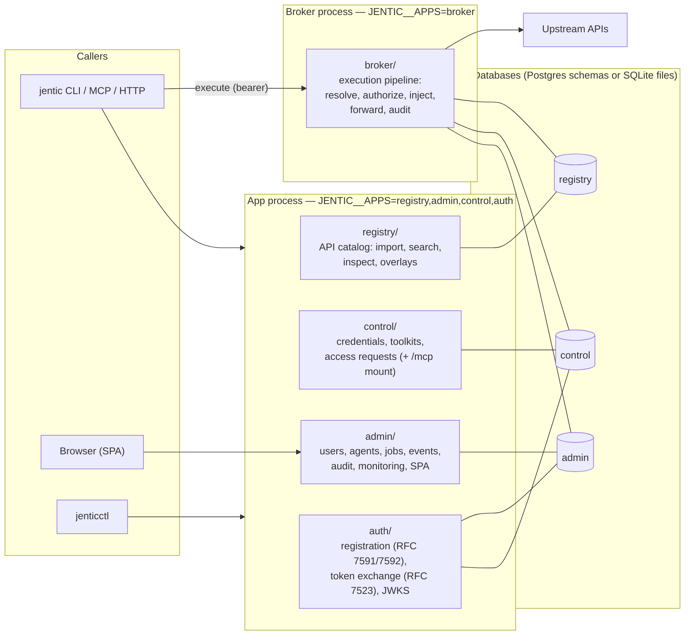

# Architecture

How Jentic One is put together: the surfaces, the processes they run in, the
databases behind them, and the execution path a brokered call takes. Each doc
here is grounded in the module it describes — follow the paths into
[`src/jentic_one/`](../../src/jentic_one/) when you need the next level of detail.

| Doc | Question it answers |
| --- | ------------------- |
| [Surfaces and layering](surfaces-and-layering.md) | How the code is organized: five surfaces, the `web → services → repos → core` layering, and the import rules [`tests/arch/`](../../tests/arch/) enforces. |
| [Composition and processes](composition-and-processes.md) | How a process boots: `__main__.py` → `wiring.py` → app factories, `JENTIC__APPS`, database gating, lifespan ordering, background workers, deployment topologies. |
| [Broker execution](broker-execution.md) | What happens to a brokered call: the pipeline, resilience stack, egress controls, and the credential injection point. |
| [Data model](data-model.md) | The three databases, their headline entities, and why there are no cross-database foreign keys. |
| [Identity and authorization](identity-and-authorization.md) | Who can call what: actor kinds, token kinds, scopes, and the default-deny access model. |

## The system in one diagram

The [README](../../README.md#how-it-works) has the 30-second picture. This is
the next level down: every deployment is **two processes from one Python
package** — an **app** (control plane) carrying four surfaces, and a **broker**
(data plane) that always runs alone.

Five things the diagram compresses:

- **Five surfaces, one package.** `registry`, `control`, `admin`, `broker`,
  and `auth` each live in their own package under [`src/jentic_one/`](../../src/jentic_one/);
  cross-surface imports are forbidden, with one sanctioned seam (the
  broker's credential services import control to refresh OAuth tokens);
  [`shared/`](../../src/jentic_one/shared/) holds what they have in common, and `wiring.py` is the
  composition point that sees across them
  ([surfaces and layering](surfaces-and-layering.md)).
- **The surface set is chosen at runtime.** One container image runs either
  role; `JENTIC__APPS` picks the surfaces, and the entrypoint refuses to
  bundle the broker with anything else
  ([composition and processes](composition-and-processes.md)).
- **The auth surface is a real surface.** Agent registration, the approval
  queue, token exchange, and `/.well-known/jwks.json` live in
  [`src/jentic_one/auth/`](../../src/jentic_one/auth/), not inside admin
  ([identity and authorization](identity-and-authorization.md)).
- **The broker holds all three database connections but a narrow job**: resolve
  the operation (registry), select the toolkit and credential (control), and
  record the execution (admin). It exposes essentially one route — a
  catch-all forward proxy ([broker execution](broker-execution.md)).
- **The databases share no foreign keys.** Registry, control, and admin are
  separate schemas linked by identity tuples and plain id strings, so they
  can be split without schema surgery ([data model](data-model.md)).

## The five surfaces at a glance

| Surface | Owns | Package |
| ------- | ---- | ------- |
| Registry | The API catalog: imported OpenAPI descriptions as immutable revisions, search, inspection, overlays, catalog-update tracking | [`src/jentic_one/registry/`](../../src/jentic_one/registry/) |
| Control | Credentials, toolkits, toolkit-credential bindings, permission rules, access requests; carries the optional `/mcp` mount | [`src/jentic_one/control/`](../../src/jentic_one/control/) |
| Admin | Operators (users), agents' admin records, jobs, events, executions monitor, audit log, instance config; serves the SPA | [`src/jentic_one/admin/`](../../src/jentic_one/admin/) |
| Auth | Agent/OAuth-client registration and approval, Ed25519 assertion exchange, opaque tokens, API keys, JWKS and OAuth discovery | [`src/jentic_one/auth/`](../../src/jentic_one/auth/) |
| Broker | The execution data plane: one credential-injecting forward proxy | [`src/jentic_one/broker/`](../../src/jentic_one/broker/) |

Related reading: [`deploy/README.md`](../../deploy/README.md) for how the
image is built and shipped, [`docs/development/extending-jentic-one.md`](../development/extending-jentic-one.md)
for adding to the codebase, and [`docs/reference/`](../reference/README.md)
for the generated endpoint/config references.
