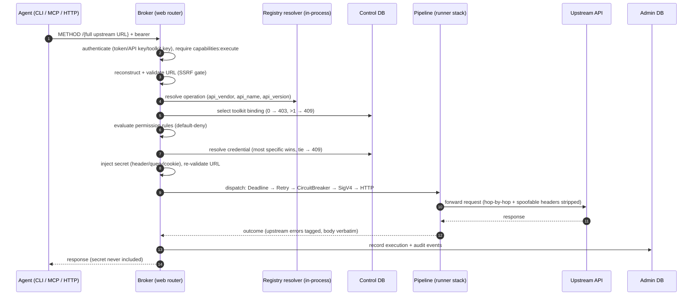

# Broker execution

What happens between an agent's `jentic execute` and the upstream API's
response. The broker (`src/jentic_one/broker/`) is a credential-injecting
forward proxy with essentially one route: a catch-all
`/{upstream_url:path}` that accepts every HTTP method
(`broker/web/routers/execute.py`).

## A brokered call, end to end



## One pipeline, two callers

The docstring rule in `broker/services/execution/pipeline.py` is
"one pipeline, two callers": the execution use-case (`run_execution` in
`broker/services/execution/service.py`) is invoked by exactly two paths, and
neither re-implements any step.

- **The sync router.** The catch-all route awaits `run_execution` and adapts
  the outcome to a FastAPI response. This is the default.
- **The async worker.** A request carrying `Prefer: respond-async` is not
  executed inline: the router enqueues a `JobKind.EXECUTION` job and answers
  `202` with a `/jobs/{job_id}` link. The shared `WorkerLoop`
  (`shared/jobs/worker.py`) later hands the job to `ExecutionHandler`
  (`shared/jobs/execution_handler.py`), which re-validates the URL, injects
  the credential, and dispatches through the same runner stack. The seam is
  two protocols (`UpstreamExecutor`, `CredentialInjector` in
  `shared/jobs/protocols.py`) implemented broker-side by `PipelineExecutor`
  and `CredentialService` — so `shared/jobs/` never imports `broker/`
  (enforced by `tests/arch/test_worker_no_inline_dispatch.py`).

Results of async executions are polled through the jobs API
(`GET /jobs/{job_id}`, `GET /jobs/{job_id}/result`) or the
`get_execution_result` MCP tool.

## The Broker protocol and `DefaultBroker`

`shared/broker/broker.py` defines the `Broker` protocol — `execute()`
(buffered) and `execute_streaming()` (passthrough). `DefaultBroker`
(`broker/default_broker.py`) is the stock implementation wrapping the
`BrokerExecutionPipeline`; a deployment (or the enterprise overlay) can
inject its own via `app.state.broker` / `app.state.broker_factory`, and
`BaseBrokerComplianceTest` in `jentic_one.testing` pins the contract.

## The resilience stack

`build_runner` (`broker/services/execution/pipeline.py`) composes the
outbound call as a decorator chain over one shared `httpx.AsyncClient`
(all in `broker/adapters/runners/`):

```
DeadlineRunner( RetryRunner( CircuitBreakerRunner( SigV4SigningRunner( HttpRunner ))))
```

- **`DeadlineRunner`** — outermost whole-call wall-clock budget, distinct
  from per-attempt transport timeouts; expiry is a `504` with a `wait`
  directive.
- **`RetryRunner`** — retries only when safe: the failure happened before
  the request was sent, or the method is idempotent, or the caller supplied
  an idempotency key. Exponential backoff with full jitter; honors
  `Retry-After` on 429/503; never retries a streaming response.
- **`CircuitBreakerRunner`** — a per-upstream-host breaker over the shared
  state backend (memory or Redis), so one failing vendor cannot burn the
  budget of every call.
- **`SigV4SigningRunner`** — innermost signer for AWS-shaped credentials;
  re-signs on every retry attempt; a no-op otherwise.
- **`HttpRunner`** — the only place a request actually leaves the process
  (pinned by `tests/arch/test_broker_runner_seam.py`); per-host concurrency
  bulkhead, mid-stream response-size cap, raw-byte streaming.

At the web edge, admission control sheds load when too many requests are in
flight (`broker/web/middleware.py`) and a per-caller rate limiter answers
`429` with `RateLimit-*` headers (`broker/web/deps.py`).

## Egress controls

Two layers keep the proxy from being used against the network it runs in:

- **Pre-request validation** (`shared/url_validation.py`) — `http`/`https`
  only; private, loopback, and link-local ranges refused; cloud metadata
  endpoints are a hard, non-overridable deny. Operators can exempt specific
  private subnets/domains via `EgressConfig`.
- **Connection-time DNS pinning** (`shared/egress.py`) — re-resolves and
  re-validates at connect time and pins the connection to the validated IP,
  closing DNS-rebinding races. Redirects are not followed
  (`follow_redirects=False`); the egress layer owns redirect policy.

Validation runs again after server-variable substitution, in both the sync
and async callers, so an injected variable cannot smuggle in a new host.

## Credential injection

`CredentialService` (`broker/services/credentials/orchestrator.py`) is the
one place a secret meets a request:

1. **Resolve** against the control DB by the API identity tuple
   (`api_vendor`, `api_name`, `api_version`; `NULL` = wildcard,
   most-specific match wins). No match → `424` with a *provision this
   credential* pointer; more than one → `409 ambiguous_credential` listing
   the candidates. See [How credential resolution works](../guides/credentials-and-toolkits.md).
2. **Refresh** OAuth tokens when expired (transient failures and
   needs-reconnect are distinct errors).
3. **Inject** per credential type (`broker/core/injection.py`): bearer or
   basic `Authorization` headers, API keys into header/query/cookie, SigV4
   as signing material for the runner. The response path never carries the
   secret back.
4. **Audit** — every resolve/decrypt emits a `CREDENTIAL_ACCESSED` event.

Before any of that, the toolkit deriver
(`broker/repos/caching_toolkit_deriver.py`) works out which toolkit serves
the call from the agent's bindings (none → `403`, several → `409` asking for
`Jentic-Toolkit-Id`), and the toolkit's permission rules are evaluated
**default-deny**: no matching rule, no call
(`broker/repos/rule_evaluator.py`).

## What gets recorded

Every execution lands as an append-only `ExecutionRecord` in the admin DB
(`shared/executions/ingest.py`): status, duration, operation and API
identity, HTTP status, actor, origin, and the credential used (by id and
name, never the secret). Lifecycle events (`EXECUTION_COMPLETED` /
`EXECUTION_FAILED`), permission denials (`PBAC_DENIED`), and credential
incidents each emit typed events into the monitor.

## Related

- [Composition and processes](composition-and-processes.md) — why the broker
  always runs alone, and how its runner stack is assembled at startup.
- [Identity and authorization](identity-and-authorization.md) — the token
  kinds the broker's composite validator accepts.
- [`docs/reference/endpoints.md`](../reference/endpoints.md) — the scope
  each route requires.
