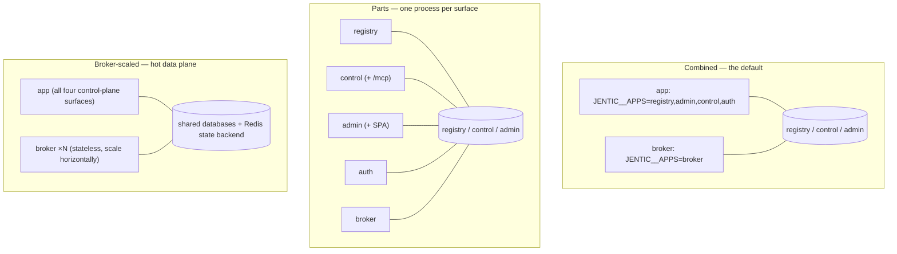

# Composition and processes

How one Python package becomes the processes you deploy: what happens between
`python -m jentic_one` and a serving FastAPI app, which surfaces share a
process, and which background work rides along.

## Boot sequence

```
python -m jentic_one
  └─ __main__.py        load_config() → configure logging/tracing/metrics
       └─ Context(config, allowed_dbs=…)      # DB gate computed from JENTIC__APPS
            └─ wiring.build_default_container(ctx)   # cross-surface seams
                 └─ app factory                       # per-surface or combined
                      └─ uvicorn.run(app)
```

- **`__main__.py`** owns process concerns: config loading, observability
  setup, the `create-admin` first-run subcommand, and the guard that disables
  `server.reload` on a SQLite admin DB (a single-file DB cannot take multiple
  writer processes).
- **`Context`** (`shared/context.py`) carries config plus lazily-opened
  database handles, gated by `allowed_dbs` (below).
- **`wiring.py`** is the composition root (see
  [surfaces and layering](surfaces-and-layering.md)); it builds the
  `AppContainer` — the DI seam carrying an optional injected `Broker`, extra
  routers, extra installers, and extra lifespans. The enterprise overlay and
  other downstream packages extend the system here, not inside surfaces.
- **The app factories** (`shared/web/app_factory.py`) assemble either one
  standalone surface app (`SURFACE_MODULES[surface].create_app`) or a
  combined app that includes every selected surface's routers in one shared
  root namespace — only the per-surface health routers carry a prefix
  (`/registry/health`, `/control/health`, …); business routes such as
  `/apis` and `/credentials` are served unprefixed.

## `JENTIC__APPS` selects the surfaces

One image, one package, any shape: the comma-separated `JENTIC__APPS`
environment variable decides which surfaces a process serves. Two rules are
enforced at boot:

- **The broker runs alone.** `_build_app` raises if `broker` appears with any
  other surface. The data plane holds decrypted secrets in memory during
  injection; keeping it in its own process keeps that memory out of the
  control plane and lets the two scale independently.
- **Databases are gated per shape.** `Context` only opens the databases the
  surface set needs. Each surface implies its own DB, widened by
  `SURFACE_DB_DEPS` in `__main__.py`: `broker` needs all three (resolve
  against registry, credentials from control, audit into admin); `auth`
  needs admin + control; standalone `control`/`registry` need admin (their
  local auth verifier resolves API keys and permissions there); and a
  control shape with MCP enabled needs registry (the `/mcp` search tools
  call registry services in-process). Touching a DB outside the gate raises
  immediately, so a mis-deployed process fails at boot.

## Deployment topologies



- **Combined** — two containers: everything except the broker in one
  process, the broker in the other. What
  [`deploy/`](../../deploy/README.md)'s compose files and the Helm chart's
  default values produce.
- **Parts** — each surface standalone, fronted by a gateway that routes by
  path prefix. Standalone apps serve at root (`/health`, not
  `/registry/health`); the combined app keeps the per-surface health
  prefixes so the probes don't collide. Agent-discovery documents
  (`/llms.txt`, `/skills/*`) are mounted on every standalone surface so a
  split deployment still serves them.
- **Broker-scaled** — brokers are stateless; run several behind a load
  balancer. Set `broker.resilience.backend.backend` to `redis` (and give
  every replica the same `broker.resilience.backend.redis_url`) so rate
  limits, circuit breakers, and idempotency records are shared across
  replicas.

## Lifespan ordering

`create_surface_app` wires one lifespan per process, and teardown order is
load-bearing:

1. **Startup:** `ctx.startup()` → DB instrumentation → telemetry → the
   surface's own `extra_lifespan` (the broker opens its shared outbound
   `httpx.AsyncClient` here) → container-injected lifespans (the `/mcp`
   session manager) → background workers.
2. **Shutdown**, with a drain step first: the broker's admission gate
   reports unready (so the load balancer deregisters the instance) →
   scanners stop → the job worker drains → telemetry flushes →
   `ctx.shutdown()` → container-injected lifespans exit in reverse → the
   surface lifespan closes the shared HTTP client. Draining the worker
   *before* closing the client matters: an async execution mid-flight must
   finish over a live connection pool.

## Background work

Three loops start inside the lifespan:

| Loop | Runs when | Job |
| ---- | --------- | --- |
| `WorkerLoop` (`shared/jobs/worker.py`) | the admin DB is reachable and a handler registered | Claims queued jobs from the admin DB's jobs table. The `IMPORT` handler registers only on registry shapes; the `EXECUTION` handler only where the broker's upstream executor exists. A broker process therefore never claims import jobs, and an app process never claims executions. |
| `CredentialExpiryScanner` | control shapes | Emits expiry warnings for credentials nearing their end date. |
| `CatalogUpdateScanner` | registry shapes | Watches imported APIs' sources for upstream changes and raises update-available notifications. |

The gate is the surface set (`enabled_apps`), not which DBs happen to be
reachable: the broker is granted the registry DB for its synchronous resolve
path, but it is not the registry surface, so it must not race the control
plane for import jobs.

## Related

- [Broker execution](broker-execution.md) — what the broker process does
  with the resources this lifespan hands it.
- [Data model](data-model.md) — the three databases the gate above controls.
- [`docs/installation/helm.md`](../installation/helm.md) and
  [`deploy/README.md`](../../deploy/README.md) — how these shapes are
  expressed in Helm values and compose files.
