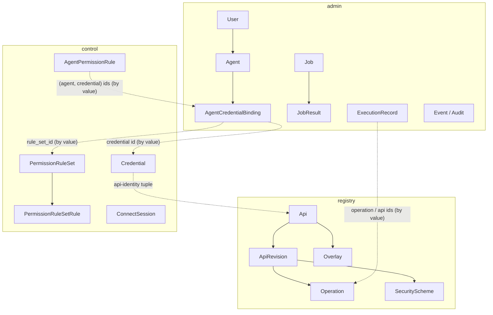

# Data model

Jentic One persists into **three databases** — `registry`, `control`, and
`admin` — that are schemas in one Postgres instance, or three separate SQLite
files on the single-host shape (both are supported backends). Each ORM model
inherits exactly one of three declarative
bases (`RegistryBase` / `ControlBase` / `AdminBase` in
[`shared/db/base.py`](../../src/jentic_one/shared/db/base.py)), each database has its own Alembic version tree under
[`src/jentic_one/migrations/`](../../src/jentic_one/migrations/), and each tree keeps a single head
([`tests/arch/test_migration_single_head.py`](../../tests/arch/test_migration_single_head.py)).

## Why three, and why no foreign keys between them

The split follows the surfaces and their trust boundaries: the **registry**
holds public-shaped catalog data, the **control** DB holds secrets, and the
**admin** DB holds identity and operational records. Because each surface can
be deployed as its own process against only its own database (see
[composition and processes](composition-and-processes.md)), a foreign key
across databases would be unenforceable. So there are none — cross-database
references are plain values:

- **The API-identity tuple** `(api_vendor, api_name, api_version)` is how a
  credential or permission rule in the control DB refers to an API in the
  registry. `NULL` acts as a wildcard (a vendor-wide credential leaves
  `api_name`/`api_version` `NULL`), which is what makes most-specific-wins
  [credential resolution](../guides/credentials-and-toolkits.md) possible.
- **Agent and credential ids** are carried by value where the admin DB
  records which credential an agent is bound to
  (`agent_credential_bindings`), and resolved back against the control DB
  when a name is needed. A binding's optional `rule_set_id` points the same
  way at a shared `permission_rule_sets` row in the control DB.

## The headline entities

Arrows inside a box are real foreign keys; dotted arrows across boxes are
by-value references only.

The diagram is deliberately coarse — headline entities only, so it survives
migrations. The full table list lives in each surface's `core/schema/`
package.

### Registry — the catalog

An `Api` (vendor/name/version) has **immutable revisions**: every import or
overlay application creates a new `ApiRevision` rather than mutating an
existing one, so an execution can be pinned to the exact spec content it ran
against (`spec_digest`), and a rollback is just re-activating an earlier
revision. Each revision carries its parsed `Operation` rows (plus a URL
index for the broker's resolve path), `SecurityScheme` rows, servers, and
spec files. `Overlay` rows record catalog edits; `CatalogSnapshot` and
`CatalogUpdateCheck` support export and upstream-change detection. See
[overlays](../guides/overlays.md).

### Control — secrets and grants

`Credential` is the polymorphic core row (typed detail tables carry
API-key/basic/OAuth/SigV4 material, encrypted at rest via the
[`shared/crypto/encryption.py`](../../src/jentic_one/shared/crypto/encryption.py) facade). Permission policy — the
default-deny allowlist the broker evaluates — lives either inline per
binding (`AgentPermissionRule`, keyed by the `(agent, credential)` pair) or
in a shared, ordered `PermissionRuleSet` that several bindings can point at.
`ConnectSession` rows track agent-driven OAuth connect flows
(device-authorization / auth-code) from creation to a terminal state;
`CustomerAPIKey` is the bearer-key row for API-key access. The retired
toolkit tables (`toolkits`, `toolkit_permission_rules`,
`toolkit_credential_bindings`, `toolkit_keys`) remain until the phase-6b
drops, gated on the `toolkit_flattening_acks` sentinel — see the
[release runbook](../development/releasing.md).

### Admin — identity and operations

`User` and `Agent` are the actor tables (an agent is owned by a user);
`OAuthClient` rows back dynamic client registration, and `agent_credentials`
holds the long-lived API-key alternative to the OAuth flow. The retired
`service_accounts`/`service_account_credentials` tables survive only as the
source of the service-account → agent migration (which stamps each row, and
whose sweep archives it) and the unmigrated-key fallback, until their
acknowledge-gated drop (see the [release runbook](../development/releasing.md)). Token state lives in
`access_tokens`/`refresh_tokens`/`authorization_codes`; scope grants in
`actor_scope_grants` and `user_permission_grants`. Operationally:
`jobs`/`job_results` (the queue the `WorkerLoop` claims from),
`execution_records` (append-only history of brokered calls), `events`, and
`audit_entries` rows.

## Conventions that hold across all three

- **Transactions** happen in services via `DatabaseSession.transaction()`;
  manual `commit()` calls are rejected by [`tests/arch/test_no_manual_commit.py`](../../tests/arch/test_no_manual_commit.py).
- **Row-level visibility** is applied by each surface's `scoping/filters.py`
  — see [surfaces and layering](surfaces-and-layering.md#the-scoping-packages).
- **ORM style** is pinned by [`tests/arch/test_orm_conventions.py`](../../tests/arch/test_orm_conventions.py) and
  `test_no_backref.py` (explicit `back_populates`, typed `Mapped[]` columns).
- **Secrets** never appear as plain `str` config or columns
  (`test_secrets_are_secretstr.py`, admin secrets isolation tests).

## Related

- [Context and config](../development/context-and-config.md) — how a process
  gets its database handles.
- [Identity and authorization](identity-and-authorization.md) — the actor
  and token tables in use.
