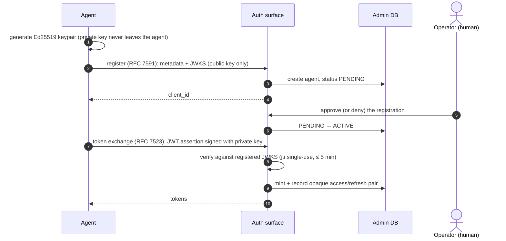

# Identity and authorization

Who can call what, and where that decision is made. This is the conceptual
map; per-route scope requirements live in
[`docs/reference/endpoints.md`](../reference/endpoints.md), and the auth
surface's protocol details (discovery documents, registration endpoints) in
[`docs/reference/`](../reference/README.md).

## Actors

Every authenticated request resolves to one `Identity`
([`shared/auth/identity.py`](../../src/jentic_one/shared/auth/identity.py)) with an explicit `actor_type`
([`shared/models/actors.py`](../../src/jentic_one/shared/models/actors.py)) — verification fails closed on a token that
doesn't name one:

| Actor | Who it is | Typical credential |
| ----- | --------- | ------------------ |
| `user` | A human operator, signed in through the SPA or `jenticctl`. | Session token (JWT), or a password login exchanged for one. |
| `agent` | An AI agent owned by a user. Registered first, approved by a human before it can act. | Ed25519-signed assertion → opaque access token, or a `jak_` API key. |
| `service_account` | A headless integration. | `sak_` API key. |
| `toolkit` | The toolkit itself, on the broker data plane only. | `jntc_live_` toolkit key. |

An agent's `Identity` carries its owner (`parent_actor_id`) and the owner's
effective permissions (`parent_permissions`): an agent can never out-rank
the human it belongs to.

## How an agent gets a token

Agent identity is asymmetric — the platform never holds the agent's private
key:

1. **Register** ([`auth/`](../../src/jentic_one/auth/) surface, RFC 7591/7592 dynamic client
   registration): the agent submits metadata plus a JWKS containing at least
   one **Ed25519** public key (`registration_service.py` rejects anything
   else, including any private-key material).
2. **Wait for approval**: registration lands as a `PENDING` agent; a human
   approves or denies it (`agent_service.py`). Until approval, token
   exchange answers "pending", distinct from a rejected assertion.
3. **Exchange** (RFC 7523 JWT-bearer grant, `assertion_service.py`): the
   agent signs a short-lived assertion (≤ 5 minutes, single-use `jti`) with
   its private key; the auth surface verifies it against the registered
   JWKS and mints an opaque access/refresh token pair, recorded in the
   admin DB.

Operators and the SPA use session JWTs minted at login; API keys
(`jak_`/`sak_`) are the long-lived alternative, resolved by prefix against
the admin DB ([`shared/auth/api_key_resolver.py`](../../src/jentic_one/shared/auth/api_key_resolver.py)). JWT verification for
asymmetric tokens allows only asymmetric algorithms — `alg: none` and all
HMAC algorithms are rejected ([`shared/auth/jwt_verification.py`](../../src/jentic_one/shared/auth/jwt_verification.py)).

## Scopes

Scopes shared across surfaces are canonical constants in
[`shared/scopes.py`](../../src/jentic_one/shared/scopes.py). The shape of the system:

- **`capabilities:execute`** is the one scope the broker's data plane
  requires. Every accepted credential kind must carry it.
- **`DEFAULT_AGENT_SCOPES`** is the safe agent baseline: execute, reads
  (`apis:read`, `executions:read`, `jobs:read`, `events:read`),
  `catalog:import`, and the `owner:*:read` delegation set.
- **Self-service elevation is bounded.** An agent may file a `scope:grant`
  access request only for `GRANTABLE_SCOPES` (the baseline plus
  `apis:write`). The privileged scopes — `org:admin`, `agents:write`,
  `overlays:confirm` — are deliberately excluded, so neither an agent nor a
  merely agent-owning operator can escalate through the request path.
- **`owner:<resource>:read`** scopes power delegation: an operator holding
  them sees their agents' rows (credentials, toolkits, access requests)
  without being org admin. The `scoping/filters.py` modules translate these
  into row-level filters (see
  [surfaces and layering](surfaces-and-layering.md#the-scoping-packages)).

## Enforcement points

Authorization is checked at three distinct layers, and they answer
different questions:

1. **Route admission** (`web/`): every non-health router declares an auth
   dependency (enforced by [`tests/arch/test_web_layer.py`](../../tests/arch/test_web_layer.py)); the dependency
   verifies the credential, resolves the `Identity`, and checks the route's
   scope. On the broker, `CachedTokenValidator`
   ([`broker/core/token_validation.py`](../../src/jentic_one/broker/core/token_validation.py)) fronts the resolvers with a short-TTL
   cache keyed on the token's SHA-256 (both hits and misses cached, LRU
   bounded).
2. **Row visibility** (`scoping/`): services pass the identity's access
   filters into repos, so a list endpoint only ever queries the rows the
   caller may see.
3. **Execution permission** (broker): a brokered call must additionally
   match a toolkit permission rule. This is **default-deny** — an agent
   with `capabilities:execute` and a valid credential still cannot call an
   API unless a human-approved toolkit binding explicitly allows that
   vendor/API/operation (see [broker execution](broker-execution.md)).

The chain for an agent's first real call is therefore: registration
approval (human) → toolkit binding via an access request (human) → scope
check (route) → permission rule (call). Each step is auditable, and none is
implied by the previous one.

## Related

- [Connecting agents](../guides/connecting-agents.md) — the same flow from
  the agent's point of view.
- [How credential resolution works](../guides/credentials-and-toolkits.md) —
  what happens after authorization succeeds.
- [Security](../security/README.md) — threat model and hardening posture.
