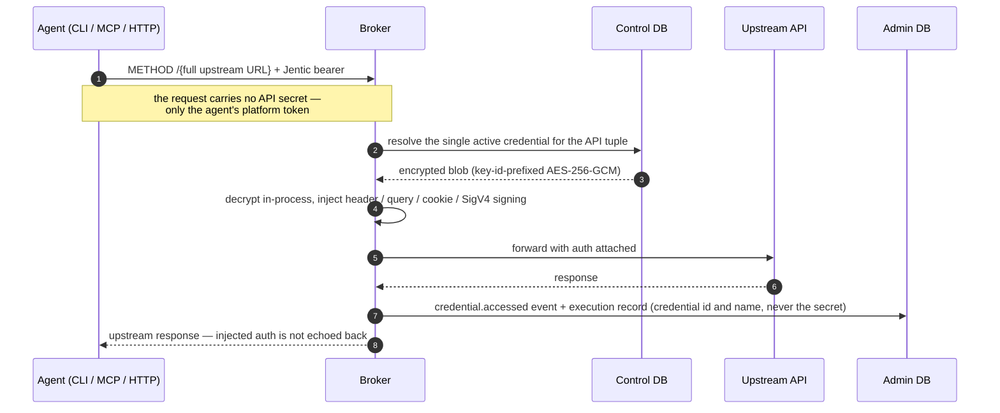
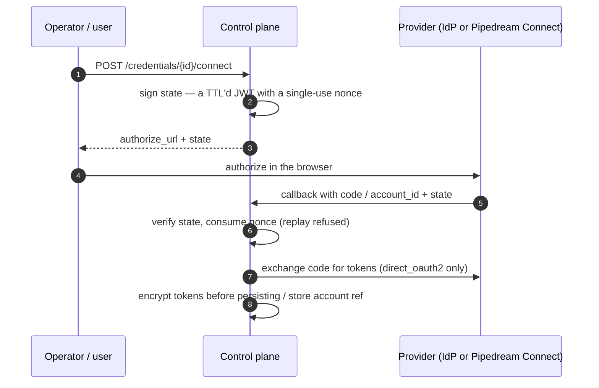

# How credential resolution works

How Jentic One keeps API secrets away from agents: what an agent actually
sends, how the single active credential for an API is resolved and injected
server-side, how secrets are encrypted at rest, how credentials get into the
system through providers, and what every use leaves in the audit trail.
Storing a credential and granting an agent access are walked through in
[Your first brokered call](first-call.md) (steps 4–5); read
[Deploying Jentic One securely](../security/security.md) before storing a
real one. The rest of the guides are indexed in [`README.md`](README.md).

## The promise: the agent never holds the secret

An agent calls an API by sending the broker a method and the full upstream
URL, authenticated with its Jentic token — never the API's secret. The
broker resolves the credential from the control DB, decrypts it in-process,
and attaches it to the outbound request ([`broker/core/injection.py`](../../src/jentic_one/broker/core/injection.py), driven
by the resolve → refresh → inject orchestrator in
[`broker/services/credentials/orchestrator.py`](../../src/jentic_one/broker/services/credentials/orchestrator.py)). The upstream response is
mirrored back; the injected auth material is not part of it.

What can leave the platform is bounded:

- **No export path.** No API returns credential plaintext, and a
  [backup](../operations/backup-restore.md) contains only ciphertext —
  "there is no export-secrets path" is the product's core guarantee.
- **Redacted reads.** `GET /credentials` and `GET /credentials/{id}` return
  redacted views. Error bodies disclose at most `last4` — the tail of the
  non-secret credential *id*, never the secret.
- **Records carry identifiers.** Execution records and audit events
  reference the credential by id and name only.

The full execution pipeline — toolkit derivation, default-deny permission
rules, SSRF gates, the runner stack — is documented in
[Broker execution](../architecture/broker-execution.md). This guide owns the
credential-centric view.

## The model

- A **credential** stores the secret for one API, keyed by the API identity
  `(api_vendor, api_name, api_version)` (control DB, `credentials`).
- A **toolkit** groups the credentials an agent may use. A
  **toolkit-credential binding** (`toolkit_credential_bindings`) associates a
  toolkit with a credential.
- At execution time the Broker resolves the **single active** credential for
  the requested API and injects its secret — the secret never reaches the
  agent.

Registry (the `apis` table) and Control (`credentials`,
`toolkit_credential_bindings`) are **separate databases** with no foreign key
between them; the link is the API identity tuple carried on the credential.

## Resolution invariants

### One active credential per API within a toolkit

Within a single toolkit there is **at most one active credential per API
identity**. Two active credentials for the same API in the same toolkit make
resolution ambiguous — the Broker cannot tell which secret to inject, so it
refuses with `409 ambiguous_credential`. The platform prevents that state at
bind time: binding a second active credential for an API a toolkit already
covers is rejected with `409 conflicting_api_binding`. Unbind the existing
credential first to replace it.

A credential may be **reused across toolkits** (e.g. a broad read-only key in
one toolkit and a scoped key in another) — the one-per-API rule is scoped to
a single toolkit, not global.

### Most specific wins; an explicit name wins over that

A credential's identity tuple may leave `api_name`/`api_version` unset
(wildcard). When several active credentials cover the same call, the most
specific one is chosen — a full `vendor.name.version` pin beats a
vendor-wide credential — so a wildcard coexisting with a pin does not force
a spurious 409. A caller can also disambiguate explicitly with the
`Jentic-Credential-Name` header, which selects by name across all covering
credentials; a name that matches nothing is a
`400 credential_name_not_found` listing the candidates.

### No match is a loud 424

If no active credential covers the API, the broker answers
`424 credential_not_provisioned` with a `prompt_human` directive (and a
provisioning URL when one is configured) so the agent hands off to a human
instead of retrying. Every credential failure is also emitted as a typed
event (see [What's audited](#whats-audited)).

### Deleting an API deactivates its credentials

Because the two databases share no referential integrity, deleting an API
from the registry does not delete the control-plane credentials that
reference it. To avoid stranding them — a later re-import plus a new
credential would collide with `409 ambiguous_credential` — the API delete
**deactivates** the matching credentials (`active = false`). The rows are
preserved (the operator can still see and rotate them) but no longer
participate in resolution, so a re-import starts clean.

### When ambiguity is genuinely surfaced

If two equally specific active credentials are ever resolved (the loud,
correct refusal), the `409 ambiguous_credential` body lists the candidates
so the caller can pick which to remove. Each candidate carries `id`, `name`,
`last4` (the tail of the non-secret credential id — never the secret), and
`created_at`, so two similarly-named credentials remain distinguishable.

## Where secrets live

Every stored secret is encrypted with **AES-256-GCM envelope encryption**
([`shared/crypto/encryption.py`](../../src/jentic_one/shared/crypto/encryption.py)) before it touches the database. The keyset
is versioned: `credentials.encryption.entries` is a list of
`(id, 32-byte key)` pairs and `active_id` names the write key. Each blob is
prefixed with the id of the key that produced it (`<key_id>:<payload>`), so
retired keys keep decrypting old rows. An unknown key id or a failed GCM
authentication raises `DecryptionError`, which the broker maps to
`424 credential_undecryptable` with a prompt-human directive — the agent
cannot self-recover; an operator must re-add the credential. That module is
the only one permitted to import `cryptography`, enforced by an architecture
test ([`tests/arch/test_encryption_facade.py`](../../tests/arch/test_encryption_facade.py)).

The keyset reaches the process one of three ways:

| Source | How |
| ------ | --- |
| Config file | `credentials.encryption.active_id` / `.entries` — see the [config reference](../reference/config.md) |
| Environment | `JENTIC__CREDENTIALS__ENCRYPTION__ACTIVE_ID`, `JENTIC__CREDENTIALS__ENCRYPTION__ENTRIES__0__ID`, `…__0__MATERIAL` (indexed per entry) |
| Helm | generated into the release-scoped `<release>-app-secrets` Secret on first install, or supplied via `global.appSecrets.existingSecret` — see [Helm → Secrets](../installation/helm.md#secrets) |

Rotation is additive: add a new entry, flip `active_id`. New writes use the
new key immediately, but a stored secret re-encrypts only when its row is
next rewritten, so retired keys stay in the keyset — removing one makes
anything still encrypted under it permanently unreadable. The contract is
spelled out in [Upgrades](../operations/upgrades.md#what-an-upgrade-never-does).

## How credentials get in: providers

Every credential names a **provider** — the component that acquires and
maintains its secret. Three ship
([`control/services/credentials/providers/`](../../src/jentic_one/control/services/credentials/providers/)):

| Provider | Managed | Stored locally (encrypted) | Stays remote |
| -------- | ------- | -------------------------- | ------------ |
| `static` | no | the operator-supplied secret (bearer/API key/basic/SigV4/…) | nothing |
| `direct_oauth2` | yes | the OAuth client secret, plus the access and refresh tokens the platform obtains — the platform *is* the OAuth2 client | nothing |
| `pipedream` | yes | an opaque `provider_account_ref`, plus a short-lived access token cached at refresh time | the durable OAuth grant, held by Pipedream Connect |

`static` is always registered; the OAuth providers are enabled per
deployment under `credentials.providers.<name>` in the
[config reference](../reference/config.md) or at runtime with the
`jentic admin config providers` CLI.

Managed providers acquire tokens through the **connect flow**
([`control/services/credentials/connect_service.py`](../../src/jentic_one/control/services/credentials/connect_service.py)):

Tokens are encrypted with the keyset above before they are persisted; a
completed connect writes an audit entry and a `credential.connected` event,
a failed one a `credential.connection_failed` event.

**The extension seam.** All three implement the `CredentialProvider`
Protocol ([`providers/base.py`](../../src/jentic_one/control/services/credentials/providers/base.py)): `begin_connect` / `complete_connect` /
`refresh`, plus `managed` and `supported_types`, resolved by name through a
`ProviderRegistry`. This Protocol is where an external vault would plug in.
No HashiCorp Vault or AWS Secrets Manager integration ships today — an
integrator implements the Protocol (as `pipedream` does for its external
vault, storing only an account reference locally) and registers it.

## Server-side token refresh

An expired OAuth2 access token is refreshed by the broker mid-call, before
injection ([`broker/services/credentials/refresh.py`](../../src/jentic_one/broker/services/credentials/refresh.py)) — the agent never
handles a refresh token and never sees the refresh happen. The refresh is
lazy and single-flight: a per-credential advisory lock (Postgres) or process
lock (SQLite) plus a double-check after acquiring, so concurrent calls
trigger one upstream refresh. Tokens are considered stale ahead of expiry by
a configurable skew, and the fresh tokens are re-encrypted before persisting.
A revoked grant (`invalid_grant`) maps to `401 credential_needs_reconnect`
with a prompt-human directive; a transient IdP failure maps to `502`.

## What's audited

Two append-only records in the admin DB, browsable in the UI and API — see
[Monitoring → executions and the audit trail](../operations/monitoring.md#what-agents-did-executions-and-the-audit-trail):

- **`audit_entries`** — who changed what: `CREATE` on store, `UPDATE` on a
  completed connect, `ENABLE`/`DISABLE`/`DELETE` on lifecycle changes, and
  `GRANT`/`REVOKE` on every toolkit bind/unbind, each with actor, target,
  and origin.
- **Events** — every resolve → decrypt → inject emits exactly one
  `credential.accessed` event carrying actor, credential id, provider, wire
  type, and API identity, stamped with the execution's trace id so a
  credential use joins back to the execution that triggered it. Failures are
  typed: `credential.not_provisioned`, `credential.refresh_failed`,
  `credential.undecryptable` (flagged for the Action Inbox),
  `credential.connection_failed`.

Execution records themselves carry the credential used by id and name —
never the secret.

## Lock down the agent side

The platform holds the secrets; these docs close the remaining gaps around
the agent:

- [Deploying Jentic One securely](../security/security.md) — the umbrella
  threat model, deployment tiers, and production checklist.
- [Same-host setups](../security/same-host/README.md) — what changes when
  the agent and the credential store share a machine, and what `jentic run`
  isolation buys.
- [Hardening same-host MCP](../security/same-host/mcp-same-host-hardening.md) —
  the stdio MCP server runs as the desktop user; how to contain it.
- [Identity and authorization](../architecture/identity-and-authorization.md) —
  scoped tokens and default-deny permission rules, so a leaked agent token
  is bounded.
- [Broker execution → egress controls](../architecture/broker-execution.md#egress-controls) —
  SSRF validation and DNS pinning keep the proxy from being turned against
  its own network.
- [Harden a Jentic One install](../agent/harden.md) — the agent-runnable
  hardening runbook.
