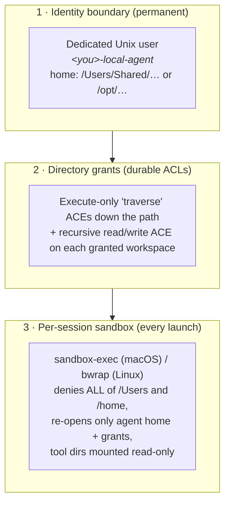
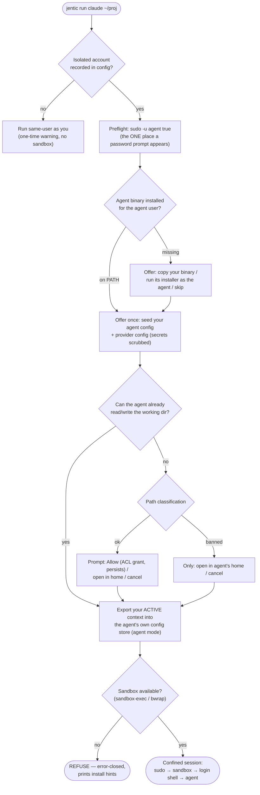

# Run coding agents in isolation — `jentic run`

This is the operator guide to the **local-agent sandbox**: launching a CLI coding
agent (Claude Code, Codex, Cursor's `cursor-agent`, Hermes) as its **own
unprivileged Unix user**, so a compromised or prompt-injected agent cannot read
your SSH keys, browser session, cloud credentials, or the Jentic One credential
store.

It covers the flow and day-to-day usage with examples. For the security design
and rationale, see [`docs/security/same-host/`](../security/same-host/README.md);
for the generated per-flag reference, open `/app/docs` on your deployment
(Reference → CLI).

- [The mental model](#the-mental-model)
- [Quickstart](#quickstart)
- [What `jentic setup` sets up](#what-jentic-setup-sets-up)
- [The `jentic run` flow](#the-jentic-run-flow)
- [Cookbook](#cookbook)
- [Where state lives](#where-state-lives)
- [Tearing it all down — `jentic reset`](#tearing-it-all-down--jentic-reset)
- [Troubleshooting](#troubleshooting)
- [Platform support](#platform-support)

## The mental model

Three mechanisms stack, and all three must hold for a session to start:



The result, from the agent's point of view:

| Path | Access | Why |
| ---- | ------ | --- |
| Agent's own home (`/Users/Shared/<agent>` / `/opt/<agent>`) | ✅ read/write | Its workspace-of-last-resort; you keep an inherited read/write ACL into it |
| Each directory you granted | ✅ read/write | Recursive inherited ACL + sandbox re-open |
| The agent's own `~/.local/bin` | ✅ read + execute, ❌ write | So it can't rewrite its own launched binary |
| System / Homebrew tool dirs (`/usr/bin`, `/opt/homebrew/bin`, …) | ✅ read + execute, ❌ write | Shared tools without letting the agent replace them |
| **Your home** — everything not granted | ❌ | Sandbox denies `/Users` + `/home` wholesale |
| `~/.ssh`, `~/.aws`, `~/.jentic`, keychains, browser profiles | ❌ **never grantable** | Hard-banned: the grant prompt offers no "grant anyway" |
| System trees (`/etc`, `/usr`, `/var`, `/`) | ❌ not grantable | Hard-banned |

Two honest limits (details in the
[security docs](../security/same-host/local-agent-isolation.md)): the boundary
protects **you from the agent** — it does not partition the agent from itself
(anything seeded into the agent's home is readable by it), and it does **not**
restrict network egress.

## Quickstart

```bash
# 1. One-time: onboard. After you pick your agent, setup offers to isolate
#    it behind a dedicated Unix user (asks before any sudo runs).
jentic setup

# 2. Every session: launch the agent, confined, in the project you name.
jentic run claude ~/projects/my-app

# 3. Done with the whole setup? Tear it down (prompts before anything destructive).
jentic reset
```

A first `jentic run` in a directory the agent can't reach looks like this:

```text
$ cd ~/projects/my-app && jentic run claude
⚠ Agent alice-local-agent has no access to /Users/alice/projects/my-app.
How should the session reach this directory?
  Open in the agent's home instead
> Allow the agent read/write here (adds an inherited ACL)
  Cancel

  Granted (persists across sessions; `jentic run claude --list-grants` to review).
  This is OS-level access only — the agent still runs its own workspace-trust prompt.
Launching claude as alice-local-agent in /Users/alice/projects/my-app (confined) ...
```

From then on that directory opens without a prompt.

> **No isolated account?** `jentic run` still works: it launches the agent
> directly **as you** (no sandbox) and prints a one-time warning telling you
> so. Run `jentic setup` to get the isolated setup.

## What `jentic setup` sets up

`jentic setup` takes a fresh machine to ready: register an agent identity
with your Jentic install, write the CLI-usage skill into your agent runtime, and
— the part this guide is about — offer to isolate the agent. The isolation step
is **sudo-last**: it asks *"Create a dedicated user account for your local
agent? (requires sudo)"* before any privileged command runs, so declining never
triggers a password prompt.

Opting in shows one prefilled, editable form:

| Field | Default | Notes |
| ----- | ------- | ----- |
| Agent account name | `<you>-local-agent` | Validated as a safe Unix username |
| Agent home directory | `/Users/Shared/<name>` (macOS), `/opt/<name>` (Linux) | Always outside every human home |
| Copy your agent config? | Yes when found | Names the exact files ("Will copy: ~/.claude, ~/.claude.json") |
| Copy your provider config? | Yes when detected | AWS Bedrock → `~/.aws`; Google Vertex → `~/.config/gcloud` |
| Passwordless launch? | Yes | Scoped sudoers rule to *become the agent user* — never root |

Then, if your agent has a record of trusted workspaces (Claude Code's
`~/.claude.json` projects you accepted the trust dialog for), setup offers
them as a pre-selected multiselect — **"Bring your workspaces over"** — so you
don't re-grant each project by hand on first run. Banned paths (see
[the grant model](#granting-directories)) are never offered.

Non-interactive setup:

```bash
jentic setup --url https://jentic.example.com --operator claude --yes
jentic setup --skip-skill        # identity only
jentic setup --dry-run           # describe everything, change nothing
```

Prerequisites are checked **before** the first sudo. If something is missing
(e.g. `bwrap` on a minimal Linux), setup prints the exact install command
for your package manager and offers to continue same-user — a missing dependency
never blocks the identity/skill provisioning you came for.

## The `jentic run` flow

```
jentic run <agent> [path] [flags] [-- <agent-args>...]
jentic run -- <agent> [agent-args...]
```

`<agent>` picks the **binary** (`claude`, `codex`, `cursor`, `hermes`) — never
an account or identity. There is one shared agent account; identity comes from
your **active context**, exported into the agent's home at every launch.

What a launch does, in order:



Details worth knowing:

- **One password prompt.** All privileged steps go through the same `sudo -u
  <agent>`; the preflight is where you're asked (or nothing, with the
  passwordless rule). A declined password is reported as a sudo problem, never
  misdiagnosed as "agent not installed".
- **Binary provisioning.** Single-file agents (claude, codex) default to
  copying your binary into the agent's `~/.local/bin`; installer-based agents
  (cursor, hermes) run their documented installer *as the agent user*. Copying
  carries the binary, never your credentials — the agent authenticates its own
  tools on first launch.
- **Config seeding is opt-in, once, and never clobbers.** It only runs while
  the agent has no config of its own. Discrete credential files inside seeded
  trees (Codex's `~/.codex/auth.json`, Hermes's `~/.hermes/.env`) are scrubbed
  after the copy: the agent inherits your *settings* but authenticates as
  itself.
- **Confinement is required.** If the machine can't sandbox the session,
  `jentic run` refuses (`CONFINEMENT_UNAVAILABLE`) rather than silently running
  unconfined — and prints the per-dependency fix.
- **Your environment doesn't leak.** The launch forwards only terminal/locale
  variables (`TERM`, `LANG`, …) and explicitly unsets SSH/GPG agent handles, so
  the agent can't ride your forwarded ssh-agent.

## Cookbook

### Launching

```bash
jentic run claude                       # current directory (prompts to grant if needed)
jentic run claude ~/projects/api        # explicit working directory
jentic run claude --home                # start in the agent's own home — nothing to grant
jentic run codex ~/work/site            # any runnable agent: claude, codex, cursor, hermes
```

### Forwarding arguments to the agent

Everything after `--` goes to the agent binary **verbatim** (like
`cargo run --` / `kubectl exec --`). Two forms:

```bash
# Trailing --: jentic's own args (agent, optional path) come first.
jentic run claude -- --model opus -p "review this"    # runs: claude --model opus -p "review this"
jentic run claude ~/work/api -- --resume              # forwards --resume, workdir ~/work/api

# Leading --: the whole agent command follows the separator. Nothing after it is
# parsed by jentic, so agent flags can never collide with jentic flags.
jentic run -- claude --resumeSessionId=1234
```

The leading form takes no path argument (the working directory is the current
one) — use the trailing form when you need to pass a path. Forwarded arguments
run inside the same confined session; they never widen the sandbox.

### Granting directories

Grants are **persistent** (they're filesystem ACLs, not per-session), so review
them occasionally:

```bash
jentic run claude --list-grants          # what can the agent reach?
jentic run claude --grant  ~/work/api    # grant without launching
jentic run claude --revoke ~/work/api    # revoke (leaf access drops immediately)
```

```text
$ jentic run claude --list-grants
Directory grants
  agent: claude
  user:  alice-local-agent
  dir:   /Users/alice/projects/my-app
  dir:   /Users/alice/work/api

To take a directory away: `jentic run <agent> --revoke <dir>` (`--list-grants` to review).
```

What you can and can't grant:

| You ask for | Verdict | What happens |
| ----------- | ------- | ------------ |
| `~/projects/my-app` | ✅ fine | Allow / open-in-home / cancel prompt |
| `~` (your home) | ⚠ soft ban | Not grantable itself — grant a subdirectory instead |
| `~/.config` | ⚠ soft ban | Holds credential children; grant e.g. `~/.config/nvim` instead |
| `/Users/bob` | ⚠ soft ban | Another human's home root |
| `~/.ssh`, `~/.aws`, `~/.jentic`, `~/.kube`, browser profiles, keychains | ⛔ hard ban | Path **and every descendant** refused — no "grant anyway" exists |
| `/etc`, `/usr`, `/var`, `/` | ⛔ hard ban | System trees |

Symlinks are resolved before classification, so a link into a banned tree is
caught. On macOS the check is case-insensitive (`~/.SSH` is still `~/.ssh`).

### Non-interactive / scripted use

```bash
jentic run claude --yes                  # take the safe default at every prompt
                                         # (never grants a flagged-dangerous dir)
jentic run claude ~/proj --allow-dir     # pre-answer the grant prompt with "Allow"
jentic run claude --no-allow-dir         # never grant; open in the agent's home
jentic run claude --seed-config          # copy your agent config without prompting
jentic run claude --no-seed-config       # never copy it
```

`--allow-dir` still hard-refuses a banned directory — flags can't override the
boundary.

### Per-agent notes

| Agent | Binary | Provisioning default | Seeded config | Secrets scrubbed after seeding |
| ----- | ------ | -------------------- | ------------- | ------------------------------ |
| `claude` | `claude` | copy your binary | `~/.claude`, `~/.claude.json` | — (key is embedded in the config Claude needs) |
| `codex` | `codex` | copy your binary | `~/.codex` | `~/.codex/auth.json` |
| `cursor` | `cursor-agent` | run its installer | `~/.cursor` | — |
| `hermes` | `hermes` | run its installer | `~/.hermes` | `~/.hermes/.env` |

`cursor` here is the **headless `cursor-agent` CLI** — the Cursor GUI cannot run
under a separate Unix account (see
[GUI IDEs](../security/same-host/local-agent-isolation.md#gui-ides-cursor--vs-code)
for the Remote-SSH pattern). `generic` is a skill-only target for
`jentic skill`; `jentic run generic` is refused with a pointer.

### Cloud LLM providers (Bedrock / Vertex)

If your Claude Code setup points at a cloud provider, `jentic run` detects it
from `~/.claude/settings.json` and offers to seed *that provider's* config:

| `settings.json` env | Provider | Seeded |
| ------------------- | -------- | ------ |
| `CLAUDE_CODE_USE_BEDROCK=1` | AWS Bedrock | `~/.aws` (config + profiles; **not** the cached SSO token) |
| `CLAUDE_CODE_USE_VERTEX=1` | Google Vertex | `~/.config/gcloud` + any `GOOGLE_APPLICATION_CREDENTIALS` file |
| neither | Anthropic API | nothing extra |

Both seed prompts carry the same warning: seeded credentials are readable by the
agent. Prefer fronting the provider with an LLM proxy (e.g. LiteLLM) and a
revocable virtual key, so nothing sensitive comes to rest in the agent account.

### The agent's tools

- The agent's `~/.local/bin` is prepended to its PATH (where its binary lands).
- Your **world-readable** tool dirs (Homebrew's `/opt/homebrew/bin`,
  `/usr/local/bin`, `/snap/bin`) are appended to the agent's PATH so `git`,
  `jq`, `rg`, `node` etc. just work — read-only inside the sandbox.
- Tool dirs **under your home** (`~/.cargo/bin`, `~/go/bin`, npm globals) are
  deliberately *not* shared — the agent can't reach into your home. Install
  those in the agent account, or use the binary-copy route.

## Where state lives

Everything jentic-owned is XDG on both sides (localagent keeps nothing in
`~/.jentic` — records written there by older releases are adopted into the XDG
file on the next `jentic run`/`jentic reset` write, or by `jentic migrate`):

| Location | Owner | Holds |
| -------- | ----- | ----- |
| `~/.config/jentic/agent-account.yaml` (yours) | you | The `agent_account:` record — account name, home, and the consolidated `granted_dirs` list — plus the one-time same-user notice flag. Paths and names only, no secrets. |
| `~/.config/jentic` + `~/.local/state/jentic` (yours) | you | Your V2 identity store: environments, identities, contexts, keys, tokens. |
| `<agent home>/.config/jentic` + `<agent home>/.local/state/jentic` | agent | A **minimal export of your active context** (one environment + identity + context, mode forced to `agent`), refreshed at every launch — so the `jentic` the agent runs resolves the same install and identity without flags, and can never drift onto a stale copy. |

The ACLs on disk are the source of truth for access; the `granted_dirs` list is
the recorded inventory that `--list-grants`, the sandbox profile, and `reset`
read. Because the list lives in *your* config tree — and `~/.config/jentic` is
itself hard-banned from grants and denied by the sandbox — the agent can't edit
its own access.

## Tearing it all down — `jentic reset`

```bash
jentic reset                        # full clean slate (interactive, typed confirmation)
jentic reset --force                # non-interactive; keeps the agent home
jentic reset --force --delete-home  # non-interactive; deletes the home too
```

Run it **as yourself**, not `sudo jentic reset` — it prompts for your password
only when it reaches the privileged steps. It surveys first and shows the full
plan (every ACL, file, and the account) before a typed `reset` confirmation, and
then removes, in order: the directory ACLs (leaf grants *and* the ancestor
traverse entries), the agent's own jentic identity (its exported keys and
tokens under `<agent home>/.config/jentic` and `<agent home>/.local/state/jentic`,
plus any legacy `<agent home>/.jentic`), the sudoers drop-in, the Unix account,
and finally your own jentic identity state.

The **agent's home is preserved by default** — re-owned to you so the agent's
work survives — with its jentic identity and any seeded agent/provider config
(`~/.claude`, `~/.aws`, `~/.codex`, …) cleared from it, so no credential
material outlives the account. Deleting the home takes a separate, explicit
confirmation. To remove a single context or identity instead of everything, use
`jentic context delete` / `jentic identity delete`.

## Troubleshooting

| Symptom | Cause | Fix |
| ------- | ----- | --- |
| `confined agent sessions aren't available on this machine` (`CONFINEMENT_UNAVAILABLE`) | No `sandbox-exec` (macOS) or missing `bwrap` / unprivileged user namespaces / `acl` package (Linux) | Run the printed install command, e.g. `sudo apt install bubblewrap acl`; userns: `sudo sysctl -w kernel.unprivileged_userns_clone=1`. `jentic run` never falls back to an unconfined session. |
| Password prompt on every launch | No passwordless rule installed | Re-run `jentic setup` and accept the passwordless-launch toggle, or enable Touch ID for sudo on macOS. |
| `agent account "…" does not exist` | Isolation was never set up (or was reset) | `jentic setup` (or `jenticctl wizard`). |
| "Running the agent as YOU" warning | Same-user fallback: no isolated account recorded | Expected if you declined isolation; `jentic setup` to isolate. |
| Grant prompt reappears for a directory you granted before | The ACL drifted (e.g. the directory was recreated by a build) | Re-grant; `jentic run <agent> --list-grants` shows the recorded inventory. |
| Agent can't see a file *next to* its workspace | Working as designed — only granted subtrees are visible | Grant the sibling directory too, or a common parent. |
| `test -w` fails / editor save fails inside a granted dir on macOS | A grant made by an older build used a narrower ACE set | Re-granting (or re-running setup) re-applies the full ACE set. |
| Noisy per-file errors during reset / account creation on macOS | SIP/TCC-protected home-template files (`Library/Mail`, …) that even root can't touch | Harmless; the steps are best-effort by design and continue. |
| Agent's `jentic` says it has no identity | No active context at launch time, or env-var mode (`JENTIC_BASE_URL`/`JENTIC_BEARER_TOKEN`) | Activate a context (`jentic context use …`) and relaunch — the export happens at every launch. |

## Platform support

| | macOS | Linux | Windows |
| --- | --- | --- | --- |
| Sandbox | Seatbelt (`sandbox-exec`, ships with the OS) | `bwrap` + unprivileged userns + `acl` package | ❌ `jentic run` isolation unsupported — use WSL |
| Agent home | `/Users/Shared/<agent>` | `/opt/<agent>` | — |
| ACLs | `chmod +a` (native) | POSIX ACLs (`setfacl`) | — |
| Account tooling | `sysadminctl` / `dscl` | `useradd` / `userdel` | — |

## Related commands

- **`jentic skill`** — writes the "how to use Jentic" skill set into your agent
  runtime's native layout (`skill init` / `list` / `update` / `remove`), so the
  launched agent knows how to drive the CLI. `jentic setup` runs it for you.
- **`jentic doctor`** — read-only self-check, including whether the agent would
  run as the same uid as you.
- **`jenticctl wizard`** — the installer-side onboarding; its agent-isolation
  step is the same setup flow described here.

## Further reading

- [Security design index](../security/same-host/README.md) — the problem
  analysis, the full isolation design, the filesystem access model, and the
  confinement layer, including the residual risks and the mechanisms' exact
  commands.

