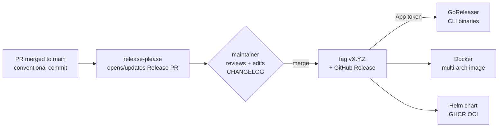

# Release Procedure — Proposal

> **PROPOSAL — nothing is wired up yet.** For review. **DECISION** = needs sign-off.
> Facts re-verified against the repo. Supersedes the manual bump steps in
> [`deploy/README.md`](../../deploy/README.md).

## The idea in one picture

**In words:** you already write Conventional Commits and squash-merge. A tool
(**release-please**) turns those into a reviewable "Release PR"; merging it cuts the
tag, changelog, and GitHub Release; the tag then builds the CLI, image, and chart.

## Why now (the gap)

| | |
| --- | --- |
| ✅ We have | Conventional Commits + squash-merge, enforced (`cz` + lefthook) |
| ❌ We lost | The release automation (jentic-mini's semantic-release pipeline, deleted in the 2026-07-01 OSS scrub) |
| ⚠️ Result | No versioning/tagging/release/changelog automation; the git-conventions rule still points at an "auto-generated changelog" that no longer exists |

## Current state (the facts that matter)

| Thing | Reality today |
| --- | --- |
| **Version** | `pyproject.toml` = **`0.1.1`**, Helm charts = **`0.1.0`**, tags reach **`v0.13.2`** → **three-way drift** |
| **Tags** | `v0.1.0`…`v0.13.2` + 19 `backup/*` exist **only locally** — **0 tags on every remote** |
| **Automation** | None. 3 workflows (ci, dependabot, smoke-helm); no tag/release triggers; CI doesn't run on tags |
| **Changelog** | No `CHANGELOG.md`, no GitHub Releases, no `.github/release.yml` |
| **Install path** | `install.sh` / `jenticctl` **build from source** at a git ref — they never pull `ghcr.io/...:X.Y.Z` |

## The recommendation

| Piece | Choice | Why |
| --- | --- | --- |
| **Engine** | **release-please** (manifest mode) | Language-agnostic, reviewable Release PR, fits our commit style |
| **Versioning** | Single **lockstep** version, `bump-minor-pre-major` | One number for app+CLI+image+chart; breaking→minor while beta |
| **CLI** | **GoReleaser stamps from the tag** | CLI version is a build-time ldflag, not a committed literal |
| **Image + chart** | Docker + Helm → **GHCR** on the tag | One registry; publish **umbrella + observability only** |
| **Changelog** | Keep-a-Changelog format + `UPGRADING.md` | Human-readable; operators read before upgrading |
| **Trigger** | **GitHub App token** | `GITHUB_TOKEN` can't fire downstream workflows |

## Decisions needed (sign-off before building)

1. **Version baseline** — clean `v0.1.0` (honest for a new public repo) **or** continue `0.x` → `v0.14.0` (continuity, needs a "continues our internal predecessor" note). **Not `1.0.0`** while the README allows breaking changes without a major bump. *(No tag-collision risk — tags are local-only.)*
2. **Distribution** — does the install pull the released image (default `JENTIC_REF`=tag), or is the first release "source-built, tag = git marker"? **This gates whether published artifacts matter.**
3. **Lockstep vs independent** — app+CLI lockstep (recommended); decide the observability chart separately.
4. **App token** — reuse mini's `ARAZZO_BUILDER_APP_ID`-style app, or provision new.
5. **Doc home** — this proposal lives in `docs/plans/`; the ratified procedure likely belongs in `docs/` or `deploy/`.

---

<b>Detail: release-please + Helm gotchas (the tricky bits)</b>

- **Root** uses `release-type: python` (bumps `pyproject.toml`). Add a **`uv.lock`** updater/step — release-please won't touch it and `uv sync --frozen` in CI will fail otherwise.
- **Helm:** manage the **umbrella** `Chart.yaml` (`version`+`appVersion`) and `observability` via `release-type: helm`. Only these 2 charts have `appVersion`; the 6 subcharts have `version` only.
- **Blocker to plan for:** the umbrella pins each subchart version in `dependencies:` (all `0.1.0`) and each subchart pins the `file://` `common` lib — **release-please won't rewrite these**, so bumping subcharts breaks `helm dependency build`. Fix: loosen `file://` pins to `">=0.0.0"` or add `extra-files` updaters.
- **Image tag** comes from the **umbrella** `appVersion` / `global.image.tag`, *not* subchart appVersions — so manage the umbrella, don't scatter across subcharts.
- **Seed `.release-please-manifest.json`** to the baseline; if continuing at `v0.14.0`, also set `bootstrap-sha` to a current-`main` commit so the first changelog doesn't replay pre-scrub history (history was rewritten in the scrub).

<b>Detail: tag → publish pipeline</b>

On the release-please tag (via App token, since `GITHUB_TOKEN` — and `on: release` — won't fire downstream):

1. **CI-on-tag gate** — build + run migrations on a fresh DB + `/health` **before** the Release is marked published (tags get no CI today; also scope `cancel-in-progress` to PRs).
2. **GoReleaser** — `jentic` + `jenticctl` binaries + `checksums.txt`, **cosign-signed**, attached to the Release.
3. **Docker buildx** — multi-arch → `ghcr.io/jentic/jentic-one/*:X.Y.Z`, **cosign-signed + SBOM + provenance**; add a Trivy **image** scan.
4. **Helm** — bump umbrella `version`/`appVersion`, `helm push … oci://ghcr.io/jentic/...`, duplicate-version guard. **Publish only the umbrella + observability** — subcharts bundle into the umbrella `.tgz`; `common` is a library chart that can't be installed.
5. **GHCR packages = public**; minimal `permissions:` (`contents: write`, `packages: write`).

<b>Detail: changelog & upgrade notes</b>

- **`CHANGELOG.md`** in Keep-a-Changelog format (`[Unreleased]` + Added/Changed/Deprecated/Removed/Fixed/Security + a prominent **Breaking Changes** block), generated by release-please and **editable in the Release PR** (the one human-curation gate).
- **One root changelog, sectioned by scope** (`feat(cli)`, `fix(helm)`) — not per-component files while in beta. Use commit scope so CLI vs server changes are findable.
- **`UPGRADING.md`** with Vector-style "Action needed" blocks for any migration/breaking release — the operator "what must I *do*" surface, separate from "what *changed*".
- **`.github/release.yml`** label categories as a cheap complement.
- Operators read **GitHub Releases** (Watch→Releases for upgrade notifications); `CHANGELOG.md` is the raw dev feed.

<b>Detail: distribution, migrations, governance (the gaps to close)</b>

- **Distribution (gates the plan):** `install.sh` (`JENTIC_REF`=`main`) and `jenticctl` build from source and never pull a tagged image. Either make the install pull the released image + default `JENTIC_REF` to the tag, or scope the first release as "source-built, tag = git marker." Document `JENTIC_REF=vX.Y.Z curl … | sh`; consider pointing `install.sh` at GoReleaser binaries + a Homebrew tap.
- **Migrations (~65, forward-only, "data unrecoverable"):** upgrade **one minor at a time** (each release tests migrations from N-1); rollback = restore backup + pin previous tag; **backup is a required pre-upgrade step**. Define a hotfix flow (`release-0.X` branch → patch tag) so a critical fix doesn't drag in all of `main`.
- **Supply chain:** image signing + SBOM + provenance (not just CLI binaries); image scan on release.
- **Governance:** protect the Release PR (CODEOWNERS + branch protection — merging it *is* the ship action); confirm release-please/bot commits satisfy DCO; add a "Releases" section to `CONTRIBUTING.md`; reconcile the git-conventions rule's "auto-generated changelog" wording.
- **Housekeeping:** fix the 3-way version drift; local-only cleanup of `v0.*` + `backup/*` tags (these don't confuse release-please — hygiene only); add `VERSIONING.md`.

<b>Detail: what jentic-mini did (the proven prior art)</b>

Node **semantic-release**, push-to-`main`: `commit-analyzer` → `release-notes-generator`
→ stamp `pyproject.toml` + `Dockerfile` → commit `chore(release): cut X.Y.Z` + tag →
publish GitHub Release → trigger `docker-publish.yml` → `ghcr.io/jentic/jentic-mini`,
bridged by the `ARAZZO_BUILDER_APP_ID` App token. Removed in the OSS scrub. **We're
re-establishing a proven model**, adapted from Node/semantic-release to the
polyglot-friendly release-please.

## Implementation order (once decisions land)

1. Fix version drift (pyproject + 9 charts) + add `VERSIONING.md`; local tag cleanup.
2. Resolve the **distribution** decision (#2) — it gates whether artifacts matter.
3. Add `release-please` (manifest, lockstep, seeded + `bootstrap-sha`, Helm pin handling, `uv.lock`).
4. Cut the first Release PR; verify version + changelog (no pre-scrub replay).
5. Add the tag-triggered publish (CI-on-tag gate → GoReleaser + signed Docker + Helm-OCI) behind the App token.
6. Add `CHANGELOG.md` + `UPGRADING.md` + `.github/release.yml`; reconcile git-conventions + CONTRIBUTING.
