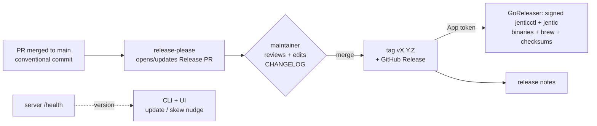
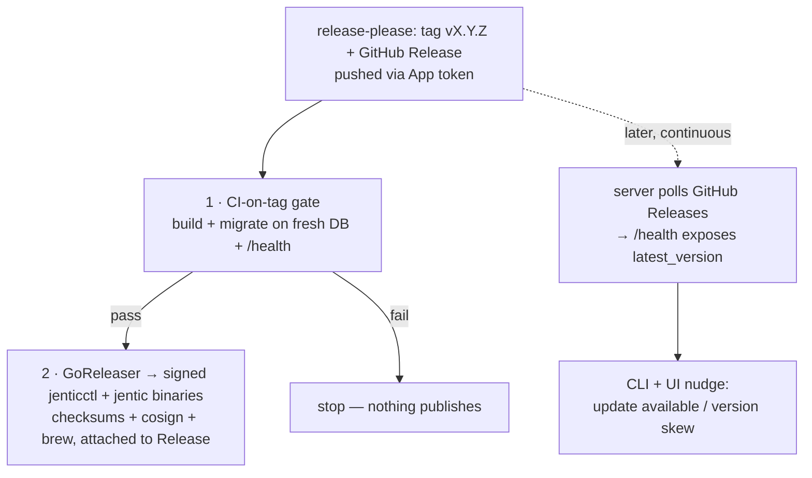

# Release & Distribution Procedure — Proposal

> **PROPOSAL — nothing is wired up yet.** For review. **DECISION** = needs sign-off.
> Facts re-verified against the repo. Supersedes the manual bump steps in
> [`deploy/README.md`](../../deploy/README.md).

## The idea in one picture

**In words:** you already write Conventional Commits and squash-merge. **release-please**
turns those into a reviewable Release PR; merging it cuts the tag, changelog, and GitHub
Release; the tag then publishes the **prebuilt, signed CLI binaries** (the install). Separately, the CLI
and UI passively check `/health` to nudge when a newer version (or a version-skewed
remote server) is detected.

## What happens after the GitHub Release

Everything below is triggered *by the tag/Release appearing*. release-please pushes the
tag using a **GitHub App token** — the default `GITHUB_TOKEN` is deliberately blocked from
triggering other workflows (loop-prevention), so the App token is what lets the Release
kick off the publish steps.

1. **CI-on-tag gate (safety check before publishing).** Runs on the exact tagged commit:
   build the app, spin up a **fresh empty DB and run all migrations**, hit `/health`. Today
   CI only runs on `main`, so the tag itself is untested — and a broken migration is our top
   risk. If this fails, we stop and **nothing publishes**.
2. **Publish the CLI binaries → GoReleaser.** From the tag, compile **`jenticctl` + `jentic`**
   for every OS/arch, produce `checksums.txt` + a **cosign signature**, a **Homebrew** formula,
   and **attach them to the GitHub Release**. This *is* the install — `jenticctl` holds the
   setup wizard, and the CLI is also a standalone client an agent runs on a *different host*
   than the server.

*(The Docker image and Helm chart are deliberately **not** in these steps for beta — deferred
until their tripwires; see the distribution table.)*

**Separately, a continuous notification loop** (not triggered by the release): the server
periodically checks the GitHub Releases API and exposes the latest version on `/health`; the
CLI and UI read it and passively nudge "vX.Y.Z available," and the CLI also warns if its
version differs from the remote server it targets. Pure read, sends no data, default-on with
one flag off, silenced by `--offline`.

## Why now (the gap)

| | |
| --- | --- |
| ✅ We have | Conventional Commits + squash-merge, enforced (`cz` + lefthook) |
| ❌ We lost | The release automation (jentic-mini's semantic-release pipeline, deleted in the 2026-07-01 OSS scrub) |
| ⚠️ Result | No versioning/tagging/release/changelog automation; the git-conventions rule still points at an "auto-generated changelog" that no longer exists; **nothing is published anywhere — every install builds from source** |

## Distribution strategy — the CLI is the front door

Research across comparable self-hosted OSS (Sentry, PostHog, Supabase, Meilisearch,
Plausible) and mainstream CLIs (`gh`, `kubectl`, `terraform`, `supabase`, Claude Code)
is consistent: **the install is a single prebuilt CLI, and nobody's happy path is
compile-from-source** — source-build is always the last-resort fallback.

For jentic-one that CLI is **`jenticctl`** (with the `install` wizard) — it's already the
front door today (`curl | sh` → `jenticctl` → wizard sets up config + DB + starts the
server). The one thing to change is *how the binary is produced*: build **once in CI**
(prebuilt) instead of **on the user's machine** (from source).

| Artifact | Beta stance | Why |
| --- | --- | --- |
| **`jentic` + `jenticctl` binaries** — prebuilt, signed (GoReleaser + Homebrew + `curl \| sh` that *downloads*) | **Ship — headline install** | This *is* the "install jentic-one" story. See rationale below. |
| **Tag + release notes + checksums** | **Ship** | Always. |
| **Source build** (`curl \| sh` that compiles) | **Keep as fallback** | For auditing / unsupported platforms; a liability only if it's the *only* path. |
| **Python wheel (PyPI)** | **Not an install path** | Dropped. See "Why not a wheel" below. |
| **Docker server image (GHCR)** | **Defer — honestly** | Keep "build locally" for beta, **documented as the current state** (not dressed up). A hosted image is a standing promise (needs a CVE-rebuild cron). **Tripwire:** the first "how do I run this without building?" from a non-author → add a signed multi-arch GHCR image + rebuild cron + rewire the installer to pull it. |
| **Helm chart (OCI publish)** | **Defer** | Strongest-supported deferral (PostHog killed theirs, Supabase refused in-repo, Meilisearch isolates it). Keep a repo-referenced `charts/` dir. **Tripwire:** ≥2–3 real k8s users. |

### Why prebuilt CLI binaries (not build-from-source)

A Go program must be compiled. Today `curl | sh` **compiles on the user's machine** —
it downloads a Go toolchain and builds, which is slow (minutes), needs a toolchain, can
fail on version/network/arch quirks, and is only as trustworthy as the build script.
**Prebuilt** means *we* compile once per release in CI, for every OS/arch, sign
(cosign) + checksum, and publish the finished executables; the user's `curl | sh` just
downloads the right one.

- **Fast + zero prerequisites** — seconds, no Go toolchain to install.
- **Reliable** — no "build failed on your machine."
- **Verifiable supply chain** — signed, checksummed artifacts prove *we* built them,
  untampered (stronger than "trust this build script").
- **Enables `brew install jentic`** and GitHub Release assets — these distribute
  binaries, not source.
- **It's the universal norm** — `gh`, `kubectl`, `terraform`, `supabase`, Claude Code
  all ship prebuilt signed binaries and offer source-build only as a fallback.
- **Low effort** — one GoReleaser config, fired by the release tag we already create.

### Why *not* a Python wheel as an install path

An earlier draft proposed publishing a `jentic-one` wheel to PyPI as a "no-Docker"
install. **Dropped**, because:

- **The product is two programs:** the **server** (Python) and the **CLI** (`jenticctl`,
  Go). `pip install` can only deliver the Python server — **not** the CLI, and the CLI
  *is* the front door (it holds the setup wizard). So `pip install jentic-one` would
  give you a bare server with **no** config, no migrations, no wizard — not a usable
  install.
- Making it usable would mean building a **second, Python-side onboarding flow**
  (`jentic-one setup`) that duplicates the Go wizard — real complexity for a near-empty
  audience (embedding the package / pure-PaaS deploys), which isn't a beta priority.
- It's not how comparable tools work — you install *the CLI*, and the CLI runs the
  server. (Claude Code etc. hand you one CLI, not a language package.)

If a genuine "embed the server as a library" use case appears later, a wheel can be
revisited then — but it is **not** the beta install path, and the docs should point
users at the CLI.

## CLI as a remote client (the VPC / different-host case)

The `jentic` CLI is **already a standalone HTTP client**: a separate Go module, no Python
dependency, and it already targets a remote instance via `--base-url` (control plane) +
`--broker-scheme`/`--broker-host` (broker), persisted per profile. An agent on host B can
already drive a jentic-one in a VPC on host A — this is documented in
[`docs/security/hardening.md`](../security/hardening.md).

**Implication:** the CLI is really a *client* to a server it may not have installed and
doesn't control (think `kubectl` ↔ Kubernetes). That affects versioning.

| Decision | Beta choice | Rationale |
| --- | --- | --- |
| **Versioning model** | **Lockstep for now** (one version), but **publish the CLI as standalone binaries** | Full decoupling (independent trains + a compatibility matrix) is real complexity for an unknown-audience beta. Lockstep is simple; the CLI still ships separately because agents run it elsewhere. |
| **Version-skew safety** | **Add now** | When the CLI talks to a remote instance, warn if its version ≠ the server's (`/health` already exposes the server version — today it's only displayed, never compared). |
| **Remote-client UX** | **Add now** | A single **instance URL** that derives both control-plane + broker, and a `JENTIC_BASE_URL` env var (only `JENTIC_HOME`/`JENTIC_PROFILE` exist today). Smooths the "point at a different broker/control plane" flow. |
| **Full decouple** | **Defer** | **Tripwire:** evidence agents run mismatched CLI/server versions against remote instances → split release trains + publish a compatibility window. |

## Update & version notifications (firm requirement)

Both the CLI and UI must nudge when a newer version exists. Privacy-respecting, Grafana/Gitea model:

- **Mechanism:** a one-way GET to the GitHub Releases API (or a static `versions.json`), compared to the running version. **Two skews to surface:** CLI/server **vs latest release**, and CLI **vs the remote server it's talking to** (from `/health`).
- **Surfaces:** server `/health` gains an optional `latest_version`/`update_available` field (server does the check; CLI + UI already read `/health`); CLI shows a dim "vX.Y.Z available" line (reuse `VersionPanel` + the existing `update` "Update available: X → Y" phrasing); UI shows a dismissible banner (the UI shows **no** version today — needs the admin `/health` schema to include `version` + a banner in the app shell).
- **Privacy:** pure pull, **sends no data**; **default-on but one flag off** (`check_for_updates=false` / `JENTIC_CHECK_FOR_UPDATES=false`); **separate from telemetry** (which stays opt-in); a single `--offline` silences all outbound calls.
- **Build-on:** add a semver lib to the Go CLI (`golang.org/x/mod/semver` — none today; the current `update` compares git SHAs, not tags).

## Decisions needed (sign-off before building)

1. **Version baseline** — clean `v0.1.0` (honest for a new public repo) **or** continue `0.x` → `v0.14.0` (continuity, needs a "continues our internal predecessor" note). **Not `1.0.0`** while the README allows breaking changes without a major bump. *(No tag-collision risk — tags are local-only.)*
2. **Distribution (settled above):** the install is prebuilt signed CLI binaries (GoReleaser + brew); no Python wheel install path; Docker image deferred-but-honest; Helm deferred. Confirm.
3. **Versioning model (settled above):** lockstep for beta, CLI shipped separately, skew-warning + remote-UX added now, full decouple deferred. Confirm.
4. **App token** — reuse mini's `ARAZZO_BUILDER_APP_ID`-style app, or provision new.
5. **Doc home** — this proposal lives in `docs/plans/`; the ratified procedure likely belongs in `docs/` or `deploy/`.

---

<b>Detail: current-state facts</b>

| Thing | Reality today |
| --- | --- |
| **Version** | `pyproject.toml` = **`0.1.1`**, Helm charts = **`0.1.0`**, tags reach **`v0.13.2`** → three-way drift |
| **Tags** | `v0.1.0`…`v0.13.2` + 19 `backup/*` exist **only locally** — **0 tags on every remote** |
| **Automation** | None. 3 workflows (ci, dependabot, smoke-helm); no tag/release triggers; CI doesn't run on tags |
| **Changelog** | No `CHANGELOG.md`, no GitHub Releases, no `.github/release.yml` |
| **Install path** | `install.sh` / `jenticctl` **build from source** at a git ref — they never pull a registry artifact |
| **CLI** | Separate Go module, no Python dep; already targets a remote via `--base-url` + broker flags; **no** CLI↔server version check; no GoReleaser yet |

<b>Detail: release-please + Helm gotchas</b>

- **Root** uses `release-type: python` (bumps `pyproject.toml`); add a **`uv.lock`** updater/step or `uv sync --frozen` in CI breaks.
- **Helm:** manage the **umbrella** `Chart.yaml` (`version`+`appVersion`) and `observability` via `release-type: helm`. Only these 2 charts have `appVersion`; the 6 subcharts have `version` only.
- **Blocker to plan for:** the umbrella pins each subchart version in `dependencies:` and each subchart pins the `file://` `common` lib — **release-please won't rewrite these**, so bumping subcharts breaks `helm dependency build`. Fix: loosen `file://` pins or add `extra-files` updaters.
- **Image tag** comes from the **umbrella** `appVersion`/`global.image.tag`, not subchart appVersions.
- **Seed `.release-please-manifest.json`** to the baseline; if continuing at `v0.14.0`, set `bootstrap-sha` to a current-`main` commit so the first changelog doesn't replay pre-scrub history.

<b>Detail: tag → publish pipeline</b>

On the release-please tag (via App token — `GITHUB_TOKEN`, and `on: release`, won't fire downstream):

1. **CI-on-tag gate** — build + run migrations on a fresh DB + `/health` **before** the Release is published (tags get no CI today; scope `cancel-in-progress` to PRs).
2. **GoReleaser** — `jentic` + `jenticctl` binaries + `checksums.txt`, **cosign-signed**, Homebrew cask, attached to the Release. *(This is the install.)*
3. **(deferred)** Docker image + Helm OCI — only once their tripwires fire. When added: multi-arch, cosign-signed, SBOM, provenance, image Trivy scan; publish **umbrella + observability only**.

<b>Detail: changelog & upgrade notes</b>

- **`CHANGELOG.md`** in Keep-a-Changelog format, generated by release-please and **editable in the Release PR** (the human-curation gate). One root file, sectioned by commit scope (CLI vs server findable).
- **`UPGRADING.md`** with Vector-style "Action needed" blocks for any migration/breaking release — the operator "what must I *do*" surface, separate from "what *changed*".
- **`.github/release.yml`** label categories; operators read GitHub Releases (Watch→Releases).

<b>Detail: migrations, governance, housekeeping (gaps to close)</b>

- **Migrations (~65, forward-only, "data unrecoverable"):** upgrade **one minor at a time**; rollback = restore backup + pin previous tag; **backup is a required pre-upgrade step**; define a hotfix flow (`release-0.X` branch → patch tag).
- **Governance:** protect the Release PR (merging it *is* the ship action); confirm release-please/bot commits satisfy DCO; add a "Releases" section to `CONTRIBUTING.md`; reconcile the git-conventions "auto-generated changelog" wording.
- **Housekeeping:** fix the 3-way version drift; local-only cleanup of `v0.*` + `backup/*` tags (don't confuse release-please — hygiene only); add `VERSIONING.md`; the stale `broker.jentic.ai` default in `skillgen/content/jentic.md` vs the real `127.0.0.1:8100`.

<b>Detail: what jentic-mini did (proven prior art)</b>

Node **semantic-release**, push-to-`main`: analyze commits → notes → stamp `pyproject.toml` +
`Dockerfile` → commit `chore(release): cut X.Y.Z` + tag → publish GitHub Release → trigger
`docker-publish.yml` → `ghcr.io/jentic/jentic-mini`, bridged by the `ARAZZO_BUILDER_APP_ID`
App token. Removed in the OSS scrub. We're re-establishing a proven model, adapted to the
polyglot-friendly release-please.

## Implementation order (once decisions land)

1. Fix version drift (pyproject + 9 charts) + add `VERSIONING.md`; local tag cleanup.
2. Add `release-please` (manifest, lockstep, seeded + `bootstrap-sha`, Helm-pin handling, `uv.lock`).
3. Cut the first Release PR; verify version + changelog (no pre-scrub replay).
4. Tag-triggered publish behind the App token: **GoReleaser CLI binaries** (`jenticctl` + `jentic`, signed, + brew) + notes/checksums — this is the install. (Docker/Helm deferred to their tripwires; no wheel.)
5. **Version notifications:** `/health` `latest_version` field + CLI passive nudge + CLI↔server skew warning + UI version/banner; add the Go semver lib; wire the `check_for_updates` flag.
6. **Remote-client UX:** single instance-URL config + `JENTIC_BASE_URL` env var.
7. Add `CHANGELOG.md` + `UPGRADING.md` + `.github/release.yml`; reconcile git-conventions + CONTRIBUTING; document migration/upgrade/hotfix policy.
