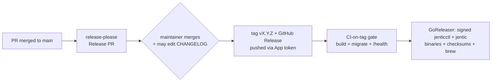

# Release & Distribution Procedure — Proposal

> **PROPOSAL — nothing is wired up yet.** For review. Facts re-verified against the repo.
> Supersedes the manual bump steps in [`deploy/README.md`](../deploy/README.md).
> Three related workstreams are split into their own docs (linked inline).

## Decisions

| # | Decision | Status |
| --- | --- | --- |
| 1 | **Version baseline** | **DECIDED: continue `0.x` → next release `v0.14.0`.** The `v0.1.0`…`v0.13.2` tags **and** GitHub Releases (notes recovered from the `chore(release)` commit bodies) have been **restored natively on `jentic-one`** — the mini history is genuinely ancestral to `main` (verified: `v0.13.2` is an ancestor of `origin/main`), so the version line is real and publicly visible. Continuing at `v0.14.0` is therefore honest. Not `1.0.0` while the README allows breaking changes without a major bump. |
| 2 | **Release model** | **DECIDED: release-please Release PR** (merge = release; edit the changelog in the PR, optional). Operated leniently ≈ mini's deliberate trigger + auto execution, plus an optional pre-ship notes edit. |
| 3 | **Distribution** | **DECIDED: prebuilt signed CLI binaries are the install** (GoReleaser + Homebrew + `curl \| sh` that *downloads*). Docker image + Helm OCI **deferred** (build-locally for beta, honestly documented, with tripwires). No Python wheel install path. |
| 4 | **Release-trigger token** | **DECIDED: provision a NEW GitHub App** scoped to exactly `contents: write` + `pull-requests: write` on this one repo (don't inherit mini's broader `ARAZZO_BUILDER_APP_ID` install). Needed because `GITHUB_TOKEN` can't trigger downstream workflows. |
| 5 | **Versioning model** | **DECIDED: lockstep for beta** (one version), CLI shipped as standalone binaries; full CLI/server decouple deferred behind a tripwire. |

## The idea in one picture

Merging the Release PR is the release gate; **editing the changelog = editing `CHANGELOG.md`
in that PR** (GitHub's file editor). The tag then runs a safety gate and publishes the
signed CLI binaries — that *is* the install. Docker/Helm are deferred (see the table).

## Why now (the gap)

| | |
| --- | --- |
| ✅ We have | Conventional Commits + squash-merge, enforced (`cz` + lefthook) |
| ❌ We lost | The release automation (jentic-mini's semantic-release pipeline, deleted in the 2026-07-01 OSS scrub) |
| ⚠️ Result | No versioning/tagging/release/changelog automation; the git-conventions rule still points at an "auto-generated changelog" that no longer exists; **nothing is published — every install builds from source** |

## Current state (verified facts)

| Thing | Reality today |
| --- | --- |
| **Version** | **four-way drift:** `pyproject.toml` = `0.1.1`, **`src/jentic_one/__init__.py` = `0.1.0` (this is what `/health` serves)**, 9 Helm `Chart.yaml` = `0.1.0`, tags reach `v0.13.2` |
| **Tags / Releases** | **RESTORED on `jentic-one`:** `v0.1.0`…`v0.13.2` tags + 36 GitHub Releases (notes recovered from `chore(release)` commit bodies), pointing at real ancestral commits. `v0.13.2` is currently "Latest"; next release is `v0.14.0`. (19 local `backup/*` tags remain unpushed — hygiene.) |
| **Helm** | 9 `Chart.yaml`: umbrella + `observability` (both have `appVersion`) + **7 version-only subcharts** (`admin app broker control gateway registry` + the `common` **library** chart). Umbrella pins each subchart version in `dependencies:`; subcharts pin `common` via `file://` |
| **Automation** | None. 3 workflows (ci, dependabot, smoke-helm); no tag/release triggers; CI doesn't run on tags |
| **Changelog** | No `CHANGELOG.md`, no GitHub Releases, no `.github/release.yml` |
| **Install path** | `install.sh` / `jenticctl` **build from source** at a git ref; never pull a registry artifact |
| **CLI** | Separate Go module, no Python dep; `jentic` (client) + `jenticctl` (operator); already targets a remote via `--base-url` + broker flags; **no** CLI↔server version compare; `version = "dev"` ldflag; no semver lib |
| **⚠️ Orphaned package** | **`ghcr.io/jentic/jentic-mini` is public + anonymously pullable, tags `0.2.0`…`0.13.2` + `latest`/`unstable`**, pre-OSS-scrub. **Live exposure — P0, tracked separately** ([security doc](plans/security-orphaned-mini-package.md)) |

## Distribution — the CLI is the front door

Comparable self-hosted OSS (Sentry, PostHog, Supabase, Meilisearch) and mainstream CLIs
(`gh`, `kubectl`, `supabase`, Claude Code) converge on: **the install is a single prebuilt
CLI; source-build is the last-resort fallback** ([References](#references--prior-art)).

| Artifact | Beta stance | Why |
| --- | --- | --- |
| **`jenticctl` + `jentic` binaries** — prebuilt, signed (GoReleaser + brew + `curl \| sh` that downloads) | **Ship — the install** | fast, no Go toolchain, signed supply chain, `brew`, industry norm; low effort |
| **Tag + release notes + checksums** | **Ship** | always |
| **Source build** (`curl \| sh` that compiles) | **Fallback — pinned to a signed tag** | auditing / unsupported platforms; **must default to a tag, not `main`, and verify the fetched script + Go-toolchain checksum** (security) |
| **Python wheel (PyPI)** | **Not an install path** | the CLI is the front door and `pip` can't ship it; a Python onboarding flow would duplicate the Go wizard. See foldout |
| **Docker image (GHCR)** | **Defer — honestly** | build-locally for beta, documented as such. Honest cost: operators run an **unsigned, unscanned, no-provenance** image they built — deferring the *more verifiable* artifact. **Tripwires:** first "run without building?" ask, **or a base-image CVE** → ship a signed multi-arch image + CVE-rebuild cron |
| **Helm chart (OCI)** | **Defer** | PostHog killed theirs, Supabase declined in-repo. Repo-referenced `charts/` dir. **Tripwire:** ≥2–3 real k8s users |

**Two-step install** (`brew install jentic` → `jenticctl install`) is idiomatic
(Supabase/Temporal/Fly). The Homebrew formula must ship **both** binaries; step 2 still
needs a runtime (the dependency-free path is **local venv + SQLite** — surface it). Note:
GoReleaser produces a Homebrew **formula** (not a cask).

## Cutting a release & editing the changelog

release-please keeps a standing **Release PR** (`chore(main): release X.Y.Z`); **merging it
is the release**. The PR's diff *is* the `CHANGELOG.md` update — edit it there (GitHub's
file editor, optional) then merge. The PR is **public** — normal and safe for OSS (only
already-public content; a next-release preview; hold the merge to time an announcement).
Operator "what must I DO on upgrade" lives in a separate `UPGRADING.md`.

## Upgrade safety (operator-critical)

~65 **forward-only** migrations, "data unrecoverable." Today `jenticctl update` prints one
warning and proceeds — insufficient for a credential broker. **Must ship with the first
release:** backup-by-default (refuse `--stack` without confirmation; `--no-backup` to opt
out), **one-minor-at-a-time hard stop**, `--dry-run`, and an `UPGRADING.md` with a concrete
rollback recipe (stop → restore DB → pin previous tag → start) + a "which versions are
supported" policy.

## Split-out workstreams (own docs)

- **`jenticctl update` rework** — package-manager-aware + release-tag-based + **signature-verified self-update** (security fix): [plans/cli-update-rework.md](plans/cli-update-rework.md)
- **Version notifications + remote-client UX** — `/health` `latest_version`, CLI + UI nudge, CLI↔server skew, `JENTIC_BASE_URL`: [plans/version-notifications-remote-client.md](plans/version-notifications-remote-client.md)
- **Orphaned `jentic-mini` package retirement (P0 security)** — rotate + git-history scan + delete: [plans/security-orphaned-mini-package.md](plans/security-orphaned-mini-package.md)

---

<b>Detail: release-please + Helm gotchas</b>

- **Root:** `release-type: python` bumps `pyproject.toml`. **Also add `src/jentic_one/__init__.py`** as an `extra-files` updater — it's the version `/health` serves and release-please won't touch it otherwise (this is the four-way-drift trap). *Better:* make `__version__` read package metadata (`importlib.metadata.version`) — one source of truth, kills the drift class.
- Add a **`uv.lock`** step — `uv sync --frozen` in CI fails on a bumped version with a stale lock.
- **Helm:** manage the **umbrella** `Chart.yaml` + `observability` via `release-type: helm`. The umbrella's `dependencies:` subchart pins and each subchart's `file://` `common` pin are **not** rewritten by release-please → `helm dependency build` breaks. **Fix: loosen the `file://` pins to `>=0.0.0`** (constraint is ceremony for a local path). *(Moot for beta since Helm publish is deferred — but the pins still matter for local `helm dependency build`.)*
- **Seed `.release-please-manifest.json`** to `0.13.2` (the restored latest release) so the next Release PR computes `v0.14.0`. Set `bootstrap-sha` to a current-`main` commit so the first changelog covers only commits since the OSS cutover (not the whole restored history, which already has its own releases/notes).

<b>Detail: tag → publish pipeline + supply-chain requirements</b>

On the release-please tag (via the App token — `GITHUB_TOKEN` and `on: release` don't fire downstream):

1. **CI-on-tag gate** — build + migrate on a **fresh DB with ephemeral/dummy secrets only** (no prod keyset, no publish token) + `/health`, **before** publish. Today CI doesn't run on tags and `cancel-in-progress: true` is unconditional — scope it to PRs first.
2. **GoReleaser** — `jenticctl` + `jentic` (ldflags `-X …/internal/cmd.version={{.Version}}`), `checksums.txt`, **cosign-signed (sign the checksum file; publish the verify identity — `--certificate-identity` + `--certificate-oidc-issuer` — and have the installer/formula verify it)**, **SBOM per binary (syft)**, Homebrew formula.
3. Release workflow: top-level `permissions: {}` + per-job grants; add a **secret scan of the artifacts** before publish.
4. **(deferred)** Docker image + Helm OCI — when tripwires fire: multi-arch, cosign-signed, SBOM, provenance, image Trivy scan (CI only scans the filesystem today); publish **umbrella + observability only**; the new image's **public visibility must be a deliberate reviewed choice** (this is how the mini orphan happened).

<b>Detail: changelog, governance, housekeeping</b>

- **`CHANGELOG.md`** (Keep-a-Changelog, release-please-generated, editable in the Release PR), sectioned by commit scope (CLI vs server); `.github/release.yml` label categories.
- **Governance:** protect the Release PR (merging it *is* the ship action); confirm release-please/bot commits satisfy DCO; add a "Releases" section to `CONTRIBUTING.md`; reconcile the git-conventions "auto-generated changelog" wording.
- **Housekeeping:** fix the four-way version drift; local cleanup of `v0.*` + `backup/*` tags (hygiene — they don't confuse release-please); the stale `broker.jentic.ai` default (in `skillgen/content/jentic.md`, `execute.go`, `install.go`) vs real `127.0.0.1:8100`.

<b>Detail: why not a Python wheel; what jentic-mini did</b>

**No wheel:** the product is two programs (Python server + Go CLI); `pip` can only ship the
server, not the CLI/wizard front door, so `pip install jentic-one` gives an unconfigured
server. A Python onboarding flow would duplicate the Go wizard for a near-empty audience.
Revisit only for a real "embed the server as a library" use case.

**mini:** Node **semantic-release** triggered by **`workflow_dispatch` only** — a human ran
the workflow, then it auto-computed version/notes/tag/Release and pushed to
`ghcr.io/jentic/jentic-mini` (via `ARAZZO_BUILDER_APP_ID`). Manual trigger, automatic
execution, no changelog review. Removed in the scrub. We're re-establishing a proven model.

## Implementation order

**Beta-blocking (the minimal value slice):**
1. **Fix version drift** — `__version__` → package metadata (or `extra-files`), align pyproject + 9 charts to `0.13.2` baseline; add `VERSIONING.md`. *(Prereq: none — decision #1 is made; tags/releases already restored.)*
2. **release-please** — manifest seeded to `0.13.2` + `bootstrap-sha`, `python`/`helm` types, `__init__.py` + `uv.lock` updaters, loosen Helm `file://` pins → first Release PR proposes `v0.14.0`. *(Prereq: #1 + provision the App token.)*
3. **CI-on-tag gate + GoReleaser signed binaries** — scope `cancel-in-progress` to PRs; tag CI (fresh-DB migrate + `/health`); GoReleaser (2 binaries, cosign + verify identity + SBOM + brew). *(Prereq: #2 + App token.)* → **this is the install.**

**Deferred (own docs / post-beta), roughly in order:**
4. Upgrade safety (backup-by-default, one-minor hard stop, `--dry-run`, `UPGRADING.md`) — *should ship with the first real upgrade*.
5. `jenticctl update` rework — **must land with or before brew** (else brew users hit the self-update footgun) — [doc](plans/cli-update-rework.md).
6. Version notifications + remote-client UX — [doc](plans/version-notifications-remote-client.md).
7. `CHANGELOG.md`/`UPGRADING.md`/`.github/release.yml`; git-conventions + CONTRIBUTING reconciliation.

**Independent / urgent:** the orphaned `jentic-mini` package (P0 security) — [doc](plans/security-orphaned-mini-package.md), blocked on org-owner access.

## References / prior art

Sources behind the "other projects do this" claims (point-in-time; verify before treating as load-bearing).

- **Distribution / CLI:** Sentry self-hosted <https://develop.sentry.dev/self-hosted/> · Meilisearch install <https://www.meilisearch.com/docs/learn/getting_started/installation> · GoReleaser <https://goreleaser.com/> · `gh` install <https://github.com/cli/cli#installation>
- **Helm deferral:** PostHog <https://posthog.com/blog/sunsetting-helm-support-posthog> · Supabase <https://github.com/supabase/supabase/discussions/6603> · Meilisearch charts <https://github.com/meilisearch/meilisearch-kubernetes>
- **Two-step install:** Supabase <https://supabase.com/docs/guides/local-development/cli/getting-started> · Temporal <https://docs.temporal.io/cli> · Fly <https://fly.io/docs/flyctl/install/>
- **Update notifications:** Grafana `check_for_updates` <https://grafana.com/docs/grafana/latest/setup-grafana/configure-grafana/#check_for_updates> · GitHub Releases API <https://docs.github.com/en/rest/releases/releases#get-the-latest-release>
- **CLI self-update vs pkg manager:** gh <https://github.com/cli/cli/issues/166> · flyctl `isUnderHomebrew` <https://github.com/superfly/flyctl/blob/master/internal/update/update.go> · gcloud <https://cloud.google.com/sdk/docs/components> · Homebrew FAQ <https://docs.brew.sh/FAQ>
- **Changelog:** Keep a Changelog <https://keepachangelog.com/en/1.1.0/> · release-please <https://github.com/googleapis/release-please> · GitHub release.yml <https://docs.github.com/en/repositories/releasing-projects-on-github/automatically-generated-release-notes>
- **Supply chain:** cosign <https://docs.sigstore.dev/cosign/signing/signing_with_containers/> · SLSA provenance <https://github.com/actions/attest-build-provenance>
- **Retiring a package:** GHCR delete/restore <https://docs.github.com/en/packages/learn-github-packages/deleting-and-restoring-a-package> · secrets in layers → rotate <https://trufflesecurity.com/blog/how-secrets-leak-out-of-docker-images>
