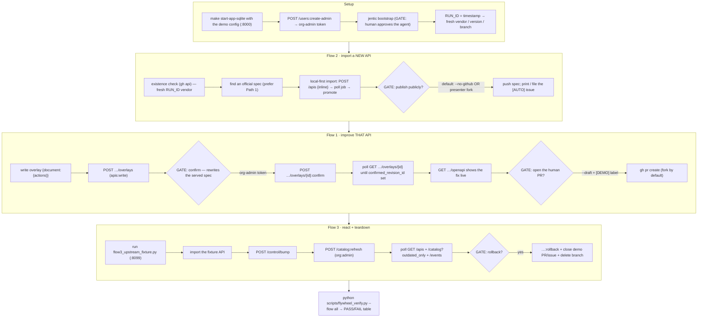

# Demo the spec-flywheel (import → improve → react), human-in-the-loop

Run all three flywheel flows end-to-end against a **local** Jentic control plane
as one coherent story about a single API's lifecycle:

```
   Flow 2            Flow 1                       Flow 3
   import  ───►  improve via overlay  ───►  react to upstream + rollback
   (new API)    (confirm makes it live)     (update-notify, then teardown)
```

You (the agent) **narrate and execute the real steps**, pausing for a human at
every irreversible / public / privileged gate, then run
`scripts/flywheel_verify.py` to prove each flow's effects actually landed.

Target: `$ARGUMENTS` — which flow to run (`all` default, or `2` / `1` / `3`).

This skill **orchestrates** the real skills — it points at
[`import-new-api`](../import-new-api/SKILL.md) and
[`contribute-spec-fix`](../contribute-spec-fix/SKILL.md) for the authoritative
command sequences and reuses their exact steps. Read those two skills before
presenting; this one adds the demo scaffolding (preflight, gates, ordering,
teardown, verification) around them.

## The demo at a glance



## Human-in-the-loop protocol (read before you start)

Gate exactly **four** kinds of step — the irreversible, the public, and the
privileged. **Auto-proceed** on everything local and reversible (writing an
overlay, a local import, submitting a still-pending overlay, reading events).
Before each gated step, emit this line verbatim and wait:

> **PAUSE — needs human: `<what>` (`<why it matters>`). Proceed? (y/n)**

The four gates:
1. **Agent approval / access grant** — `jentic bootstrap` and any
   `jentic access request` block on a human approver in the console.
2. **Overlay `:confirm`** — materializes the overlay and **rewrites the served
   spec**; needs the elevated `overlays:confirm` scope (org-admin token).
3. **Any public `gh` action** — `gh pr create`, `gh issue create`, or a push to
   a public repo. You are acting under the presenter's GitHub identity.
4. **Rollback** — restores the superseded revision; the audience should see the
   human decide to revert.

## Preflight (do this before the audience arrives)

A stalled demo is worse than no demo. Verify all of this first:

- **Stack up with the demo config** (Flow 3 needs the loopback egress + short
  probe interval, see below):
  ```
  JENTIC_CONFIG_FILE=config/local-sqlite-demo.yaml make start-app-sqlite
  ```
  Liveness: `curl -fsS http://127.0.0.1:8000/health` → `{"status":"ok",...}`.
  Setup-readiness: `curl -fsS http://127.0.0.1:8000/admin/health` →
  `setup_required` tells you whether the first admin still needs creating.
- **Org-admin token** (covers `overlays:confirm` + `org:admin`, which agents
  cannot self-grant). On a fresh DB:
  ```
  curl -fsS -X POST http://127.0.0.1:8000/users:create-admin \
    -H 'Content-Type: application/json' \
    -d '{"email":"flywheel-admin@demo.test","password":"FlywheelDemo!234","first_name":"Fly","last_name":"Wheel"}'
  ```
  Returns a `LoginResponse` with `access_token` (already org-admin,
  `must_change_password:false` — no rotation). On a re-run this 410s; log in via
  `POST /auth/login` with the same credentials instead. (This is exactly what
  `scripts/flywheel_verify.py` does — you can reuse its token.)
- **Agent token** for the CLI-driven steps: `jentic bootstrap` done (token at
  `~/.jentic/profiles/<p>/tokens.json`, key `access_token`). This is **gate 1**.
- **`gh auth status`** on the intended account/**fork** (see GitHub safety).
- **Pre-warm the flaky bits** so they don't fail live: `npx --yes bump-cli --version`
  (first run downloads over the network) and `spectral --version`.
- **Pin the `jentic-public-apis` checkout path** for Flow 1 — don't rely on a
  slow `find ~`. Know it in advance.
- **Establish a `RUN_ID`** (e.g. `RUN_ID=$(date +%Y%m%d-%H%M%S)`) and thread it
  into every vendor / version / branch / issue title so re-runs never collide
  (the existence gate STOPs on a known vendor and the import workflow hard-fails
  on a duplicate version).

Print the plan — "I will create a public spec commit, a draft PR, and (in
dry-run) show the issue body I would file" — **before** doing anything.

## GitHub safety (this is the real blast radius)

A real `[AUTO]` issue on `jentic/jentic-public-apis` triggers a live,
LLM-backed import workflow that **spends the repo's Bedrock secret and
auto-opens a PR to `main`** — it cannot be a draft. So, by default, **do not
fire that issue at the public repo**. Choose one:

- **`--no-github` dry-run (default):** run Flow 2 through publishing the spec to
  the presenter's own repo, then **print the exact `[AUTO]` issue body you
  would file** (with `import_oas_url:` + `vendor_name:`) instead of running
  `gh issue create`. Narrate "…and this issue is what drives it into the
  community catalog" without firing public CI.
- **Presenter-owned fork:** target `gh issue create --repo <presenter>/jentic-public-apis`
  (its own secret, its own `main`) so the run is genuinely end-to-end but
  contained.

For Flow 1's **human** PR (which you *can* make a draft):
`gh pr create --draft`, title prefixed `[DEMO — do not merge]`, `--label demo`,
on a `RUN_ID`-namespaced branch (`demo/<RUN_ID>-<vendor>`).

## Flow 2 — import a brand-new API

Follow [`import-new-api`](../import-new-api/SKILL.md) verbatim, with these demo
adjustments:
- Use a **fresh `RUN_ID` vendor** so Step 1's existence gate doesn't STOP.
- Prefer **Path 1** (an official vendor spec) over LLM generation — a download
  is fast and deterministic; generation is the flaky path.
- Do the **local-first import** (`POST /apis` inline → poll `GET /jobs/{id}` →
  `jentic apis promote`) so the API is immediately executable — this is the
  visible payoff. (`apis:write` may need a one-time `jentic access request` —
  that's **gate 1**.)
- At the **publish gate (gate 3)**, default to `--no-github`/fork per above.

**What you should now see:** the new API listable via `jentic search`/`GET /apis`,
and (dry-run) the issue body printed, or (fork) a real issue + auto-PR on the fork.

## Flow 1 — improve THAT API via an overlay

Now the vendor **is** catalogued (Flow 2 imported it), so
[`contribute-spec-fix`](../contribute-spec-fix/SKILL.md) is legitimately the
right skill. Follow it verbatim, with these corrected mechanics baked in:

- **Overlay submit body is `{"document": {"actions": [...]}}`** — only
  `document.actions` is validated; do not wrap it in extra top-level keys
  (the request model is `extra="forbid"`).
- **Confirm is async and returns no job id.** After `…:confirm`, **poll
  `GET …/overlays/{id}` until `confirmed_revision_id` is non-null** (equivalently
  until `_links.rollback` appears) — do NOT try to poll `GET /jobs/{id}` (you
  can't get the id from confirm). Then `GET …/openapi` shows the fix.
- **Confirm is gate 2**; use the org-admin token from preflight.
- Remember the **folder-path ≠ registry-identity** slug gotcha — resolve the
  slugified `$V/$N/$VER` from `GET /apis` (match on `catalog_api_id`), don't
  reuse the `jentic-public-apis` folder segments.
- Opening the community PR is **gate 3**: `--draft`, `[DEMO — do not merge]`,
  `--label demo`, on the `RUN_ID` branch.

**What you should now see:** the served spec (`GET …/openapi`) reflects the fix,
the overlay is `confirmed` with a `confirmed_revision_id`, and a draft PR URL.

## Flow 3 — react to an upstream change, then roll back (teardown)

You can't force the real upstream catalog to change on cue, so use the
controllable fixture. This flow doubles as the demo's teardown.

- Ensure the stack was started with `config/local-sqlite-demo.yaml` (it adds
  `catalog.update_check_interval_seconds: 1` and
  `ingest.egress.allowed_private_subnets: [127.0.0.0/8]` — both **absent** from
  the base sqlite config; interval `1`, never `0`, because `0` disables the
  sweep).
- Start the fixture upstream:
  ```
  python scripts/flow3_upstream_fixture.py    # listens on 127.0.0.1:8099
  ```
- Drive the loop (this mirrors the real update-notify e2e):
  ```
  # 1. Refresh loads the fixture manifest → flow3-e2e.test becomes importable.
  curl -fsS -X POST $BASE/catalog:refresh -H "Authorization: Bearer $ADMIN"
  # 2. Import it (async 202 + job_id); poll GET /jobs/{id} to a terminal success.
  curl -fsS -X POST $BASE/catalog/flow3-e2e.test:import -H "Authorization: Bearer $ADMIN" -d '{}'
  # 3. Simulate an upstream change.
  curl -fsS -X POST http://127.0.0.1:8099/control/bump
  # 4. Trigger the sweep.
  curl -fsS -X POST $BASE/catalog:refresh -H "Authorization: Bearer $ADMIN"
  # 5. Observe the flags flip.
  curl -fsS "$BASE/apis" -H "Authorization: Bearer $ADMIN"                          # update_available: true
  curl -fsS "$BASE/catalog?outdated_only=true" -H "Authorization: Bearer $ADMIN"    # outdated_count: 1
  curl -fsS "$BASE/events?event_type=catalog.update_available&requires_action=true" -H "Authorization: Bearer $ADMIN"
  ```
- **What you should now see:** `update_available` flips to `true`, one outdated
  catalog row, and an actionable `catalog.update_available` event. A re-import
  adopts upstream and clears it.

### Teardown (mandatory — leave the box clean and re-runnable)

This is **gate 4** (rollback), plus cleanup:
- **Roll back** the Flow-1 overlay (`…/overlays/{id}:rollback` with the org-admin
  token) so the served spec returns to baseline.
- **Close** the demo PR and issue and **delete** the `demo/<RUN_ID>-…` branch
  (and the fork's PR if you used the fork path).
- Optionally `DELETE /apis/{v}/{n}/{ver}` to drop the locally-imported demo APIs
  so the next run's Flow 2 is genuinely fresh.

## Closing — prove it with the harness

Run the self-verifying harness and report the PASS/FAIL table plus the (draft
PR / dry-run issue) URLs:

```
python scripts/flywheel_verify.py --flow all
```

It bootstraps its own org-admin, exercises the local effects of each flow
(import → listable; overlay submit → confirm → served-spec fix → rollback
reverts; fixture bump → refresh → `update_available` flips → re-import clears),
prints a compact table, and **exits non-zero on any failure** — so a green table
is your proof the demo actually worked, not just that it ran. (Flow 3 self-skips
if the fixture on `:8099` isn't up.)

## Guardrails

- **Never self-escalate privilege.** `overlays:confirm` / `org:admin` come from
  the bootstrap org-admin token — treat acquiring it as a human/operator step.
- **Never fire the real `[AUTO]` issue at `jentic/jentic-public-apis` in a
  demo.** Default to `--no-github` or a presenter fork; it spends a real LLM
  secret and opens a non-draftable PR to `main`.
- **Always run teardown.** A demo that leaves a confirmed overlay, an open PR,
  and an imported API can't be re-run cleanly.
- **Fresh `RUN_ID` every run** — the existence gate and the import workflow both
  hard-fail on repeats.
- **This skill is not served.** It's a presenter tool under `skills/`, run on
  demand (like `init-design`) — it is intentionally not in the agent-facing
  served set and ships no embedded/HTTP mirror.
